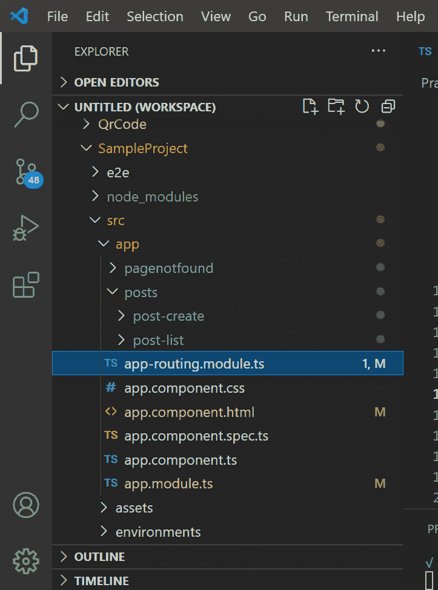
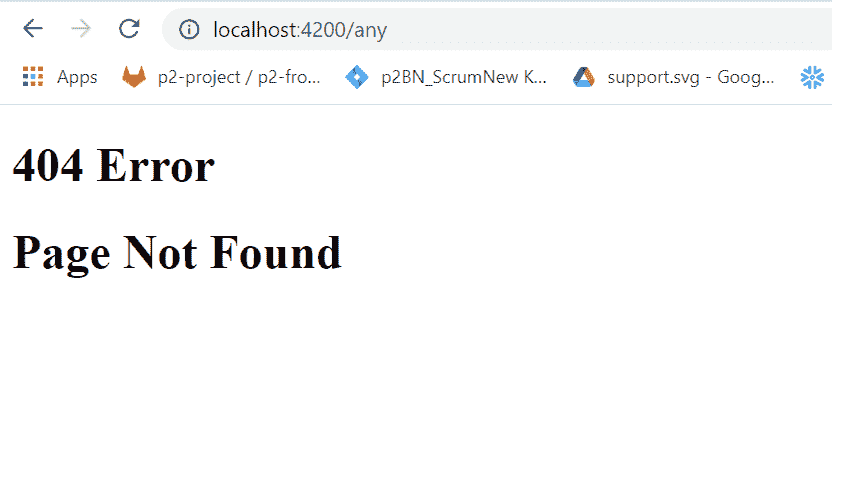

# 如何在角度布线中设置 404 页面？

> 原文:[https://www . geesforgeks . org/how-setup-404-in-page-angular-routing/](https://www.geeksforgeeks.org/how-to-setup-404-page-in-angular-routing/)

要在角度布线中设置 404 页面，我们必须首先创建一个组件，以便在发生 404 错误时显示。在下面的方法中，我们将创建一个简单的角度分量，称为**页面未找到分量**。

**创建组件:**运行以下命令创建*页面未找到的*组件。

```ts
ng generate component pagenotfound
```

**项目结构:**会是这样的。



**实现:**在这个组件的 HTML 模板里面添加下面的代码，显示一个简单的 404 错误消息。

## pagenotfound.component.html

```ts
<div>
    <h1>404 Error</h1>
    <h1>Page Not Found</h1>
</div>
```

然后在路由文件中，我们必须提供这个组件路由，并使其可用于每 404 个请求。因此，在 *app-routing.module.ts* 文件中，我们必须为此页面创建一个新的路由。

## app-routing.module.ts

```ts
import { NgModule } from '@angular/core';
import { Routes, RouterModule } from '@angular/router';
import { PagenotfoundComponent } from 
    './pagenotfound/pagenotfound.component';
import { PostCreateComponent } from 
    './posts/post-create/post-create.component';
import { PostListComponent } from 
    './posts/post-list/post-list.component';

const routes: Routes = [
    { path: '', component: PostListComponent },
    { path: 'create', component: PostCreateComponent },
    { path: 'edit/:postId', 
        component: PostCreateComponent },

    //Wild Card Route for 404 request
    { path: '**', pathMatch: 'full', 
        component: PagenotfoundComponent },

];
@NgModule({
    imports: [RouterModule.forRoot(routes)],
    exports: [RouterModule],
    providers: []
})
export class AppRoutingModule { }
```

**说明:**此处*页面未找到组件*的路线在路线数组中提供。这里，除了提供的路线之外的任何路径都由这个*页面查找组件*处理，我们的 HTML 模板显示在浏览器中。所以现在，如果有人试图向任何不在路由数组中的页面发送请求，那么该用户将自动导航到这个*页面 notfoundComponent* 。

**运行应用程序的步骤:**运行以下命令启动应用程序:

```ts
ng serve
```

现在打开浏览器，进入 ***http://localhost:4200，*** 一切正常 ***。*** 现在转到***http://localhost:4200/any，*** 我们会得到如下所示的 404 错误。

