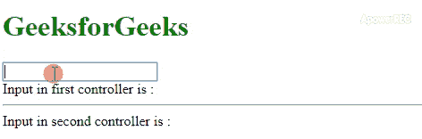

# AngularJS 中控制器之间如何共享数据？

> 原文:[https://www . geeksforgeeks . org/in-angularjs 控制器之间如何共享数据/](https://www.geeksforgeeks.org/how-to-share-data-between-controllers-in-angularjs/)

任务是使用 AngularJS 在两个或多个控制器之间共享数据变量。有许多程序可以实现这一点。这里我们将讨论最受欢迎的。

**方法:**要在 AngularJS 中的控制器之间共享数据，我们有两种主要情况:

*   **父子共享数据:**在这里，数据的共享可以简单地通过使用控制器继承来完成，因为子控制器的范围继承自父控制器的范围。
*   **Share data between controllers without having relation:** Here, the sharing of data can be done through a few ways some of them are:

    **通过使用 rootScope 变量:**我们可以使用 rootScope 变量来保存共享数据，然后可以从任何控制器引用它。这里，在 Angular 应用程序的开始，我们用某个值初始化了 rootScope 变量，然后从每个控制器中引用它，从而将两个控制器中的范围变量绑定到 rootScope 变量。

    *   **例:**

        ```
        <!DOCTYPE html>
        <html>

        <head>
            <title>
                Angular JS sharing data using rootScope
            </title>
            <script src=
        "https://ajax.googleapis.com/ajax/libs/angularjs/1.3.14/angular.min.js">
            </script>
        </head>

        <body>
            <h1 style="color:green;"> 
                GeeksforGeeks 
            </h1>

            <div ng-app="mainApp">
                <div ng-controller="firstcontroller">
                    <h2>First controller</h2>
                    <p>{{firstvalue}}</p>
                </div>
                <div ng-controller="secondcontroller">
                    <h2>Second controller</h2>
                    <p>{{secondvalue}}</p>
                </div>
            </div>

            <script>
                var mainApp = angular.module("mainApp", []);

                mainApp.run(function($rootScope) {
                    $rootScope.value = 
                       'A Computer Science Portal for Geeks';
                });
                mainApp.controller('firstcontroller',
                    function($scope, $rootScope) {
                        $scope.firstvalue = $rootScope.value;
                    });
                mainApp.controller('secondcontroller',
                    function($scope, $rootScope) {
                        $scope.secondvalue = $rootScope.value;
                    });
            </script>
        </body>

        </html>                    
        ```

    *   **输出:**
        

    **通过使用工厂或服务:****[$ root scope 方法](https://www.geeksforgeeks.org/angularjs-scope/)** 不是数据传输或共享数据的首选方法，因为它具有可用于整个应用程序的全局范围。因此，我们使用另一种方法，即创建一个工厂或服务来保存共享数据。AngularJS 工厂和服务是 JS 函数，它们执行包含两种方法&属性的特定任务，并且可以使用依赖注入注入到其他组件(例如您的控制器)中。通过这种方式，我们可以在工厂中定义一个共享变量，将其注入到两个控制器中，从而将两个控制器中的范围变量绑定到这个工厂数据。

    *   **例:**

        ```
        <!DOCTYPE html>
        <html>

        <head>
            <title>
                Angular JS sharing data using factory
            </title>
            <script src=
        "https://ajax.googleapis.com/ajax/libs/angularjs/1.3.14/angular.min.js">
            </script>
        </head>

        <body>
            <h1 style="color:green;"> 
                GeeksforGeeks 
            </h1>

            <div ng-app="mainApp">
                <div ng-controller="FirstController">
                    <input type="text" ng-model="value.name">
                    <br> Input in first controller is : {{value.name}}
                </div>
                <hr>
                <div ng-controller="SecondController">
                    Input in second controller is : {{value.name}}
                </div>
            </div>

            <script>
                var mainApp = angular.module("mainApp", []);

                mainApp.factory('Fact', function() {
                    return {
                        name: ''
                    };
                });

                mainApp.controller('FirstController',
                                function($scope, Fact) {
                    $scope.value = Fact;
                });

                mainApp.controller('SecondController',
                                function($scope, Fact) {
                    $scope.value = Fact;
                });
            </script>
        </body>

        </html>                    
        ```

    *   **输出:**
        