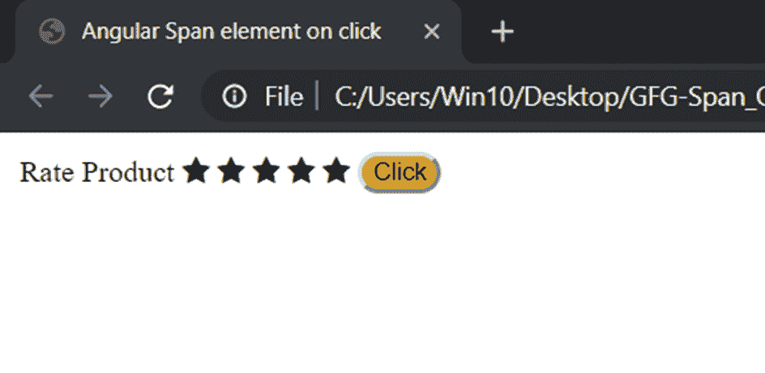
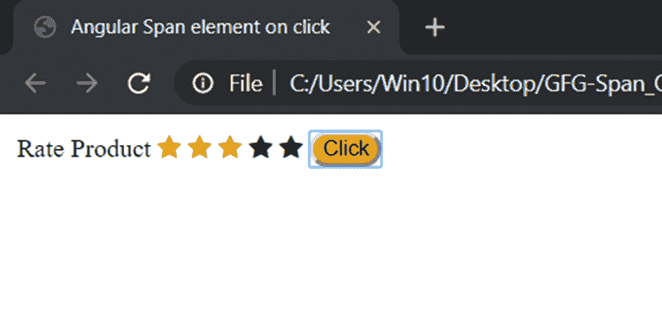
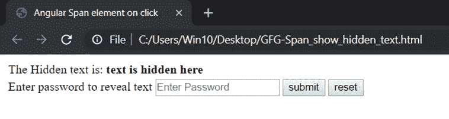
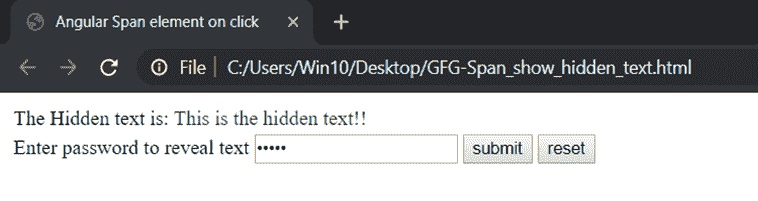
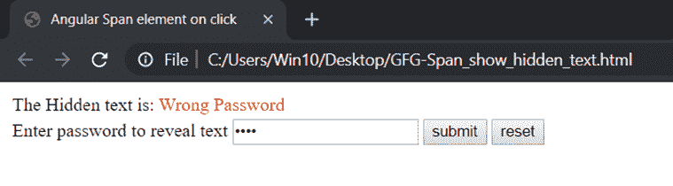

# 如何显示 AngularJS 中点击的每一行的 span 元素？

> 原文:[https://www . geesforgeks . org/how-show-a-span-element-for-每行-clicked-in-angularjs/](https://www.geeksforgeeks.org/how-to-show-a-span-element-for-each-rows-clicked-in-angularjs/)

span 元素用于对文档中的内嵌元素进行分组。它可以用来挂钩到文档的特定部分，该部分可能会受到基于 DOM 事件的特定操作的影响。
span 元素可用于高亮显示、显示、隐藏或基于功能对其执行任何特定操作。
角度提供了几个指令，通过这些指令可以轻松操作跨度元素。一些例子如下:

**方法 1:** 这是一个给出 HTML 代码的基本评级。这里的跨度元素是经过检查和检验的星形符号。
[ng-show](https://www.geeksforgeeks.org/angularjs-ng-show-directive/)和 [ng-hide](https://www.geeksforgeeks.org/angularjs-ng-hide-directive/) 用于显示或隐藏选中或未选中的星形符号。在这里，点击用于操作变量值，变量值又显示选中的星形符号。

**语法:**

```tshtml
<button ng-click="[A FUNCTION CALL] > Click! < button>
<span ng-show="[An boolean Expression] > The element < /span>
```

**示例:**

```tshtml
<!DOCTYPE html>
<html>

<head>
    <title>Angular Span element on click</title>
    <script src=
"https://ajax.googleapis.com/ajax/libs/angularjs/1.3.14/angular.min.js">
    </script>
    <link rel="stylesheet" href=
"https://cdnjs.cloudflare.com/ajax/libs/font-awesome/4.7.0/css/font-awesome.min.css">
    <style>
        .checked {
            color: orange;
        }

        .rateButton {
            border-radius: 12px;
            background-color: goldenrod;
        }
    </style>
</head>

<body>
    <div ng-app="mainApp"
         ng-controller="RatingController">
        <table>
            <tr>
                <td>Rate Product</td>
                <!--The first star is either checked or 
                    unchecked based on the value of the rating variable
                    and same for the rest 4 stars-->

                <td>
                    <span ng-show="rating>=1"
                          ng-hide="rating<1" 
                          class="fa fa-star checked">
                  </span>
                    <span ng-hide="rating>=1" 
                          ng-show="rating<1"
                          class="fa fa-star unchecked">
                  </span>

                    <span ng-show="rating>=2" 
                          ng-hide="rating<2" 
                          class="fa fa-star checked">
                  </span>
                    <span ng-hide="rating>=2"
                          ng-show="rating<2" 
                          class="fa fa-star unchecked">
                  </span>

                    <span ng-show="rating>=3"
                          ng-hide="rating<3" 
                          class="fa fa-star checked">
                  </span>
                    <span ng-hide="rating>=3" 
                          ng-show="rating<3" 
                          class="fa fa-star unchecked">
                  </span>

                    <span ng-show="rating>=4" 
                          ng-hide="rating<4" 
                          class="fa fa-star checked">
                  </span>
                    <span ng-hide="rating>=4"
                          ng-show="rating<4"
                          class="fa fa-star unchecked">
                  </span>

                    <span ng-show="rating>=5" 
                          ng-hide="rating<5" 
                          class="fa fa-star checked">
                  </span>
                    <span ng-hide="rating>=5"
                          ng-show="rating<5" 
                          class="fa fa-star unchecked">
                  </span>

                                </td>

                                <td> 
                                    <button ng-click="Rating()" 
                                            class='rateButton'>
                                      Click
                                  </button>
                                </td>
                            </tr>
                        </table>
            </div>

        <script>
            var app= angular.module("mainApp", []);
            app.controller('RatingController', function($scope){
                $scope.rating=0;
                $scope.Rating=function(){
                    $scope.rating++; 
                };
            });
        </script>
    </body>
</html>
```

**输出:**
**前点击:**

**后点击:**


**方法 2:** 这个例子展示了如何使用 span 和 ng-if 为选择性查看者(这里知道密码是 12345)隐藏一部分文本。这里点击事件是使用事件绑定技术完成的。使用的事件绑定类型称为目标事件绑定。NgForm 用于使用事件绑定技术触发函数。在这种技术中，事件被绑定在括号()中，事件的名称是要创建它的按钮的类型。

**语法:**

```tshtml
< form (nameOfEventBinder)="Function Call" > < /form > 
< button type="nameOfEventBinder" > Click! < button >
< span ng-if="[An boolean Expression] > The element < /span >
```

**例:**test.html 文件:

```tshtml
<table>
    <tr>
        <td> The Hidden text is:
            <span *ngIf="show==0" 
                  class="hidden"> 
              text is hidden here
                </span>
            <span *ngIf="show==1" 
                  class="show"> 
              This is the hidden text!!
                        </span>
            <span *ngIf="show==2"
                  class="error">
              Wrong Password
           </span>
        </td>
    </tr>
    <tr>
        <td>
            <label for="psw"> Enter password to reveal text
            </label>
            <form (submit)="check(form)"
                  (reset)="reset(form)"
                  #form='ngForm'>
                <input type="password"
                       ngModel #psw="ngModel" 
                       name="psw" 
                       placeholder="Enter Password" 
                       width="20000">
                <button type="submit"> submit
                </button>
                <button type="reset"> reset
                </button>
            </form>
        </td>
    </tr>
</table>
```

test.css 文件:

```tshtml
.hidden{
    font-weight: bold;
}
.show{
    color: green;
}
.error{
    color: red;
}
```

test.ts 文件:

```tshtml
import { Component } from '@angular/core';
import { NgForm } from '@angular/forms';
@Component({
    selector: 'app-test-html-component',
    templateUrl: './test.html',
    styleUrls:['./test.css']
})
export class TestComponent {

    show: any = 0;
    check(form: NgForm) {
        if (form.value.psw === '12345') {
            this.show = 1;
        } else {
            this.show = 2;
        }
    }
    reset(form: NgForm) {
        form.value.psw = '';
        this.show = 0;
    }
}
```

**输出:**
**最初:**

**给出正确密码后即 12345:**

**给出错误密码后:**
