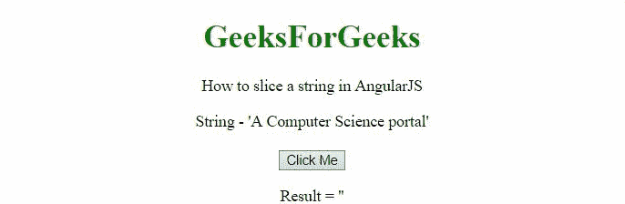
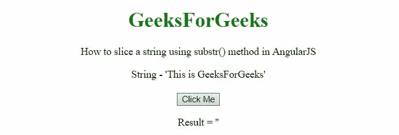
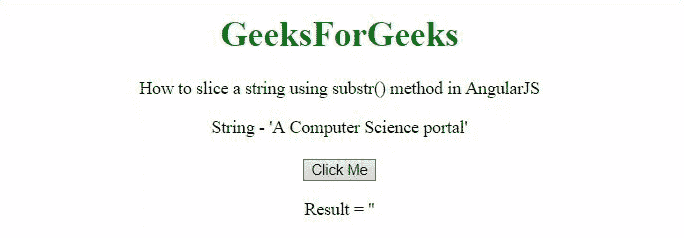

# 如何在 AngularJS 中对字符串进行切片？

> 原文:[https://www . geeksforgeeks . org/如何将字符串分割在 angularjs/](https://www.geeksforgeeks.org/how-to-slice-a-string-in-angularjs/)

给定一个字符串，任务是使用 AngularJS 对给定的字符串进行切片。

**方法 1 使用切片()方法:**方法是使用**切片()方法**，该方法接受 2 个参数**开始和结束。**在第一示例中，仅使用 1 个参数，在第二示例中，使用 2 个参数。

**例 1:**

```html
<!DOCTYPE HTML>
<html>

<head>
    <script src="//ajax.googleapis.com/ajax/libs/angularjs/1.2.13/angular.min.js">
    </script>

    <script>
        var myApp = angular.module("app", []);
        myApp.controller("controller",
            function ($scope) {
                $scope.str = "This is GeeksForGeeks";
                $scope.res = '';
                $scope.sliceStr = function () {
                    $scope.res = $scope.str.slice(8);
                }
            });
    </script>
</head>

<body style="text-align:center;">
    <h1 style="color:green;">
        GeeksForGeeks
    </h1>
    <p>
        How to slice a string in AngularJS
    </p>
    <div ng-app="app">
        <div ng-controller="controller">
            String - '{{str}}'<br><br>
            <button type="button" ng-click="sliceStr()">
                Click Me
            </button>

            <p>Result = '{{res}}'</p>
        </div>
    </div>
</body>

</html>    
```

**输出:**


**例 2:**

```html
<!DOCTYPE HTML>
<html>

<head>
    <script src=
"//ajax.googleapis.com/ajax/libs/angularjs/1.2.13/angular.min.js">
    </script>

    <script>
        var myApp = angular.module("app", []);
        myApp.controller("controller", function ($scope) {
            $scope.str = "A Computer Science portal";
            $scope.res = '';
            $scope.sliceStr = function () {
                $scope.res = $scope.str.slice(2, 18);
            }
        });
    </script>
</head>

<body style="text-align:center;">
    <h1 style="color:green;">
        GeeksForGeeks
    </h1>
    <p>
        How to slice a string in AngularJS
    </p>
    <div ng-app="app">
        <div ng-controller="controller">
            String - '{{str}}'<br><br>
            <button type="button" ng-click="sliceStr()">
                Click Me
            </button>
            <p>Result = '{{res}}'</p>
        </div>
    </div>
</body>

</html>
```

**输出:**



**方法 2 使用 substr()方法:**方法是使用 **substr()方法。**需要 2 个参数，一个是**启动**，另一个是**长度(**可选**)。**在第一个示例中，仅使用了一个参数。在第二个例子中，使用了两个参数。

**例 1:**

```html
<!DOCTYPE HTML>
<html>

<head>
    <script src=
"//ajax.googleapis.com/ajax/libs/angularjs/1.2.13/angular.min.js">
    </script>

    <script>
        var myApp = angular.module("app", []);
        myApp.controller("controller",
            function ($scope) {
                $scope.str = "This is GeeksForGeeks";
                $scope.res = '';
                $scope.subStr = function () {
                    $scope.res = $scope.str.substr(8);
                }
            });
    </script>
</head>

<body style="text-align:center;">
    <h1 style="color:green;">
        GeeksForGeeks
    </h1>
    <p>
        How to slice a string
        using substr() method in AngularJS
    </p>
    <div ng-app="app">
        <div ng-controller="controller">
            String - '{{str}}'<br><br>
            <button type="button" ng-click="subStr()">
                Click Me
            </button>
            <p>Result = '{{res}}'</p>
        </div>
    </div>
</body>

</html> 
```

**输出:**



**例 2:**

```html
<!DOCTYPE HTML>
<html>

<head>
    <script src=
"//ajax.googleapis.com/ajax/libs/angularjs/1.2.13/angular.min.js">
    </script>

    <script>
        var myApp = angular.module("app", []);
        myApp.controller("controller",
            function ($scope) {
                $scope.str = "A Computer Science portal";
                $scope.res = '';
                $scope.subStr = function () {
                    $scope.res = $scope.str.substr(2, 16);
                }
            });
    </script>
</head>

<body style="text-align:center;">
    <h1 style="color:green;">
        GeeksForGeeks
    </h1>
    <p>
        How to slice a string using
        substr() method in AngularJS
    </p>
    <div ng-app="app">
        <div ng-controller="controller">
            String - '{{str}}'<br><br>
            <button type="button" ng-click="subStr()">
                Click Me
            </button>
            <p>Result = '{{res}}'</p>
        </div>
    </div>
</body>

</html>       
```

**输出:**

