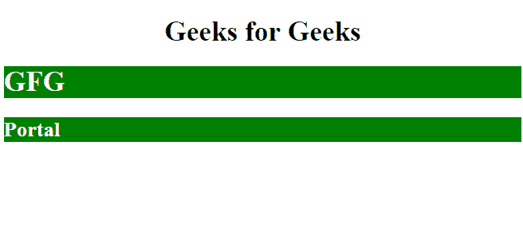
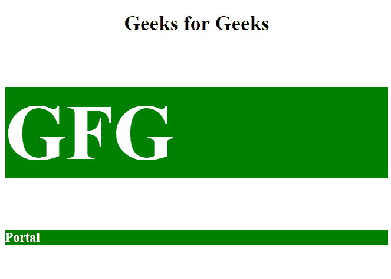

# 如何在 AngularJS 中设置组件主体元素的样式？

> 原文:[https://www . geesforgeks . org/how-to-style-in-the-host-element-of-the-component-in-angularjs/](https://www.geeksforgeeks.org/how-to-style-the-host-element-of-the-component-in-angularjs/)

若要设置组件的宿主元素的样式，请使用 ng-style 指令。CSS 属性有助于组件的样式化。

**方法:**宿主组件的样式使用 CSS 属性，可以在任何需要的时候进行更改、修改和更新。

CSS 属性如下所示:

*   **颜色:**用于设置字体颜色。
*   **背景色:**用于设置背景色。
*   **字号:**用于设置字体大小。
*   **填充:**用于设置文本周围的空间。

**语法:**

```
<element ng-style="property"></element>
```

**示例 1:** 本示例使用 ng 样式的指令。这里使用字体颜色和背景颜色的 CSS 属性。

```
<!DOCTYPE html>
<html>

<head>
    <h1><center>Geeks for Geeks</center></h1></head>

<script src=
  "https://ajax.googleapis.com/ajax/libs/angularjs/1.6.9/angular.min.js">
  </script>

<body ng-app="gfg" ng-controller="gfgctrl">

    <h1 ng-style="ele">GFG</h1>
    <h2 ng-style="ele">Portal</h2>

    <script>
        var app = angular.module("gfg", []);
        app.controller("gfgctrl", function($scope) {
            $scope.ele = {
                "color": "white",
                "background-color": "green",

            }
        });
    </script>

</body>

</html>
```

**输出:**


**示例 2:** 该示例显示了基于字体大小、字体颜色和背景颜色的组件样式。

```
<!DOCTYPE html>
<html>

<head>
    <h1><center>Geeks for Geeks</center></h1></head>

<script src=
   "https://ajax.googleapis.com/ajax/libs/angularjs/1.6.9/angular.min.js">
  </script>

<body ng-app="gfg" ng-controller="gfgctrl">

    <h1 ng-style="ele">GFG</h1>
    <h2 ng-style="ele1">Portal</h2>

    <script>
        var app = angular.module("gfg", []);
        app.controller("gfgctrl", function($scope) {
            $scope.ele = {
                "color": "white",
                "background-color": "green",
                "font-size": "120px",
            }
            $scope.ele1 = {
                "color": "white",
                "background-color": "green",
                "font-size": "20px",
            }
        });
    </script>

</body>

</html>
```

**输出:**
