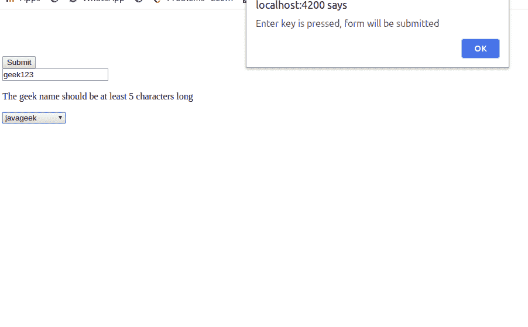

# 如何用 Angular 9 按回车键提交表单？

> 原文:[https://www . geeksforgeeks . org/如何提交表单-按回车键-带角度-9/](https://www.geeksforgeeks.org/how-to-submit-form-on-pressing-enter-with-angular-9/)

要以角度提交表单，我们有以下选项:

1.  创建一个按钮来提交表单。
2.  分配密钥以提交表单
3.  或者我们都可以。

在本教程中，我们将看到如何使用特定的键(在这种情况下是回车)来提交表单。

**进场:**

我们可以使用角度**键下**事件来使用回车键作为我们的提交键。

*   在表单标记中添加 keydown 指令。
*   创建一个函数，在按下回车键后立即提交表单。
*   将按键事件分配给该函数。

**示例:**

让我们创建一个表单，将按钮和回车键都作为表单提交模式。

*   我们将使用引导类，因此在您的 index.html 中添加引导脚本。

## 超文本标记语言

```ts
<html lang="en">
    <head>
        <meta charset="utf-8" />
        <title>Tutorial</title>

        <!--add bootstrap script here-->
        <link rel="stylesheet"
              href=
"https://maxcdn.bootstrapcdn.com/bootstrap/4.0.0/css/bootstrap.min.css"
              integrity=
"sha384-Gn5384xqQ1aoWXA+058RXPxPg6fy4IWvTNh0E263XmFcJlSAwiGgFAW/dAiS6JXm"
              crossorigin="anonymous" />

        <script src=
"https://code.jquery.com/jquery-3.2.1.slim.min.js"
                integrity=
"sha384-KJ3o2DKtIkvYIK3UENzmM7KCkRr/rE9/Qpg6aAZGJwFDMVNA/GpGFF93hXpG5KkN"
                crossorigin="anonymous"></script>
        <script src=
"https://cdnjs.cloudflare.com/ajax/libs/popper.js/1.12.9/umd/popper.min.js"
                integrity=
"sha384-ApNbgh9B+Y1QKtv3Rn7W3mgPxhU9K/ScQsAP7hUibX39j7fakFPskvXusvfa0b4Q"
                crossorigin="anonymous"></script>
        <script src=
"https://maxcdn.bootstrapcdn.com/bootstrap/4.0.0/js/bootstrap.min.js"
                integrity=
"sha384-JZR6Spejh4U02d8jOt6vLEHfe/JQGiRRSQQxSfFWpi1MquVdAyjUar5+76PVCmYl"
                crossorigin="anonymous"></script>
    </head>
    <body>
        <app-root></app-root>
    </body>
</html>
```

*   组件的代码:

## java 描述语言

```ts
import { Component } from '@angular/core';
@Component({ selector: 'app-root',
//here we used inline template format. template: `

<div style="text-align: center;">
    <h1>
        {{title}}
    </h1>
</div>

<!--using keydown to assign the event to call EnterSubmit method-->

<form #geeksForm="ngForm"
      (keydown)="EnterSubmit($event, geeksForm.form)"
      (ngSubmit)="submitit(geeksForm.form);">

    <button class="btn btn-primary"
            [disabled]="!geeksForm.valid">
      Submit
  </button>
    <input type="text"
           class="form-control"
           name="geek-name"
           ngModel #geekname="ngModel"
           required minlength="5" />

    <div *ngIf="geekname.errors.required">
        The geek name is required
    </div>
    <div *ngIf="geekname.errors.minlength">
The geek name should be at least {{
      geekname.errors.minlength.requiredLength }} characters long
    </div>
    <select class="form-control"
            name="geek-type"
            ngModel #geeksField="ngModel"
            required>
        <option *ngFor="let geek of geeks"
                [value]="geek.id">
            {{ geek.name }}
        </option>
        <div *ngIf="geeksField.touched && !geeksField.valid">
            The category is required
        </div>

`, styleUrls: [] }) export class AppComponent
      { title = 'Form submission tutorial';
      public name = "geek"; geeks = [ {id: 1, name: "c++geek"},
      {id: 2, name: "pythongeek"}, {id: 3, name: "javageek"},
      {id: 4, name: "javascriptgeek"},
        {id: 5, name: "angulargeek"} ];
 /*assigning EnterSubmit function to keydown event
      and using Enter key to submit the form. */
 //Function will take two parameters:
      //1.The key pressed.
      //2.form. EnterSubmit(event, form) {
          //keycode for
        Enter is 13 if (event.keyCode === 13) {
 alert('Enter key is pressed, form will be submitted');
//calling submit method if key pressed is Enter.
      this.submitit(form); } }
      //function to submit the form submitit(form){
        console.log(form.value);
alert("The form was submitted"); form.reset(); } }
    </select>
</form>
```

**输出:**

