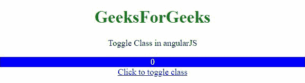
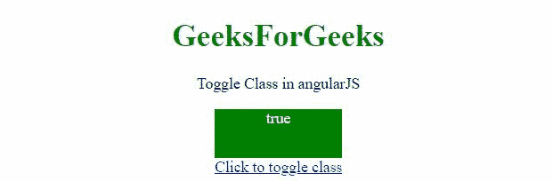

# 如何使用 AngularJS 切换类？

> 原文:[https://www . geesforgeks . org/how-to-toggle-class-use-angularjs/](https://www.geeksforgeeks.org/how-to-toggle-class-using-angularjs/)

在本文中，我们将在 AngularJS 的帮助下切换元素的类。

**方法 1:**

*   在本例中，当单击一个按钮时，元素的类就会改变。
*   因此，当按钮被点击时会调用一个函数。
*   该函数将类从 **val 切换到！val** (表示 0 到 1，反之亦然)。
*   在所调用的函数中，我们只需检查它是否是 class1，然后将其更改为 class2，否则会发生相反的情况。

**例 1:**

## 超文本标记语言

```html
<!DOCTYPE HTML>
<html>

<head>
    <script src=
"https://ajax.googleapis.com/ajax/libs/angularjs/1.2.13/angular.min.js">
    </script>

    <script>
        var myApp = angular.module("app", []);
        myApp.controller("controller",
            function ($scope) {
                $scope.val = 0;
                $scope.toggleClass = function (sel) {
                    if ($scope.val == 0) {
                        $scope.val = 1;
                    }
                    else {
                        $scope.val = 0;
                    }
                };
            });
    </script>

    <style>
        .class1 {
            color: white;
            background: blue;
        }

        .class2 {
            color: white;
            background: green;
        }
    </style>
</head>

<body style="text-align:center;">
    <h1 style="color:green;">
        GeeksForGeeks
    </h1>

    <p>
        Toggle Class in angularJS
    </p>

    <div ng-app="app">
        <div ng-controller="controller">
            <div ng-class="{'class1':!val, 
                'class2': val}">
                {{ val }}
            </div>
            <a href="javascript:void(0);" 
                ng-click='toggleClass();'>
                Click to toggle class
            </a>
        </div>
    </div>
</body>

</html>
```

**输出:**



**方法 2:**

*   这个例子有点类似于上一个例子，但是用布尔值代替了 0 和 1。
*   因此，当按钮被点击时会调用一个函数。
*   该函数将类从 val 切换到！val(表示从真到假，反之亦然)。
*   在所调用的函数中，我们只需检查它是否是 class1，然后将其更改为 class2，否则会发生相反的情况。

**例 2:**

## 超文本标记语言

```html
<!DOCTYPE HTML>
<html>

<head>
    <script src=
"https://ajax.googleapis.com/ajax/libs/angularjs/1.2.13/angular.min.js">
    </script>

    <script>
        var myApp = angular.module("app", []);
        myApp.controller("controller",
            function ($scope) {
                $scope.val = true;
                $scope.toggleClass = function (sel) {
                    if ($scope.val == true) {
                        $scope.val = false;
                    }
                    else {
                        $scope.val = true;
                    }
                };
            });
    </script>

    <style>
        .class1 {
            color: white;
            background: blue;
        }

        .class2 {
            color: white;
            background: green;
        }

        #div {
            height: 50px;
            width: 130px;
            color: white;
            margin: 0 auto;
        }
    </style>
</head>

<body style="text-align:center;">
    <h1 style="color:green;">
        GeeksForGeeks
    </h1>

    <p>
        Toggle Class in angularJS
    </p>

    <div ng-app="app">
        <div ng-controller="controller">
            <div id='div' ng-class=
                "{'class1':!val, 'class2': val}">
                {{ val }}
            </div>
            <a href="javascript:void(0);" 
                ng-click='toggleClass();'>
                Click to toggle class
            </a>
        </div>
    </div>
</body>

</html>
```

**输出:**

