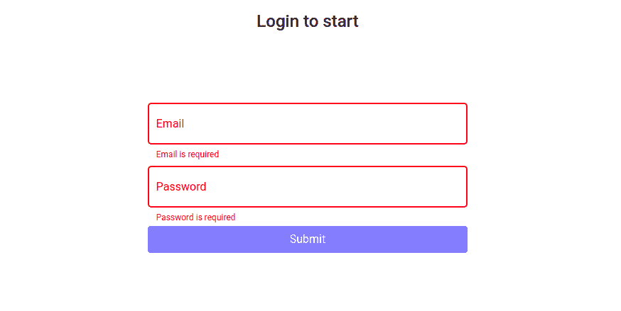
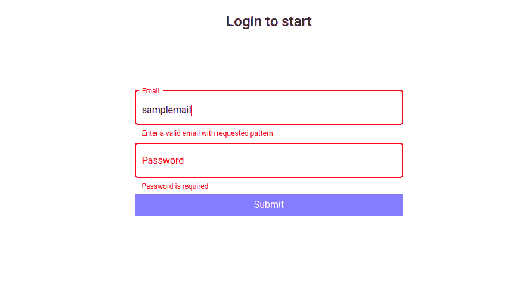
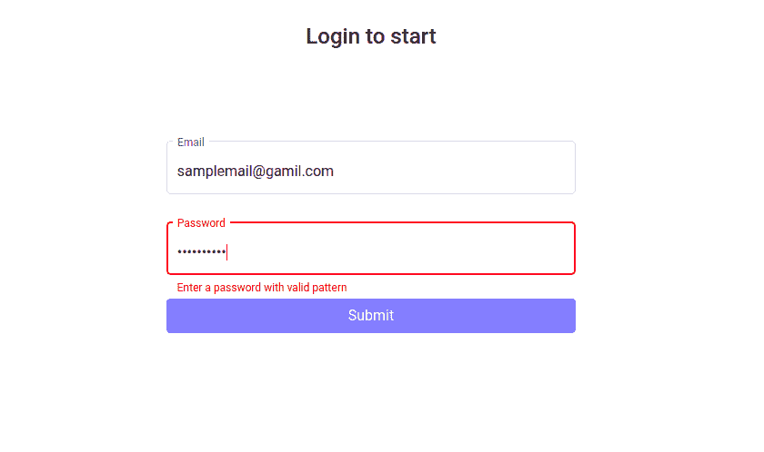

# 如何在 Angular2 中触发表单验证器？

> 原文:[https://www . geeksforgeeks . org/如何触发表单验证器-in-angular2/](https://www.geeksforgeeks.org/how-to-trigger-form-validators-in-angular2/)

在 Angular 2 中，处理复杂表单的最佳方式是使用 Reactive 表单。下面我们将详细说明如何触发登录页面的表单验证器。

在反应式表单中，我们使用 FormControl，通过使用它，我们可以访问表单的子字段及其属性。它们的一些属性是脏的、接触的、未接触的、原始的、有效的、错误的等等。使用这些属性，我们实际上可以根据需求触发验证。

*   **脏:**如果用户将子字段的值从默认值更改，该属性将被激活。
*   **触摸:**如果用户访问该子字段，则触摸属性值被设置为“真”。
*   **未接触:**如果用户没有访问该子字段，则未接触属性值被设置为“真”。它与触摸属性完全相反。
*   **原始:**如果用户访问该子字段并且其值没有任何变化，则它被设置为“真”。
*   **有效:**如果表单完成了所有表单验证，则为“真”。
*   **错误:**客户端的 Angular 会生成一个错误列表，其中包含所有内置错误，如必需、最大长度、模式、最小长度等。

使用上面讨论的属性，我们可以用自定义消息触发表单验证。使用每个子字段的 FormControl，并检查其属性，如触摸、脏等，我们可以根据需要验证表单。

**进场:**

*   首先，根据。html 文件。
*   然后在组件文件中为所需的子字段添加验证，例如:必需、最大长度、模式等。
*   确保您从“角度@/表单”导入了验证器中的所有内容
*   然后添加验证消息 in.html 文件，如下代码所示。
*   此外，从模块文件中的“角度@/材料”导入所有依赖项。

为了更好的动画和造型，angular 提供了 Angular 材质，其中包含了关于造型的丰富信息。使用有角度的材质，可以对表单进行样式化。因此，我们使用像<mat-form-field>、<mat-error>、<mat-label>和日场这样的标签。</mat-label></mat-error></mat-form-field>

使用 npm 安装后，我们可以从角度材料导入。导入它的命令如下:

```ts
ng add @angular/material
```

**代码实现:**下面是上述方法的实现。

**app.module.ts:**

## java 描述语言

```ts
import { BrowserModule } from 
        '@angular/platform-browser';
import { NgModule } from '@angular/core';
import { AppComponent } from './app.component';
import { BrowserAnimationsModule } from 
        '@angular/platform-browser/animations';
import { FormsModule, ReactiveFormsModule } 
        from '@angular/forms';
import { MatInputModule } from 
        '@angular/material/input';
import { MatDialogModule } from 
        '@angular/material/dialog';
import { MatFormFieldModule } from 
        '@angular/material/form-field';
import { MatIconModule } from 
        '@angular/material/icon';

@NgModule({
    declarations: [
        AppComponent,
    ],
    imports: [
        BrowserModule,
        FormsModule,
        ReactiveFormsModule,
        BrowserAnimationsModule,
        MatInputModule,
        MatFormFieldModule,
        MatIconModule,
        MatDialogModule,
    ],
    bootstrap: [AppComponent]
})
export class AppModule { }
```

**app.component.ts:**

## java 描述语言

```ts
import { Component, OnInit } 
        from '@angular/core';

// Imports
import { FormGroup, FormControl, 
    Validators } from '@angular/forms';

@Component({
    selector: 'app-root',
    templateUrl: './app.component.html',
    styleUrls: ['./app.component.scss']
})
export class AppComponent implements OnInit {

    constructor() { }

    ngOnInit() {
    }

    profile = new FormGroup(
        {
            // Setting Validation Controls
            email: new FormControl('', 
                [Validators.required, 
                Validators.minLength(8),
                Validators.pattern(
/^\w+@[a-z0-9A-Z_]+?\.[a-zA-Z]{2, 5}$/)]),
                password: new FormControl('', 
                [Validators.required, 
                Validators.minLength(8),
                Validators.pattern(
/^(?=.*[a-z])(?=.*[A-Z])(?=.*\d)(?=.*[@$!%*?&])[A-Za-z\d@$!%*?&]{8, }$/)])
        }
    );
}
```

**app.component.html:**

## 超文本标记语言

```ts
<div class="container-fluid">
  <div class="row">
    <div class="col-12 col-sm-6 
              col-md-6 col-lg-12">

      <h4>Login to start</h4>

      <form [formGroup]="profile">

        <mat-form-field appearance="outline">
          <mat-label>Email</mat-label>
          <input type="email" matInput 
            placeholder="Enter Email" 
            formControlName="email">

          <mat-error *ngIf=
"profile.controls['email'].errors?.pattern && profile.controls['email'].touched">
            Enter a valid email with 
            requested pattern
          </mat-error>

          <mat-error *ngIf=
"profile.controls['email'].errors?.minLength && profile.controls['email'].touched">
            Email should have minimum 
            8 characters
          </mat-error>

          <mat-error *ngIf=
"profile.controls['email'].errors?.required && profile.controls['email'].touched">
            Email is required
          </mat-error>
        </mat-form-field>

        <mat appearance="outline">
          <mat-label>Password</mat-label>
          <input matInput type="password" 
            placeholder="Enter password" 
            formControlName="password">

          <mat-error *ngIf=
"profile.controls['password'].errors?.required && profile.controls['password'].touched">
            Password is required
          </mat-error>

          <mat-error *ngIf=
"profile.controls['password'].errors?.minLength && profile.controls['password'].touched">
            Enter a password with 
            more than 8 letters
          </mat-error>

          <mat-error *ngIf=
"profile.controls['password'].errors?.pattern && profile.controls['password'].touched">
            Enter a password with 
            valid pattern
          </mat-error>
        </mat - form - field>

        <button class="btn btn-primary" 
          [disabled]="!profile.valid"> 
          Submit
        </button>
      </form>
    </div>
  </div>
</div>
```

**输出:**因此，我们成功触发了表单验证。

  