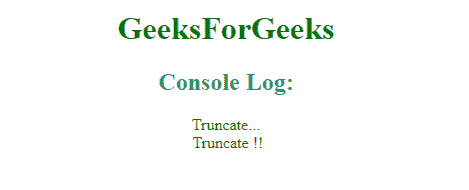

# 如何在 Angular2 中截断文本？

> 原文:[https://www . geeksforgeeks . org/如何截断成角文字 2/](https://www.geeksforgeeks.org/how-to-truncate-text-in-angular2/)

**方法:**在 Angular 中很容易截断文字。截断的文本有助于我们删除或截断部分文本。它会突然结束文本，减少文本的长度。它根据使用的截断函数删除文本。

**语法:**

*   **字符串长度大于给定字符。**

    ```
    function(str, length, ending) {........}
    ```

*   **字符串截断到指定的特定单词长度。**

    ```
    function truncate(str, no_words) {
        return str.split(" ").splice(0, no_words).join(" ");
    }
    ```

**示例 1:** 此示例显示了将 Angular 中的文本截断的方式。这里，文本/字符串的长度比给定的字符长。创建 truncate 函数，检查字符串长度是否大于给定长度。然后，它相应地返回截断的文本。

```
<!DOCTYPE html> 
<html> 
<head> 
    <title>Truncate text in Angular2</title> 

    <script src = 
"https://ajax.googleapis.com/ajax/libs/angularjs/1.3.14/angular.min.js"></script> 

    <script src = 
"https://ajax.googleapis.com/ajax/libs/angularjs/1.3.14/angular-route.min.js"> 
    </script> 
</head> 

<body style = "text-align:center;"> 

    <h1 style = "color:green;" > 
        GeeksForGeeks 
    </h1> 

    <script> 
text_truncate = function(str, length, ending) {

    if (ending == null) {
      ending = '...';
    }

    if (str.length > length) {
      return str.substring(0, length - ending.length) + ending;
    } else {
      return str;
    }
  };

console.log(text_truncate('Truncate text using Geeks for Geeks',11))
console.log(text_truncate('Truncate text using Geeks for Geeks',11,'!!'))
    </script> 
</body> 
</html>                    
```

**输出:**


**示例 2:** 这个示例展示了如何将文本截断为某些单词。它删除给定限制中未包含的单词。为此目的:使用 str.split、splice 和 join。

```
<!DOCTYPE html> 
<html> 
<head> 
    <title>Angular JS Route Change</title> 

    <script src = 
"https://ajax.googleapis.com/ajax/libs/angularjs/1.3.14/angular.min.js"></script> 

    <script src = 
"https://ajax.googleapis.com/ajax/libs/angularjs/1.3.14/angular-route.min.js"> 
    </script> 
</head> 

<body style = "text-align:center;"> 

    <h1 style = "color:green;" > 
        GeeksForGeeks 
    </h1> 

    <script> 
function truncate(str, no_words) {
    return str.split(" ").splice(0, no_words).join(" ");
}

console.log(truncate('Geeks for Geeks Portal: Truncate Text Using GFG', 6));
    </script> 
</body> 
</html>                    
```

**输出:**
