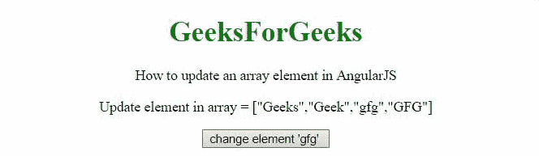
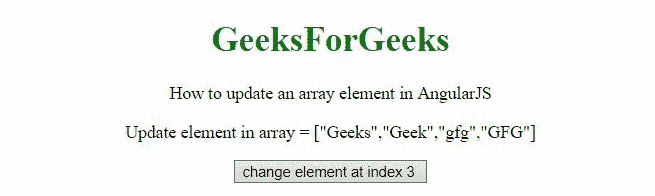

# 如何更新 AngularJS 中的一个数组元素？

> 原文:[https://www . geesforgeks . org/如何更新数组中的元素 angularjs/](https://www.geeksforgeeks.org/how-to-update-an-array-element-in-angularjs/)

任务是在 AngularJS 的帮助下更新一个数组元素。

**方法:**要更新数组中的特定项目，有两种方法，要么通过其值，要么通过其索引。在第一个示例中，元素通过其值进行更新，而在第二个示例中，它已经通过**括号符号使用索引进行了更新。**

**例 1:**

```html
<!DOCTYPE HTML>
<html>

<head>
    <script src=
"//ajax.googleapis.com/ajax/libs/angularjs/1.2.13/angular.min.js">
    </script>

    <script>
        var myApp = angular.module("app", []);
        myApp.controller("controller", function ($scope) {
            $scope.array = ['Geeks', 'Geek', 'gfg', 'GFG'];
            $scope.updateEl = function (item) {
                var index = $scope.array.indexOf(item);
                if (index > -1) {
                    $scope.array[index] = 'GeeksForGeeks';
                }
            };
        });
    </script>
</head>

<body style="text-align:center;">
    <h1 style="color:green;">
        GeeksForGeeks
    </h1>
    <p>
        How to update an array 
        element in AngularJS
    </p>
    <div ng-app="app">
        <div ng-controller="controller">
            <p>Update element in array = {{array}}</p>
            <input type="button" 
                value="change element 'gfg' " 
                ng-click="updateEl('gfg')">
        </div>
    </div>
</body>

</html>    
```

**输出:**



**例 2:**

```html
<!DOCTYPE HTML>
<html>

<head>
    <script src=
"//ajax.googleapis.com/ajax/libs/angularjs/1.2.13/angular.min.js">
    </script>

    <script>
        var myApp = angular.module("app", []);
        myApp.controller("controller", function ($scope) {
            $scope.array = ['Geeks', 'Geek', 'gfg', 'GFG'];
            $scope.updateEl = function (index) {
                if (index > -1) {
                    $scope.array[index] = 'GeeksForGeeks';
                }
            };
        });
    </script>
</head>

<body style="text-align:center;">
    <h1 style="color:green;">
        GeeksForGeeks
    </h1>
    <p>
        How to update an array 
        element in AngularJS
    </p>
    <div ng-app="app">
        <div ng-controller="controller">
            <p>Update element in array = {{array}}</p>
            <input type="button" 
                value="change element at index 3 " 
                ng-click="updateEl(3)">
        </div>
    </div>
</body>

</html>      
```

**输出:**

