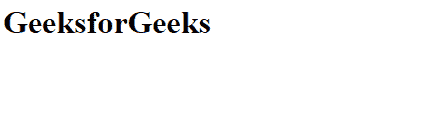

# 如何使用 AngularJS 显示 HTML 内容值？

> 原文:[https://www . geeksforgeeks . org/如何使用-angularjs-to-display-html-content-value/](https://www.geeksforgeeks.org/how-to-use-angularjs-to-display-html-content-value/)

**[ng-bind-html](https://www.geeksforgeeks.org/angularjs-ng-bind-html-directive/)** 指令用于将 html 元素的内部 HTML 绑定到应用程序数据，并从 HTML 字符串中删除危险代码。$sanitize 服务是 **ng-bind-html** 指令的必备服务。所有 HTML 元素都支持它。

**语法:**

```
<element ng-bind-html="expression"> Contents... </element>
```

**进场:**

*   初始化我们正在使用的库。这里，我们主要使用 angular-sanitize.js 库。
*   创建应用程序及其控制器范围。
*   定义控制变量。
*   将应用程序和控制器调用到 html 的主体。
*   在主体内部使用 span 标记，使用属性 ng-bind-html，并将该值赋为范围变量。

**示例:**

```
<html>
<head>
    <meta charset="utf-8">
</head>
<body ng-app="myApp" ng-controller="myCtrl">
    <span ng-bind-html="message"></span>

    <script src=
"https://cdnjs.cloudflare.com/ajax/libs/angular.js/1.6.9/angular.min.js" 
                charset="utf-8">
         </script>
    <script src=
"https://ajax.googleapis.com/ajax/libs/angularjs/1.6.9/angular-sanitize.js"
                charset="utf-8">
</script>
    <script type="text/javascript">
    var app=angular.module('myApp',['ngSanitize']);
    app.controller('myCtrl',function($scope){
        $scope.message = '<h1>GeeksforGeeks</h1>';
    });
    </script> 
</body>
</html>
```

**输出:**
