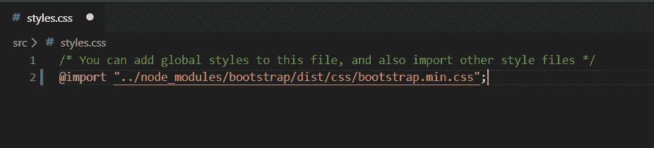
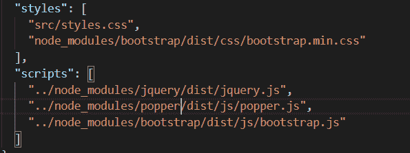
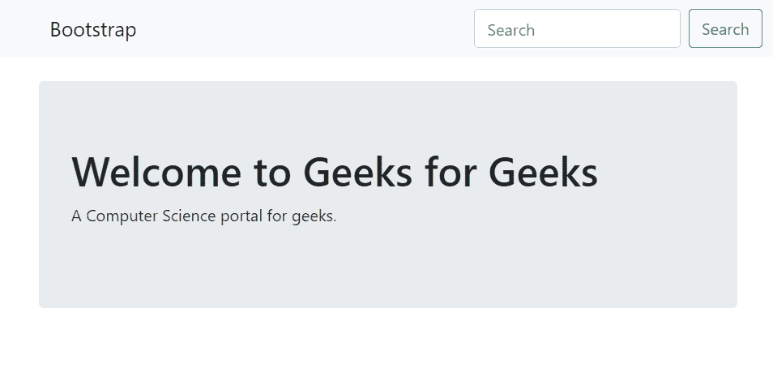

# 如何在 angular 2 中使用 bootstrap 4？

> 原文:[https://www . geeksforgeeks . org/使用方法-bootstrap-4 in angular-2/](https://www.geeksforgeeks.org/how-to-use-bootstrap-4-in-angular-2/)

**[【Bootstrap】](https://www.geeksforgeeks.org/bootstrap-tutorials/)**是一个开源工具包，用于使用 HTML、CSS 和 JS 进行开发。Bootstrap 框架可以和现代的 JavaScript web &移动框架一起使用，比如 **[Angular](https://www.geeksforgeeks.org/angularjs-tutorials/)** 。

**[Bootstrap 4](https://www.geeksforgeeks.org/bootstrap-4-introduction/)** 是 Bootstrap 的最新版本，是目前最流行的 HTML、CSS 和 JavaScript 框架。这篇文章是一步一步指导使用 Bootstrap 4 与 Angular 2。

**按照以下步骤在 Angular 2 中使用引导程序 4:**在执行这些步骤之前，您必须确保已经安装了 **Angular CLI** ，如果尚未安装，则运行以下命令安装 Angular CLI。安装完 Angular CLI 后，您可以执行以下步骤。

```ts
npm install -g @angular/cli
```

*   **步骤 1:** 通过在终端运行下面的命令创建一个新项目。

    ```ts
    ng new project-name
    ```

    *   **步骤 2:** 这里需要安装引导程序。现在在终端中打开项目，并在 Angular 2 CLI 上运行以下命令，将引导添加到您的项目中。

    ```ts
    npm i bootstrap@next --save
    ```

    *   **Step 3:** Now have to importing CSS, go to **src/style.css** and import bootstrap

    ```ts
    @import "../node_modules/bootstrap/dist/css/bootstrap.min.css";
    ```

    

    *   **Step 4:** For Bootstrap JS components to work you will still need to import **bootstrap.js** into **angular.json/angular-cli.json** under scripts. This should happen automatically, its still better to check.

    ```ts
    "scripts": ["../node_modules/jquery/dist/jquery.js",
                      "../node_modules/tether/dist/js/tether.js",
                      "../node_modules/bootstrap/dist/js/bootstrap.js"],
    ```

    

    *   **第五步:**现在必须重启服务器。

    ```ts
    ng serve
    ```

    *   **第六步:**现在你要运行**app.component.html**代码。

    ```ts
    <!DOCTYPE html>
    <html>

    <head>
        <title>
        </title>
    </head>

    <body>

        <nav class="navbar navbar-light bg-light">
            <a class="navbar-brand" href="#">
                 
                 Bootstrap
            </a>
            <form class="form-inline">
                <input class="form-control mr-sm-2" type="search" 
                       placeholder="Search" aria-label="Search">
                <button class="btn btn-outline-success my-2 my-sm-0" 
                        type="submit">
                  Search
                </button>
            </form>
        </nav>
        <div class="container">

            <div class="jumbotron">
                <h1>
                  <i class="fa fa-camera-retro"></i>
                   Welcome to Geeks for Geeks
                </h1>
                <p>A Computer Science portal for geeks.</p>
            </div>

        </div>
    </body>

    </html>
    ```

    *   **输出:**
    