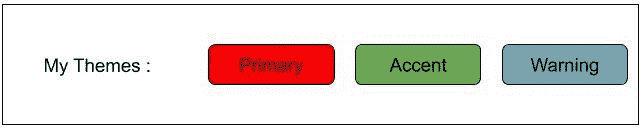

# 如何在 Angular 中使用自定义主题调色板？

> 原文:[https://www . geesforgeks . org/如何使用-自定义-主题-调色板-in-angular/](https://www.geeksforgeeks.org/how-to-use-custom-theme-palettes-in-angular/)

我们可以使用自定义的角度主题调色板来定义我们自己的调色板。并且该主题文件可以在所有组件中使用。

**进场:**

首先，我们必须创建自己的主题文件，在这种情况下，我们必须包括 mat-core() Sass mixin，并从角度材质导入主题文件。之后，我们必须开始建立我们的调色板，最后，我们必须将我们创建的主题文件包含在“角度-材质-主题”中。在这之后，我们可以通过将自定义调色板导入“样式”来使用它。Scss "文件或者我们可以直接导入到任何组件中。

**语法:**

```ts

@import '~@angular/material/theming';
@include mat-core();

//Available color palettes: https://material.io/design/color/

$[variable_name]-app-primary: mat-palette([defining color]);
$[variable_name]-app-accent:  mat-palette([defining colors]);
$[variable_name]-app-warn:  mat-palette([defining colors]);

$[variable_name]-app-theme: mat-light-theme([primary color], [accent color], [warn color]);
(or)
$[variable_name]-app-theme: mat-dark-theme([primary color], [accent color], [warn color]);

@include angular-material-theme($[variable_name]-app-theme);

```

**示例:**

```ts
@import '~@angular/material/theming';
@include mat-core();

/* ======== Angular material custom themes ======== */ 

$my-custom-primary: mat-palette($mat-deep-purple);
$my-custom-accent: mat-palette($mat-pink, 100, 500, A100);
$my-custom-warn: mat-palette($mat-lime); //Optional

$my-custom-theme: mat-light-theme(
              $my-custom-primary, 
              $my-custom-accent, 
              $my-custom-warn);

@include angular-material-theme($my-custom-theme);
```

在调色板中，我们必须定义与亮度相关的值。默认值为 500(这是我的品牌颜色/强调色的真实色调)。其余的是该颜色的其他色调(其中较低的数字表示较亮的色调，较高的数字表示较暗的色调)。同样，数字越小意味着越亮，数字越高意味着越暗。

现在，我们可以通过两种方式创建调色板:

*   光
*   黑暗

在上面的例子中，我们使用了一个灯光主题，然后我们在**“角度-材质-主题”**中包含了特定的主题。

```ts
<html>
<mat-card class="my-alternate-theme">
   My Themes:
   <button mat-raised-button color="primary">Primary</button>
   <button mat-raised-button color="accent">Accent</button>
   <button mat-raised-button color="warn">Warning</button>
</mat-card>
</html>
```

**输出:**

**参考:**https://material.angular.io/guide/theming