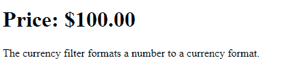
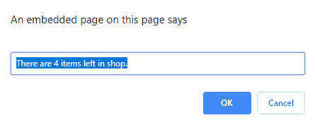
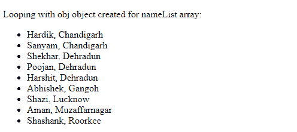

# 如何在 AngularJS 中使用控制器内的过滤器？

> 原文:[https://www . geeksforgeeks . org/如何使用 angularjs 中的控制器内过滤器/](https://www.geeksforgeeks.org/how-to-use-filter-within-controllers-in-angularjs/)

过滤器用于格式化表达式的值并显示给用户。它可以用在 HTML 预览、控制器或服务以及指令中。AngularJS 有许多内置的过滤器，但是我们可以很容易地定义自己的过滤器。

**内置过滤器:**

*   **[AngularJS 滤镜滤镜:](https://www.geeksforgeeks.org/angularjs-filter-filter/)**
*   **[安古拉 JS 货币过滤器:](https://www.geeksforgeeks.org/angularjs-currency-filter/)**
*   **[安古拉 JS 号过滤器:](https://www.geeksforgeeks.org/angularjs-number-filter/)**
*   **[AngularJS 日期过滤器:](https://www.geeksforgeeks.org/angularjs-date-filter/)**
*   **[角型 json 滤波器:](https://www.geeksforgeeks.org/angularjs-json-filter/)T3**
*   **[AngularJS 小写滤镜](https://www.geeksforgeeks.org/angularjs-lowercase-filter/)**
*   **[AngularJS 大写滤镜:](https://www.geeksforgeeks.org/angularjs-uppercase-filter/)**
*   **[角限制滤波器](https://www.geeksforgeeks.org/angularjs-limitto-filter/)**
*   **[【angolajs order by filter】](https://www.geeksforgeeks.org/angularjs-orderby-filter/)**

如果使用依赖项**货币过滤器**注入了过滤器**货币**。注入的参数是一个函数，它将要格式化的值作为第一个参数，并从第二个参数开始过滤参数。以下方法用于实现过滤器。

**方法 1:** 在视图模板中使用过滤器
**语法:**

*   通过将过滤器应用于视图模板中的表达式:

    ```ts
    {{ expression | filter }} 
    ```

*   过滤器可以应用于另一个过滤器的结果。这叫做“链接”:

    ```ts
    {{ expression | filter1 | filter2 | ... }}
    ```

*   过滤器可能有参数:

    ```ts
    {{ expression | filter:argument1:argument2:... }}
    ```

**程序:**

```ts
<!DOCTYPE html>
<html>
<head>
    <script src=
"https://ajax.googleapis.com/ajax/libs/angularjs/1.6.9/angular.min.js">
    </script>
</head>
<body>

    <div ng-app="app1" ng-controller="currencyCtrl">

        <h1>Price: {{ price | currency }}</h1>

    </div>

    <script>
        var app = angular.module('app1', []);
        app.controller('currencyCtrl', function($scope) {
            $scope.price = 100;
        });
    </script>

    <p>
      The currency filter formats a number
      to a currency format.
    </p>

</body>

</html>
```

**输出:**


**方法 2:** 过滤器用于指令、服务和控制器。为此，在您的**指令/控制器/服务**中注入一个名为过滤器的依赖项。

**程序:**

```ts
<script>
var listedItems = [
    { itemID: 001, itemName: "Laptop", stockLeft: 1 },
    { itemID: 002, itemName: "Cell Phone", stockLeft: 3 },
    { itemID: 003, itemName: "Earphones", stockLeft: 0 },
    { itemID: 004, itemName: "Chargers", stockLeft: 5 },
    { itemID: 005, itemName: "Headphones", stockLeft: 0 },
    { itemID: 006, itemName: "USB Cables", stockLeft: 15}
];

 listedItems = listedItems.filter(function (item) {
    return (item.stockLeft > 0);
});

// This will display the no of items are in stock
prompt("", "There are " + listedItems.length
        + " items left in shop.");
</script>
```

**输出:**


**方法 3:** 是第二种方法的修改。还可以向 AngularJS 添加过滤器来格式化数据值。在我们的 AngularJS 控制器中使用了 **$filter** 服务。在 AngularJS 中，您还可以在控制器中注入$filter 服务，并可以使用以下语法进行过滤。

**语法:**

*   ```ts
    $filter("filter")(array, expression, compare, propertyKey)
    function myCtrl($scope, $filter)
    {
        $scope.finalResult = $filter("filter")(
                $scope.objArray, $scope.searchObj);
    };

    ```

*   AngularJS 有一些内置的过滤器，可以用来减少一个数组的执行或数组在某些时候根据某些条件。

    ```ts
    $scope.formatDate = $filter("date")($scope.date, "yyyy-MM-dd");
    $scope.finalResult = $filter('uppercase')($scope.name);

    ```

**程序:**过滤器被添加到指令中，就像 [ng-repeat](https://www.geeksforgeeks.org/angular-js-ng-repeat-directive/) 一样，通过使用**管道**符号或字符 **`|`** ，后面跟着一个过滤器标签。

```ts
<!DOCTYPE html>
<html>

<head>
    <script src=
"https://ajax.googleapis.com/ajax/libs/angularjs/1.6.9/angular.min.js">
    </script>
</head>

<body>

    <div ng-app="app1" ng-controller="piprCtrl">

        <p>
          Looping with obj object created for 
          nameList array:
        </p>
        <ul>
            <li ng-repeat="obj in nameList | orderBy:'city'">
                {{ obj.name + ', ' + obj.city }}
            </li>
        </ul>

    </div>

    <script>
        angular.module("app1", []).controller(
                "piprCtrl", function($scope) {
            $scope.nameList = [{
                name: "Hardik",
                city: "Chandigarh"
            }, {
                name: "Shekhar",
                city: "Dehradun"
            }, {
                name: "Sanyam",
                city: "Chandigarh"
            }, {
                name: "Poojan",
                city: "Dehradun"
            }, {
                name: "Aman",
                city: "Muzaffarnagar"
            }, {
                name: "Shashank",
                city: "Roorkee"
            }, {
                name: "Shazi",
                city: "Lucknow"
            }, {
                name: "Harshit",
                city: "Dehradun"
            }, {
                name: "Abhishek",
                city: "Gangoh"
            }];
        });
    </script>

</body>

</html>
```

**输出:**
