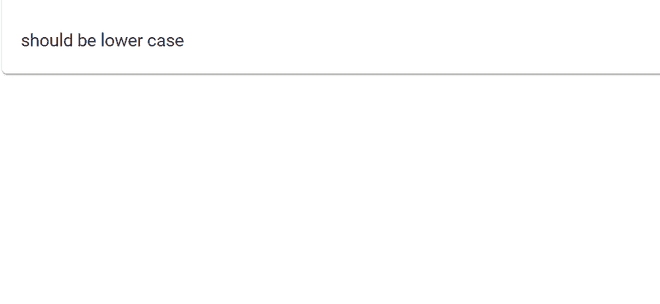

# 如何在 AngularJS 中使用字符串插值中的 javascript 函数？

> 原文:[https://www . geesforgeks . org/how-用法-JavaScript-字符串函数-插值-in-angularjs/](https://www.geeksforgeeks.org/how-to-use-javascript-function-in-string-interpolation-in-angularjs/)

字符串插值基本上用于在 HTML 模板上显示动态数据。它方便您对*组件. ts* 文件进行更改，并自动从那里获取数据到 HTML 模板(component.ts 文件)。

因此，这里我们创建一个简单的 HTML 模板，使用字符串插值，然后我们编写在字符串插值内部使用的函数。

**进场:**

*   创建要使用的角度应用程序。
*   创建一个组件“DemoComponent”。在 demo.component.ts 中，我们创建了一些在字符串插值中使用的方法。
*   这里我们还在字符串插值中使用了内置的 JavaScript 函数。

**语法:**

```
<h4>Book Price : {{ 'SHOULD BE LOWER CASE'.toLowerCase() }}</h4>
```

**示例 1:(内置函数)**在角度模板中添加下面的 HTML，并使用*“ng serve”*运行，它使字符串小写。

## example.component.html

```
<h4>Book Price : {{ 'SHOULD BE LOWER CASE'.toLowerCase() }}</h4>
<hr/>
```

**输出:**



#### 示例 2:(自定义函数)

## demo.component.ts

```
import { Component } from '@angular/core';

@Component({
    templateUrl: './demo.component.html',
    styleUrls: ['./demo.component.css']
})
export class DemoComponent{

    public Books = [
        {name:"The Pilgrim’s Progress",author:'John Bunyan',price:"13"},
        {name:"Robinson Crusoe",author:'Daniel Defoe',price:"43"},
        {name:"Gulliver’s Travels",author:'Jonathan Swift',price:"33"}
    ]

    constructor(){}

    printBookName(book){
        return "[ " + book.name + " ]";
    }
    printBookAuthor(book){
        return "[ " + book.author + " ]";
    }
    printBookPrice(book){
        return "[ " + " {content}quot; + book.price + " ]";
    }
}
```

在上面的代码中，我们创建了一个存储 book 对象的 books 数组，然后我们创建了三个函数，我们将在字符串插值中使用这三个函数来打印特定的 book 细节。

## demo.component.html

```
<div style="margin-left:100px" *ngFor="let book of Books">
  <hr>
  <h4>Book Name : {{ printBookName(book) }}</h4>
  <h4>Book Author : {{ printBookAuthor(book) }}</h4>
  <h4>Book Price : {{ printBookPrice(book) }}</h4>
</div>
```

**输出:**


在 HTML 模板中，我们使用字符串内插函数来打印特定的书籍数据。