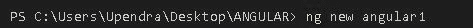
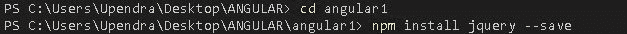
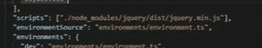
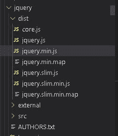
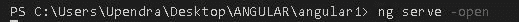
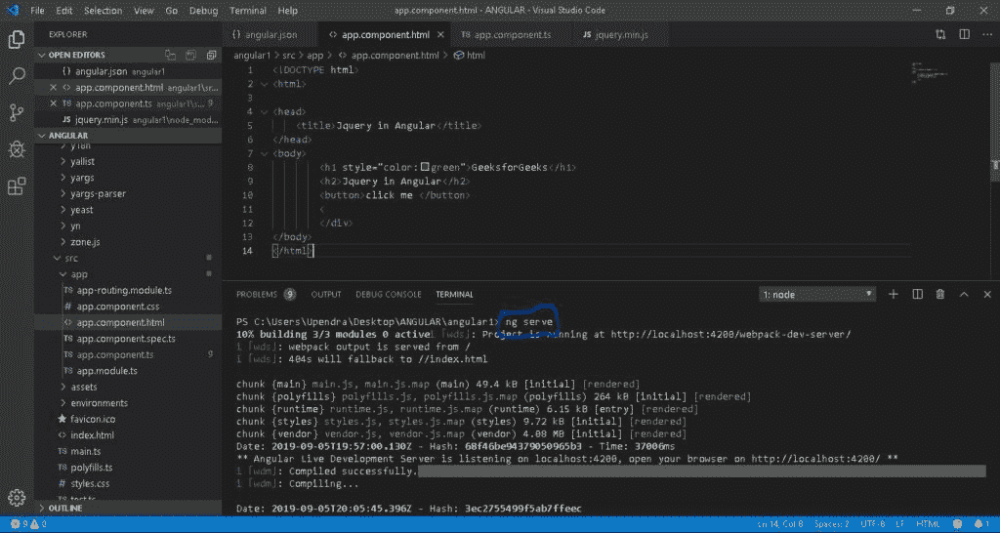
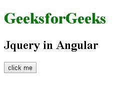
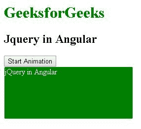

# 如何在 Angular 中使用 jQuery？

> 原文:[https://www.geeksforgeeks.org/how-to-use-jquery-in-angular/](https://www.geeksforgeeks.org/how-to-use-jquery-in-angular/)

在开始在 angular 中使用 jQuery 之前，我们需要将其安装在我们的系统上。现在基本上有两种安装 jQuery 的通用方法:
注意:在开始本教程之前，你先展示一下知道这里使用的软件是微软 visual studio 代码，已经安装了 NodeJs 和 typescript 来配合 angular 使用。

1.  **Using NPM method:**
    Now to install jQuery Using NPM method, we need to create a new angular application by running the command at the VS Code Terminal.

    ```
     ng new angular1
    ```

    这里 angular1 是应用程序的名称，需要几秒钟的时间，但是它将创建带有所有必需文件的 angular 应用程序。
    
    现在我们“光盘”进入应用文件夹安装 jquery。我们在 VS 代码终端执行以下命令:

    ```
    cd angular1
    npm install jquery --save

    ```

    
    之后，你的 angular app 就可以和 jquery 一起使用了。

2.  **Using jQuery CDN:**
    While browsing **https://jquery.com/download/**, you can easily locate the jQuery CDN and download it.
    It is always recommended sticking with the latest version of the official CDN since it supports Subresource Integrity (SRI). Now to use the jQuery CDN, you need to reference the file in the script tag directly from the jQuery CDN domain. The code with Subresource Integrity attribute will be like this. jQuery 3.4.1 is used here.

    ```
    <script
    src=”https://code.jquery.com/jquery-3.4.1.js"
    integrity=”sha256–2z0P7MLoyxByUtvAk/xjkmindefS4auh4Pfzbm7y6g0=”
    crossorigin=”anonymous”>
    </script>
    ```

    以上代码将包含在 angular app 的 HTML 文件(*app.component.html*)的头标中。

    安装 jQuery 后，我们需要使它成为全局的。在 jQuery 模块中，“dis”文件夹下的 jquery.min.js 不是公共的。要使 jQuery 全局化，我们需要执行以下操作:
    该步骤包括浏览到位于 Angular CLI 项目文件夹根的文件**“Angular-CLI . JSON”**，并找到脚本:[]属性，并按照给定的路径包含 jQuery 文件夹

    ```
    "scripts" :["./node_modules/jquery/dist/jquery.min.js"]
    ```

    

    现在确认这个路径，浏览到*node _ modules->jquery->dist->jQuery . min . js .*
    
    你会看到这个路径，这意味着你已经将 jQuery 库全局添加到这个应用程序中。为了让这些更改在应用程序中平稳过渡，我们必须使用 serve 重新运行这个应用程序。

    ```
     ng serve -open 
    ```

    

    现在要使用 jquery，剩下的就是将其导入到您想要使用 jQuery 的任何组件中。

    ```
    import * from jquery
    ```

**注意:**所有的示例程序都是使用微软 visual studio 代码执行的。

*   **示例:**现在，为了跟进本教程，我们需要在 app.component.html

    ```
    <!DOCTYPE html>
    <html>

    <head>
        <title>Jquery in Angular</title>
    </head>

    <body>
        <h1 style="color:green">GeeksforGeeks</h1>
        <h2>Jquery in Angular</h2>
        <button>click me </button>
    </body>

    </html>
    ```

    中包含 Html 代码
*   We need to include the below code in app.component.ts to make the button perform an action.

    ```
    import * as $ from 'jquery'
    import {
        Component, OnInit
    }
    from‘ @angular / core’;
    export class AppComponent implements OnInit {
        ngOnInit() {
            $(‘button’).click(function() {
                alert(‘GeeksForGeeks’);
            });
        }
    }
    ```

    **运行此应用:**
    将上述代码包含在你的应用的 HTML 和组件部分后，我们将通过在终端输入命令来运行此应用:

    ```
     ng serve 
    ```

    
    输入上述命令后，进入你的网页浏览器，点击地址 *https://localhost:4200/* 加载你的应用程序。

    **输出:**
    

在上面的代码中，我们首先导入 jquery 来使用它的组件。然后我们需要实现一个可以从 Angular Core 导入的 ngOnInit 生命周期钩子。我们可以在 ngOnInit 方法中编写 jQuery 代码，为了将动作添加到我们在 app.component.html 创建的按钮中，我们在 ngOnInit 方法中添加了一个 button.click 事件。
现在运行上述程序

**示例:**在本例中，我们使用 angular 中的 jquery 在 Html 中制作一个字段的动画。我们在 app.controller.ts 写 Html 代码，在 app.controller.ts.
写 angular Code/jquery**Html 代码:**

```
<!DOCTYPE html>
<html>

<head>
    <title>Jquery in Angular</title>
</head>

<body>
    <h1 style="color:green">
      GeeksforGeeks
  </h1>
    <h2>Jquery in Angular</h2>
    <button>Start Animation </button>
    <div style="border:1px solid;
                border-radius:3px; 
                color:white;
                background:green; 
                height:105px; 
                width:260px; 
                position:relative;">
      jQuery in Angular
  </div>
</body>

</html>
```

**角码:**

```
import { Component, OnInit} from ‘@angular/core’;
import * as $ from 'jquery' 
export class AppComponent implements OnInit {
ngOnInit(){
$(document).ready(function(){
            $("button").click(function(){
                var div=$("div");
                div.animate({left:'100px'}, "slow");
                div.animate({fontSize:'5em'}, "slow");
            });
        });
}
```

**输出:**
**点击按钮前**

**点击按钮后**


jQuery 是一个开源的 JavaScript 库，它简化了 HTML/CSS 文档之间的交互，它以其“少写多做”的理念而闻名。
跟随本 [jQuery 教程](https://www.geeksforgeeks.org/jquery-tutorials/)和 [jQuery 示例](https://www.geeksforgeeks.org/jquery-examples/)可以从头开始学习 jQuery。