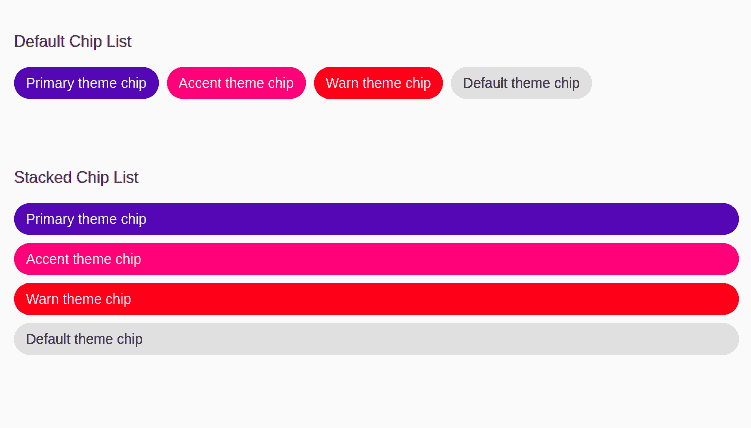

# 如何在棱角材质中使用<mat-chip-list>和<mat-chip>？</mat-chip></mat-chip-list>

> 原文:[https://www . geesforgeks . org/mat-chip-list-and-mat-chip-in-angular-mate/](https://www.geeksforgeeks.org/how-to-use-mat-chip-list-and-mat-chip-in-angular-material/)

Angular Material 是一个 UI 组件库，由 Angular 团队开发，用于构建桌面和移动网络应用程序的设计组件。为了安装它，我们需要在我们的项目中安装 angular，一旦你有了它，你可以输入下面的命令并下载它。mat-chip-list 主要用于标签。

**安装语法:**

```ts
ng add @angular/material
```

**进场:**

*   首先，使用上述命令安装角度材料。
*   安装完成后，从 app.module.ts 文件中的“@ angular/matching/chips”导入“MatChipsModule”。
*   然后使用<mat-chip-list>标签将该组标签内的所有标签或项目分组。</mat-chip-list>
*   在<mat-chip-list>标签中，我们需要对每个项目或标签使用<mat-chip>标签。</mat-chip></mat-chip-list>
*   在 Angular material 中，我们还有一种称为堆栈芯片列表的芯片列表类型，其中所有芯片或标签都像堆栈一样垂直显示。
*   为了以这样的形式显示，我们需要使用这个类名“mat-chip-list-stacked”。
*   如果我们想改变主题，那么我们可以使用 color 属性来改变它。在 angular 中，我们有 3 个主题，它们是主要的、强调的和警告的。
*   完成上述步骤后，就可以开始项目了。

**项目结构:** 如下图。


**代码实现:**

**app.module.ts:**

## java 描述语言

```ts
import { NgModule } from '@angular/core'; 
import { BrowserModule } from '@angular/platform-browser'; 
import { FormsModule } from '@angular/forms'; 
import { MatChipsModule } from '@angular/material/chips'; 

import { AppComponent } from './app.component'; 
import { BrowserAnimationsModule } from '@angular/platform-browser/animations';

@NgModule({ 
  imports: 
  [ BrowserModule, 
    FormsModule, 
    MatChipsModule,
    BrowserAnimationsModule], 
  declarations: [ AppComponent ], 
  bootstrap: [ AppComponent ] 
}) 
export class AppModule { }
```

**app.component.html:**

## 超文本标记语言

```ts
<p>Default Chip List</p>

<mat-chip-list aria-label="Fish selection">
    <mat-chip color="primary" selected>
        Primary theme chip
    </mat-chip>

    <mat-chip color="accent" selected>
        Accent theme chip 
    </mat-chip>

    <mat-chip color="warn" selected>
        Warn theme chip
    </mat-chip>

    <mat-chip>Default theme chip </mat-chip>
</mat-chip-list>
<br><br><br>

<p>Stacked Chip List</p>

<mat-chip-list class="mat-chip-list-stacked"
    aria-label="Fish selection">

    <mat-chip color="primary" selected>
        Primary theme chip 
    </mat-chip>

    <mat-chip color="accent" selected>
        Accent theme chip
    </mat-chip>

    <mat-chip color="warn" selected>
        Warn theme chip
    </mat-chip>

    <mat-chip>Default theme chip </mat-chip>
</mat-chip-list>
```

**输出:**

