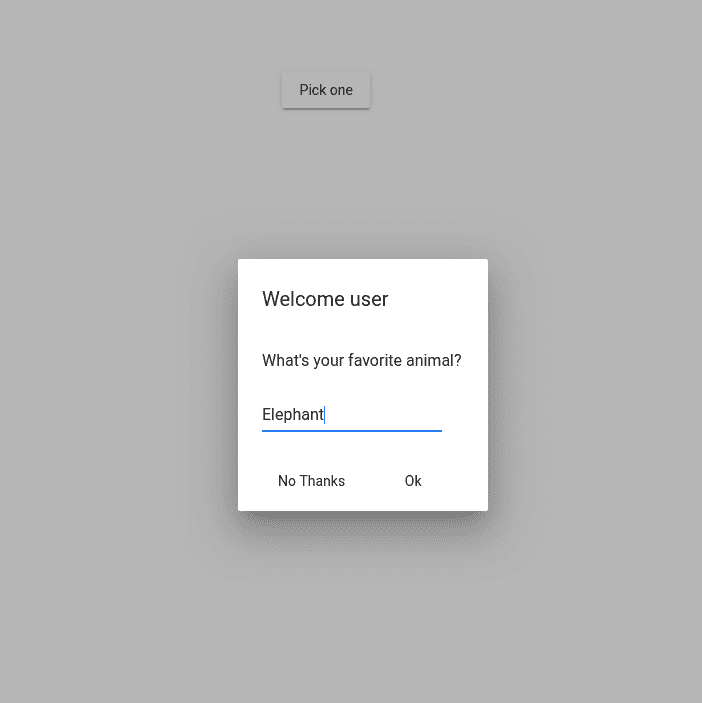
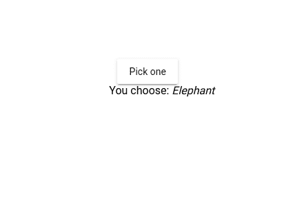

# 如何在 Angular 中使用 Mat-Dialog？

> 原文:[https://www . geesforgeks . org/如何使用 mat-in-dialog-angular/](https://www.geeksforgeeks.org/how-to-use-mat-dialog-in-angular/)

**简介:**
Angular Material 是 Angular 团队开发的 UI 组件库，用于构建桌面和移动 web 应用的设计组件。为了安装它，我们需要在我们的项目中安装 angular，一旦你有了它，你可以输入下面的命令并下载它。

**安装语法:**

```
ng add @angular/material
```

**进场:**

*   首先我们需要从“@angular/material/dialog”导入“MatDialog”，我们需要在构造函数中为它创建一个实例。
*   使用这个实例，我们可以打开对话框组件。
*   现在为对话框创建一个单独的组件，并根据需求编写代码。
*   在对话框组件中，我们需要创建一个“MatDialogRef”的实例，我们应该从“@angular/material/dialog”中导入该实例。
*   从 app.module.ts 文件中的“@angular/material”导入“MatDialogModule”。
*   确保您在模块文件的 entryComponents 数组中提到了对话框组件。

**实现代码:** **app.component.html:**

```
<button mat-raised-button (click)="openDialog()">
    Pick one
</button>
<br>

<span *ngIf="animal">
    You choose: <i>{{animal}}</i>
<span>
```

**app.component.ts:**

```
import { Component } from '@angular/core';
import { MatDialog } from '@angular/material';

import { ExampleDialogComponent } from './example-dialog';

@Component({
  selector: 'app-root',
  templateUrl: 'app.component.html',
})
export class AppComponent {

  animal: string;
  name: string;

  constructor(public dialog: MatDialog) {}

  openDialog(): void {
    let dialogRef = this.dialog.open(ExampleDialogComponent, {
      width: '250px',
      data: { name: this.name, animal: this.animal }
    });

    dialogRef.afterClosed().subscribe(result => {
      this.animal = result;
    });
  }

}
```

**app.module.ts:**

```
import { CommonModule } from '@angular/common';
import { NgModule } from '@angular/core';
import { FormsModule } from '@angular/forms';
import {
  MatButtonModule,
  MatCommonModule,
  MatFormFieldModule,
  MatInputModule,
} from '@angular/material';

import { AppComponent } from './example.component';
import { ExampleDialogModule } from './example-dialog';

@NgModule({
  declarations: [AppComponent],
  exports: [AppComponent],
  imports: [
    ExampleDialogModule,
    CommonModule,
    FormsModule,
    MatButtonModule,
    MatCommonModule,
    MatFormFieldModule,
    MatInputModule,
  ],
})
export class AppModule {}
```

**示例-dialog.component.html:**

```
<h1 mat-dialog-title>Welcome user</h1>
<div mat-dialog-content>
  <p>What's your favorite animal?</p>
  <mat-form-field>
    <input matInput [(ngModel)]="data.animal">
  </mat-form-field>
</div>
<div mat-dialog-actions>
  <button mat-button (click)="onCancel()">No Thanks</button>
  <button mat-button [mat-dialog-close]="data.animal" 
             cdkFocusInitial>Ok</button>
</div>
```

**示例-dialog.component.ts:**

```
import { Component, Inject } from '@angular/core';
import { MatDialogRef, MAT_DIALOG_DATA } from '@angular/material';

@Component({
  selector: 'app-example-dialog',
  templateUrl: 'example-dialog.component.html',
})
export class ExampleDialogComponent {

  constructor(
    public dialogRef: MatDialogRef<ExampleDialogComponent>,
    @Inject(MAT_DIALOG_DATA) public data: any) { }

  onCancel(): void {
    this.dialogRef.close();
  }

}
```

**示例-dialog.module.ts:**

```
import { NgModule } from '@angular/core';
import { FormsModule } from '@angular/forms';
import {
  MatButtonModule,
  MatCommonModule,
  MatDialogModule,
  MatFormFieldModule,
  MatInputModule,
} from '@angular/material';

import { ExampleDialogComponent } from './example-dialog.component';

@NgModule({
  declarations: [ExampleDialogComponent],
  entryComponents: [ExampleDialogComponent],
  imports: [
    FormsModule,
    MatButtonModule,
    MatCommonModule,
    MatDialogModule,
    MatFormFieldModule,
    MatInputModule,
  ],
})
export class ExampleDialogModule {}
```

**输出:**


**对话框打开时输出:**



**当输入值显示在屏幕上时输出:**

