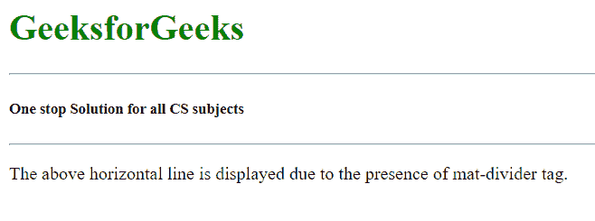

# 如何在角材中使用<mat-divider>？</mat-divider>T3】

> 原文:[https://www . geesforgeks . org/如何使用角形材料垫分隔器/](https://www.geeksforgeeks.org/how-to-use-mat-divider-in-angular-material/)

Angular Material 是一个 UI 组件库，由 Angular 团队开发，用于构建桌面和移动网络应用程序的设计组件。为了安装它，我们需要在我们的项目中安装 angular，一旦你有了它，你可以输入下面的命令并下载它。 **<分垫器>** 标签用于用水平线分隔两个部分或内容。

**安装语法:**

```ts
ng add @angular/material
```

**进场:**

*   首先，使用上述命令安装角度材料。
*   安装完成后，从 app.module.ts 文件中的“@angular/material/divider”导入“MatDividerModule”。
*   导入‘matdividemodule’后，我们需要使用<mat-divider>标签。</mat-divider>
*   当我们使用<mat-divider>时，屏幕上呈现出一条水平灰线。</mat-divider>
*   这个标记的主要目的是分隔任何两个块、div 或任何部分。
*   完成上述步骤后，就可以开始项目了。

**项目结构:** 如下图。


**代码实现:**

**app.module.ts:**

## java 描述语言

```ts
import { NgModule } from '@angular/core'; 
import { BrowserModule } from '@angular/platform-browser'; 
import { FormsModule } from '@angular/forms'; 

import { MatDividerModule } from '@angular/material/divider';
import { AppComponent } from './app.component'; 
import { BrowserAnimationsModule } from '@angular/platform-browser/animations';

@NgModule({ 
  imports: 
  [ 
    BrowserModule, 
    FormsModule, 
    MatDividerModule,
    BrowserAnimationsModule
  ], 
  declarations: [ AppComponent ], 
  bootstrap: [ AppComponent ] 
}) 
export class AppModule { }
```

**app.component.html:**

## 超文本标记语言

```ts
<h1 style="color:green">
    GeeksforGeeks
</h1>

<mat-divider> </mat-divider>

<h5>One stop Solution for all CS subjects</h5>

<mat-divider> </mat-divider>

<p>
    The above horizontal line is displayed 
    due to the presence of mat-divider tag.
</p>
```

**输出:**

