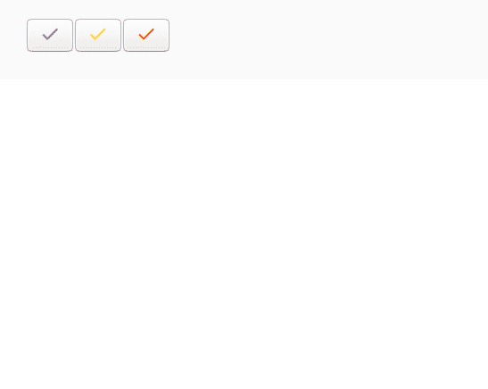

# 如何在 angular 中使用 mat-icon？

> 原文:[https://www . geeksforgeeks . org/如何使用 mat-icon-in-angular/](https://www.geeksforgeeks.org/how-to-use-mat-icon-in-angular/)

要在网页中包含图标，您可以使用 **mat-icon** 指令。以前它被称为 md-icon。最好使用 mat-icon，因为它们提供 SVG 图标，即基于矢量的图标，适用于任何分辨率和尺寸，另一方面，基于光栅的图标具有固定的点模式，具有指定的值，如果调整大小，分辨率会改变。

**进场:**

*   首先，我们必须使用以下语法在您的 HTML 文件中加载字体库:

    > <link href="”https://fonts.googleapis.com/icon?family=Material+Icons”" rel="”stylesheet”">

*   现在使用以下命令将**数学模块**导入到模块文件中:

    ```
    import {MatIconModule} from '@angular/material/icon';
    ```

*   使用以下命令显示图标:

    ```
    <mat-icon>icon-name</mat-icon>
    ```

您可以根据需要更改图标的颜色:

1.  小学。
2.  口音。
3.  警告。

这些图标可以用作按钮，或者可以传达一些信息，例如表单域类型、状态等。

**示例:**

使用 mat-icon 让我们创建三个不同的按钮。

在 index.html 文件中，加载字体库。

```
<html lang="en">
<head>
  <meta charset="utf-8">
  <title>Tutorial</title>

  <!--font library is loaded prior to using mat-icons-->

  <link href=
"https://fonts.googleapis.com/icon?family=Material+Icons&display=block" 
        rel="stylesheet">

</head>
<body>
  <app-child></app-child>
</body>
</html>
```

现在使用 mat-icon 作为按钮。

```
import { Component } from '@angular/core';

@Component({
  selector: 'app-child',
  template: `

  <button ><mat-icon color = "primary">check</mat-icon></button>
  <button ><mat-icon color = "accent">check</mat-icon></button>
  <button ><mat-icon color = "warn">check</mat-icon></button>

  `,
  styleUrls: []
})
export class childComponent {

}
```

**输出:**

