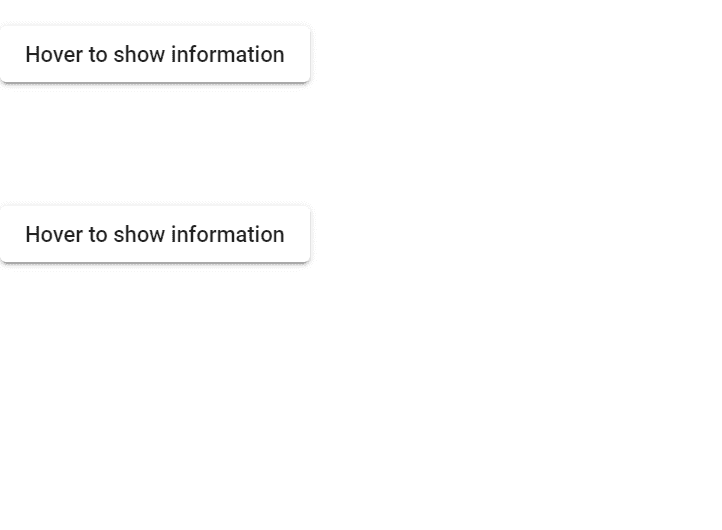

# 如何在角度材质中使用 matTooltip？

> 原文:[https://www . geesforgeks . org/mattooltip-in-angular-material/](https://www.geeksforgeeks.org/how-to-use-mattooltip-in-angular-material/)

Angular Material 是 Angular 团队开发的 UI 组件库，用于构建桌面和移动网络应用程序的设计组件。为了安装它，我们需要在我们的项目中安装 angular，一旦你完成了，你可以输入下面的命令并下载它。**当用户将鼠标悬停在按钮上时，要显示某些信息时，会使用 matTooltip** 。

**安装语法:**

```
ng add @angular/material
```

**进场:**

*   首先，使用上述命令安装角度材料。
*   安装完成后，从 app.module.ts 文件中的“@ angular/material/tooltip module”导入“ MatTooltipModule ”。
*   我们需要使用‘matTooltip’属性来显示我们想要渲染的文本。
*   为了显示位置，我们需要使用“matTooltipPosition”属性。
*   我们还可以自定义工具提示的位置，比如使用下面的名称“上”、“下”、“左”、“右”等。
*   完成上述步骤后，就可以开始项目了。

**项目结构:** 如下图。


**代码实现:**

**app.module.ts:**

## java 描述语言

```
import { NgModule } from '@angular/core'; 
import { BrowserModule } from '@angular/platform-browser'; 
import { FormsModule } from '@angular/forms'; 

import { AppComponent } from './app.component'; 
import { BrowserAnimationsModule } from 
    '@angular/platform-browser/animations';
import { MatTooltipModule } from '@angular/material/tooltip'; 
import { MatButtonModule } from '@angular/material/button'; 

@NgModule({ 
    imports: [ 
        BrowserModule, 
        FormsModule, 
        MatButtonModule,
        MatTooltipModule,
        BrowserAnimationsModule
    ], 
    declarations: [ AppComponent ], 
    bootstrap: [ AppComponent ] 
}) 
export class AppModule { }
```

**app.component.html:**

## 超文本标记语言

```
<br>
<button mat-raised-button matTooltip=
    "Hover to display information on below."
        matTooltipPosition="below">
    Hover to show information
</button>

<br><br><br><br><br>

<button mat-raised-button matTooltip=
    "Hover to display information on right."
        matTooltipPosition="right">
    Hover to show information
</button>
```

**输出:**

