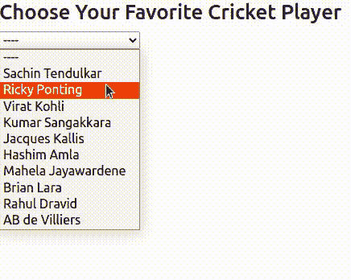

# 如何使用 ngfor 从数组中下拉 Angular？

> 原文:[https://www . geeksforgeeks . org/如何使用从阵列角度下拉菜单/](https://www.geeksforgeeks.org/how-to-use-ngfor-to-make-a-dropdown-in-angular-from-an-array/)

在这篇文章中，我们将看到如何使用 AngularJS 在下拉菜单中显示数组元素。有时我们需要显示动态获取的数据，这就是场景中的特征。我们可以迭代数组，应用条件并轻松显示数据。

**使用 ngforr:**ngforr 是一个内置的模板指令，它可以很容易地迭代数组或对象之类的东西，并为每个项目创建一个模板。

**语法:**

```tshtml
<tag-name  *ngFor="let item of array">{{iter}}</tag-name>
<tag-name  *ngFor="let key of object">{{key}}</tag-name>
```

**先决条件**:必须预装 [NPM](https://www.geeksforgeeks.org/node-js-npm-node-package-manager/) 。

#### 环境设置:

*   安装角度:

```tshtml
npm install -g @angular/cli
```

*   创建新的角度项目:

```tshtml
ng new <project-name>
cd <project-name> 
```

*   通过运行项目来检查安装。您应该会在 http://localhost:4200/上看到角度着陆页面

```tshtml
ng serve -o
```

#### 创建下拉菜单:

1.创建新组件:

```tshtml
ng g c dropdown
```

2.它将创建一个包含 4 个新文件的新目录。打开**下拉菜单，粘贴如下代码:**

**dropdown.component.ts:**

## java 描述语言

```tshtml
import { Component } from '@angular/core';

@Component({
  selector: 'app-dropdown',
  templateUrl: './dropdown.component.html',
  styleUrls: ['./dropdown.component.css']
})
export class DropdownComponent {
  players = [
    "Sachin Tendulkar",
    "Ricky Ponting",
    "Virat Kohli",
    "Kumar Sangakkara",
    "Jacques Kallis",
    "Hashim Amla    ",
    "Mahela Jayawardene    ",
    "Brian Lara",
    "Rahul Dravid",
    "AB de Villiers"
  ]
  selected = "----"

  update(e){
    this.selected = e.target.value
  }
}
```

在上面的代码中，我们已经定义了**玩家**数组，该数组包含我们将在下拉菜单中显示的数据。此外，我们有一个**选定的**变量，我们将使用它来显示选定的元素。方法**更新()**获取一个事件，并将选定的设置为其值。

3.现在将以下代码添加到 **dropdown.component.html 中:**

**dropdown.component.html:**

## 超文本标记语言

```tshtml
<h3>Choose Your Favorite Cricket Player</h3>
<select #cricket (change)="update($event)">
    <option value="default">----</option>
    <option *ngFor="let player of players" [value]="player">
        {{player}}
    </option>
</select>

<p>You selected {{selected}}</p>
```

我们已经创建了一个下拉菜单，将使用玩家阵列。使用神经生长因子填充选项。所选变量用于显示所选选项。

4.最后将此组件添加到**app.component.html**中:

**app.component.html:**

## 超文本标记语言

```tshtml
<app-dropdown></app-dropdown>
```

5.现在运行项目并打开 http://localhost:4200/查看结果:

```tshtml
ng serve -o
```

### 输出

