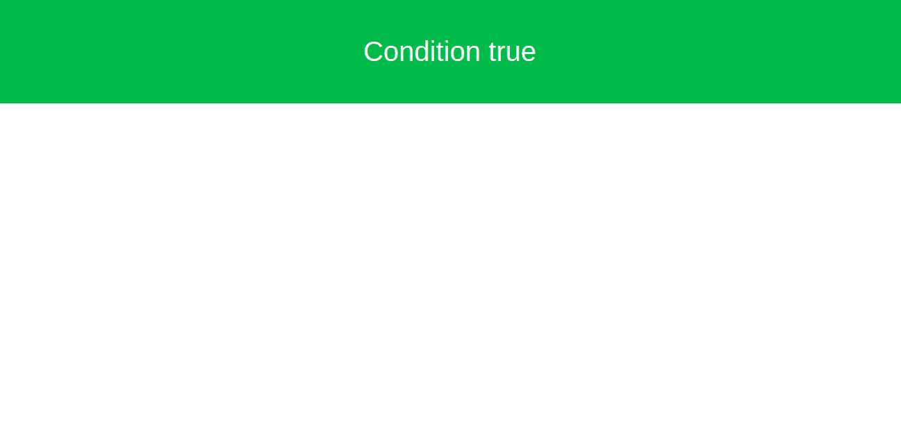
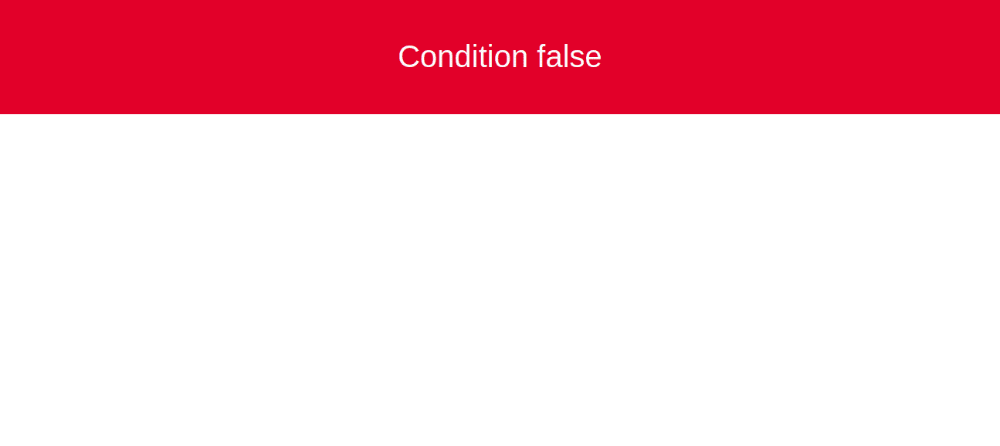

# 如何在 AngularJS 中使用*ngIf else？

> 原文:[https://www . geeksforgeeks . org/如何使用-ngif-else-in-angularjs/](https://www.geeksforgeeks.org/how-to-use-ngif-else-in-angularjs/)

**简介:**ngIf 指令用于显示或隐藏角度应用的部分。它可以添加到任何标签，它是一个普通的 HTML 标签，模板，或选择器。这是一个结构指令，意味着它包括基于约束为布尔值的条件的模板。当表达式计算为真时，它运行/显示“然后”子句中给出的模板。或者，当表达式的计算结果为 false 时，它会显示“else”子句中给出的模板。如果 else 子句中没有任何内容，默认情况下将显示为空白。

**语法:**

```
ngIf with an "else" block
```

```
<div *ngIf="condition; else elseStatement">
    when condition is true.
</div>
<ng-template #elseStatement>
    when condition is false.
</ng-template>
<!--It can be seen that the else 
    clause refers to ng-template,
    with the label #elseStatement -->
```

它在内部创建了两个`<ng-template>`，一个用于*“然后”*语句，另一个用于*“否则”*。因此当 ngIf 的条件为真时，显示未标记的`<ng-template>`的内容。当错误时，被贴上标签的`<ng-template>`运行。

**进场:**

1.  正如我们所知，ngIf else 语句适用于布尔类型的变量。创建一个角度应用程序，并移动到**src/应用程序**。首先，我们需要在 **app.component.ts** 中定义一个变量“check”，值为 true 或 false。

    ```
    <!-- Define a variable say "check" with
         value true/false in app.component.ts -->
    import { Component } from '@angular/core';

    @Component({
      selector: 'app-root',
      templateUrl: './app.component.html',
      styleUrls: ['./app.component.css']
    })

    export class AppComponent {
      check:boolean = true;
    }
    ```

2.  定义一个变量后，移动到**app.component.html**并使用引导类创建两个分区。进入 angular app，编写命令 **npm 安装引导**。第一部分是“真”条件，第二部分是“假”条件。我们已经宣布检查为真，所以我们得到一个绿色部门说条件为真。如果检查结果为假，则会显示一个红色分区，表示条件为假。

    ```
    <!-- *ngIf else -->
    <div class="container-fluid">
        <div class="row bg-success 
                text-light h1 justify-content-center
                align-items-center" *ngIf="check;
                else elseStatement" 
                style="height:150px">Condition true
        </div>

      <ng-template #elseStatement>
        <div class="row bg-danger
                text-light h1 d-flex 
                justify-content-center align-items-center"
                style="height:150px">Condition false
        </div>
      </ng-template>
    </div>
    ```

**输出:**


**输出:**


**优势:**

*   编程语言的`"if"`块支持逻辑运算符，因此也支持`"ngIf"`。它支持所有逻辑运算符，如与、或、非等。
*   ngIf helps to avoid can’t read property error of undefined. Suppose there is a bound property called “student”. We are trying to access the “name” sub-property of the student which has value “Santosh”. If the student is null, it will return error undefined. So if we check for null before accessing sub-property, we will prevent error using *ngIf.

    ```
    <!--This may error-->
    <div>
      {{student.name}}
    </div>

    <!--check using ngIf-->
    <p *ngIf="student">
      {{student.name}}
    </p>
    ```

    **输出:**

    ```
    Santosh
    ```

*   **ngIf vs Hidden:** You might wonder why do we have to use ngIf when we have hidden attribute in HTML5\. Yes, they do the same work but there is still a difference. The hidden attribute hides the selected element from the DOM but the element still exists in the DOM. Whereas ngIf gets rid of the selected part from the DOM. It doesn’t intervene with CSS.

    ```
    <!--check is defined in component.ts 
        with value true (boolean)-->
    <div [hidden]="!check">
      Show this only if "check" is true
    </div>
    ```

    **输出:**

    ```
    Show this only if "check" is true
    ```