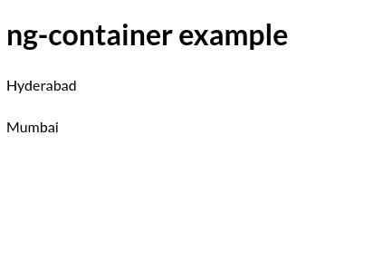
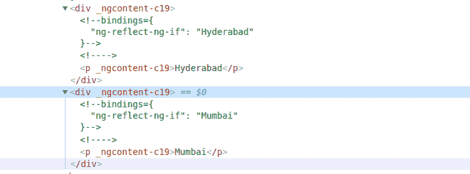

# angular 2 中没有额外元素如何使用 ngIf？

> 原文:[https://www . geeksforgeeks . org/如何使用不带额外成角元素的 ngif 2/](https://www.geeksforgeeks.org/how-to-use-ngif-without-an-extra-element-in-angular2/)

为了在 Angular 2+中使用 [*ngIf](https://www.geeksforgeeks.org/angularjs-ng-if-directive/) 而不需要额外的元素，我们可以使用 [< ng-container >或者< ng-template >](https://www.geeksforgeeks.org/difference-between-ng-container-and-ng-template-in-angularjs/)
但是在很多情况下，推荐使用< ng-container >。
关于使用不带额外元素的*ngIf 的最佳场景如下。

**app.component.ts:**

```ts
import { Component } from '@angular/core';
@Component({
  selector: 'my-app-table',
  template: './app.component.html',
  styleUrls: [ './app.component.css' ]
})
export class AppComponent  {

India=[{city:'Hyderabad'}, {city:'Mumbai'}]

}
```

**app.component.html:**

```ts
<h1>ng-container example</h1>

 <div *ngFor="let state of India"> 
   <ng-container *ngIf="state.city">
      <p> {{ state.city }} </p>
   </ng-container>
 </div>
```



天然气容器的上述代码说明

如果我们检查它，那么我们可以看到在

标签之后和

标签之前没有添加额外的元素。

