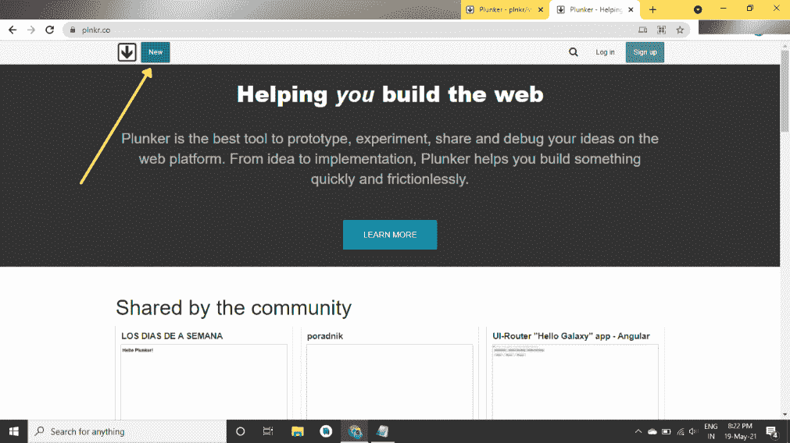
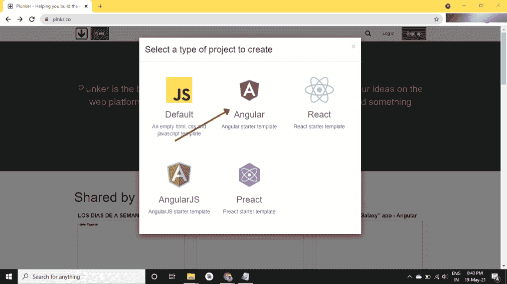
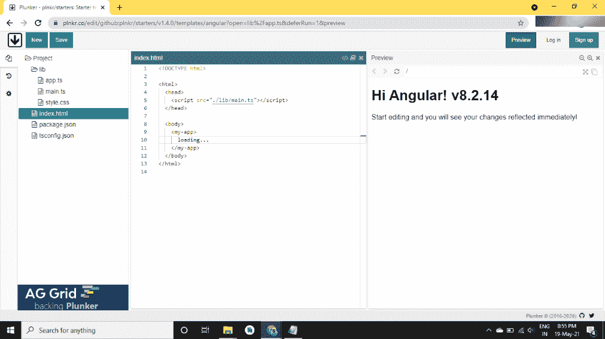
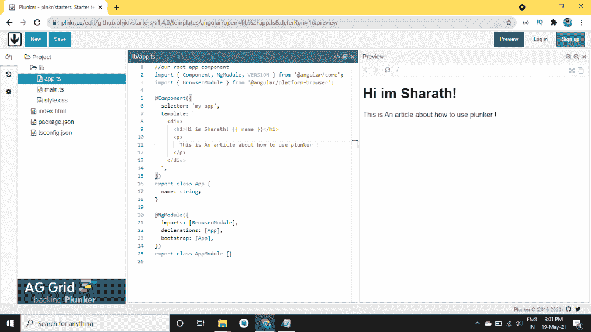
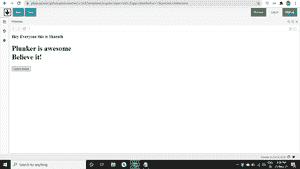

# 如何在 Angular 中使用 Plunker？

> 原文:[https://www . geesforgeks . org/how-用法-angular 中的 plunker/](https://www.geeksforgeeks.org/how-to-use-plunker-in-angular/)

Plunker 是一个网站，开发人员可以在其中收集项目信息，并相互分享他们的想法。您实际上可以实时协作，以便所有团队成员同时工作。Plunker 绝对免费使用，你只需从 Github 注册即可。开始使用它，您还可以实时看到您的工作，也就是说，实时预览是可用的，这样开发人员就可以实时看到他们的工作并相应地修改他们的代码。

易于使用。该网站可能很慢，但它提供了大量的功能来获得有趣的协作体验。

Plunker 是一个基于网络的编辑器，有了它，你可以直接从浏览器创建、编辑和运行 HTML、CSS 和 JavaScript 文件。不需要复杂的设置，每个人都可以立即在浏览器中直接编码。

现在非常有趣的是，每个 plunker 都有自己独特的 **URL** ，你可以和朋友/开发者分享，所以这是一个展示你的作品的神奇方式。但是你不能编辑/修改别人的拨片，相反，你可以分叉它。众所周知，Forking 创建了一个新的 plunker，你拥有所有复制的文件。

如果你的 plunker 有一个**index.html**文件，你可以试着运行这个文件，你可以实时预览。

**普伦克的特点:**

*   永远不要丢掉你的工作
*   全网站搜索
*   桌面集成
*   嵌入式编辑器
*   多文件、多窗格编辑器

**角锤的结构:**角锤由以下文件组成:

*   **index.html**这是一个 HTML 文件，包含了 Angular 应用程序的所有库和设计(引导)。
*   这是主文件，我们将在其中转储属于我们项目的所有 Angular 代码。
*   **system.config.js** 该文件用于处理模块加载和将 TypeScript 编译成 JavaScript 的 SystemJS 的配置。
*   **tsconfig . JSON**TYPescript trans filer 的配置。

**运行步骤:**

*   不需要任何额外的设置一切你可以直接在网上编码。
*   这是普兰克官方的链接:[https://plnkr.co/](https://plnkr.co/)去这个网站，
*   点击显示的新按钮:这将带你到一个弹出窗口



*   现在，您将会看到一个弹出窗口，询问您要对哪种编程语言进行编码选择 **<u>【角度启动器模板】</u>**



*   这里我们已经简单地讨论了每个文件(在 plunker 的结构中)。只要你需要帮助，你就可以开始写你的代码并与你的朋友分享！



*   这只是一个基本的例子，向你展示它是如何工作的。



**例:**

## index.html

```
<body>
    <!-- Begin Webpage -->
    <div class="webpage">
        <div class="red-brand-box">
            <div class="white-brand-box"></div>
        </div>

        <h3 class="presents-text">
            Hey Everyone this is Sharath
        </h3>

        <h1 class="title">
            Plunker is awesome <br /> Believe it!
        </h1>

        <button class="cta-button">
            Learn today
        </button>

        <div class="right-triangle"></div>
    </div>

</body>
```

现在根据你的需要添加 CSS，比如你希望你的网站是什么样子。

```
h1,
p {
    font-family: sans-serif;
}
```

**输出:**



以上都是关于 plunker 的，现在让我们来谈谈 plunker 的一些优点和缺点，给它一个最后的润色，最后通过总结来浓缩文章。

**优势:**

*   Plunker 允许我们向项目中添加多个文件。
*   这只是一个比简单演示更好的方法。
*   它的特点是实时代码协作和实时预览，代码林挺。
*   该项目由麻省理工学院授权。
*   很简单的 UI，没什么复杂的。

**劣势:**

*   不幸的是，嵌入的代码无法直接编辑，您需要在 plunker 上打开它来对代码示例进行更改。
*   与竞争对手相比，这个网站有点慢。