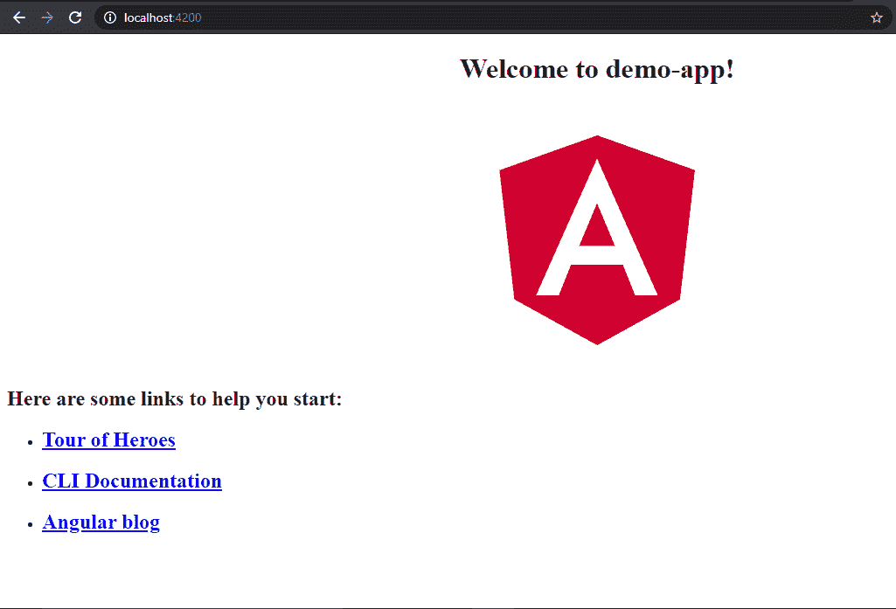
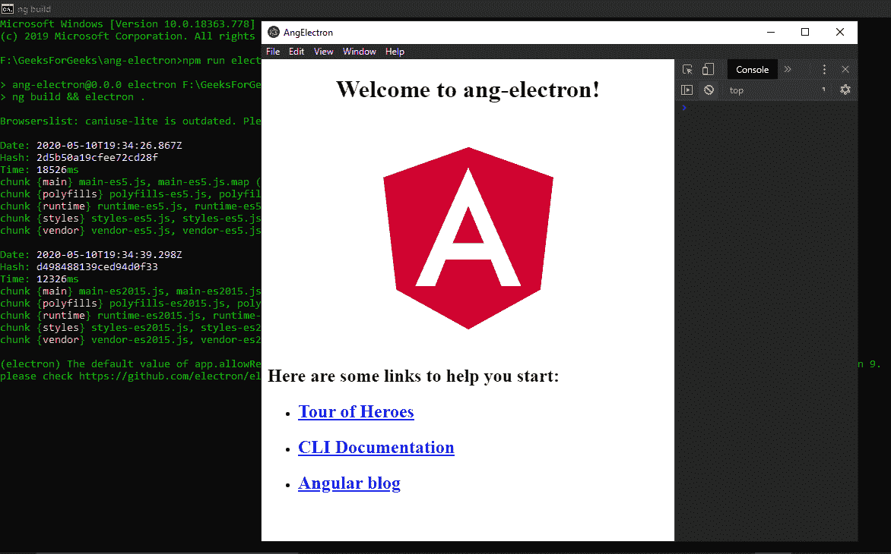
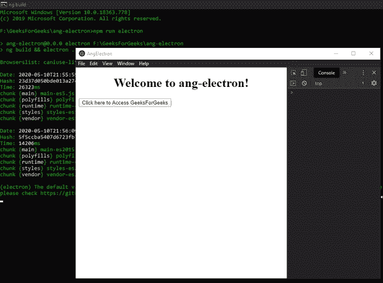

# 将 Angular 7 与 ElectronJS 结合起来

> 原文:[https://www . geesforgeks . org/integrate-angular-7-with-electronijs/](https://www.geeksforgeeks.org/integrate-angular-7-with-electronjs/)

**[electronijs](https://www.geeksforgeeks.org/introduction-to-electronjs/)**是一个开源框架，用于使用能够在 Windows、macOS 和 Linux 操作系统上运行的 HTML、CSS 和 JavaScript 等网络技术构建跨平台的本机桌面应用程序。它将 Chromium 引擎和 NodeJS 结合成一个单一的运行时。

Electron 可以与 **Angular 4+** 、 **AngularJS 1.x** 、 **React** 等几个强大的框架相结合，构建复杂的应用程序并提供增强的功能。电子的核心是一个 **[NodeJS](https://www.geeksforgeeks.org/introduction-to-nodejs/)** 应用，可以和原生的 OS 环境进行交互。通过 NodeJS 集成，我们可以访问几个低级别的 API，否则这些 API 在沙盒浏览器环境中是无法访问的。借助 Angular 集成，我们可以获得一些优势和特性，例如 MVC(模型-视图-控制器)架构、模块和定制指令。本教程将演示如何将 **[Angular 7](https://www.geeksforgeeks.org/angular-7-introduction/)** 与 ElectronJS 集成，并从 Angular 内部访问 Electron APIs。

我们假设您熟悉上述链接中介绍的先决条件。要使电子和角度工作， **[节点](https://www.geeksforgeeks.org/introduction-to-nodejs/)** 和 **[npm](https://www.geeksforgeeks.org/node-js-npm-node-package-manager/)** 需要预先安装在系统中。

**注意:**本教程同样适用于 Angular 5+版本。

**示例:**按照给定的步骤将 Angular 7 与 Electron 积分。

*   **Step 1:** Navigate to an Empty Directory to set up the project, and run the following command,

    ```
    npm install -g @angular/cli
    ```

    在全球范围内安装 **[Angular CLI](https://www.geeksforgeeks.org/angular-cli-angular-project-setup/)** 。Angular CLI 工具用于创建项目、执行测试和部署等任务，以及生成代码的各种组件。通过运行以下命令创建一个新的 Angular 项目，并提供您选择的项目名称，

    ```
    ng new ang-electron
    ```

    此命令提示您提供有关要包含在项目中的要素的信息。按下**回车**键选择合适的。
    T3】

    这也将把所需的角度依赖项和包安装到**节点模块**中。完成后，使用 npm 安装**电子**，并将其保存为开发依赖项。

    ```
    npm install electron --save-dev
    ```

    此时，Angular 应用程序已经就绪，可以在本地提供服务。要在本地主机上运行应用程序，请运行以下命令，

    ```
    cd ang-electron
    ng serve
    ```

    

*   **Step 2:** We will connect both the frameworks via code to launch the Electron application and make it use Angular. As with any Electron project, we need to create an entry point into the application. Create the **main.js** file in our base project folder. This file is going to be our entry point into the application.

    **main.js:**

    ```
    const { app, BrowserWindow } = require('electron')

    function createWindow () {
      // Create the browser window.
      const win = new BrowserWindow({
        width: 800,
        height: 600,
        webPreferences: {
          nodeIntegration: true
        }
      })

      // Load the index.html of the app
      // From the dist folder which is created 
      // After running the build command
      win.loadFile('dist/ang-electron/index.html')

      // Open the DevTools.
      win.webContents.openDevTools()
    }

    // This method will be called when Electron has finished
    // initialization and is ready to create browser windows.
    // Some APIs can only be used after this event occurs.
    // This method is equivalent to 'app.on('ready', function())'
    app.whenReady().then(createWindow)

    // Quit when all windows are closed.
    app.on('window-all-closed', () => {
      // On macOS it is common for applications and their 
      // menu bar to stay active until the user quits 
      // explicitly with Cmd + Q
      if (process.platform !== 'darwin') {
        app.quit()
      }
    })

    app.on('activate', () => {
      // On macOS it's common to re-create a window in the
      // app when the dock icon is clicked and there are 
      // no other windows open.
      if (BrowserWindow.getAllWindows().length === 0) {
        createWindow()
      }
    })

    // In this file, you can include the rest of your app's 
    // specific main process code. You can also put them in 
    // separate files and require them here.
    ```

    **main.js** 文件的样板代码，请参考此[链接](https://www.electronjs.org/docs/tutorial/first-app#electron-development-in-a-nutshell)。我们已经修改了代码以适应我们的项目需求。一旦我们运行了构建命令，它将在**区**文件夹中创建我们的角度项目的分布。我们将从这个文件夹中引用**index.html**文件。

*   **Step 3:** A small change is required in the **index.html** file located in the **src** folder. Replace the following code.

    ```
    <base href="/">
    ```

    随着

    ```
    <'base href="./">
    ```

    这一更改很重要，否则它将无法从 **dist** 文件夹中找到并引用运行应用程序所需的必要文件。我们还需要对 **package.json** 文件进行一些更改。

    **package.json:**

    ```
    {
      "name": "ang-electron",
      "version": "0.0.0",
      "main": "main.js",
      "scripts": {
        "ng": "ng",
        "start": "ng serve",
        "build": "ng build",
        "test": "ng test",
        "lint": "ng lint",
        "e2e": "ng e2e",
        "electron": "ng build && electron ."
      },
    // ...

    ```

    我们已经按照电子的要求指定了 **main.js** 文件。我们还在**脚本**标签中引入了一个新的自定义**电子**命令，用于构建和启动应用程序。 **ng build** 命令用于构建 Angular 应用程序和部署构建工件。它将生成的构建工件写入输出文件夹。默认情况下，输出文件夹为 **dist/** 。

    **输出:**一旦完成相应的更改，我们就可以启动电子应用程序了。要启动应用程序，请运行命令，

    ```
    npm run electron
    ```

    

*   **第四步:**至此，我们已经成功地将 Angular 与 Electron 进行了整合。要在 Angular 中使用电子 API，我们可以遵循以下两种方法中的任何一种:
    *   **Approach 1:** Using an external package to access the Electron APIs. We will use the **ngx-electron** npm package for this purpose. We can use this package as a simple Angular Service to access Electron APIs. For more detailed Information, Refer this [link](https://www.npmjs.com/package/ngx-electron). To install this package, run the following command:

        ```
        npm install ngx-electron --save
        ```

        一旦安装成功，我们将把它导入我们的 **app.module.ts** 文件中，以便在整个应用程序中使用。

        **app.module.ts:**

        ```
        import { BrowserModule } from '@angular/platform-browser';
        import { NgModule } from '@angular/core';
        import { AppRoutingModule } from './app-routing.module';
        import { AppComponent } from './app.component';
        import { NgxElectronModule } from 'ngx-electron';

        @NgModule({
          declarations: [
            AppComponent
          ],
          imports: [
            BrowserModule,
            AppRoutingModule,
            NgxElectronModule
          ],
          providers: [],
          bootstrap: [AppComponent]
        })
        export class AppModule { }
        ```

        该包支持的电子 API 列表，参见本**https://www.npmjs.com/package/ngx-electron#properties**。我们将使用**ngx-electronic**包装中的电子**外壳**原料药。

        **app.component.html:**

        ```
        <div style="text-align:center">
          <h1>
            Welcome to {{ title }}!
          </h1>
        </div>

        <button (click)="openWindow()">
           Click here to Access GeeksForGeeks
        </button>

        <router-outlet></router-outlet>
        ```

        点击此处访问极客页面按钮没有任何相关功能。要进行更改，请对 **app.component.ts** 文件进行以下更改。

        **app.component.ts:**

        ```
        import { Component } from '@angular/core';
        import { ElectronService } from 'ngx-electron';

        @Component({
          selector: 'app-root',
          templateUrl: './app.component.html',
          styleUrls: ['./app.component.css']
        })
        export class AppComponent {
          title = 'ang-electron';

          constructor(private electronService: ElectronService) {}

          openWindow() {
            // Accessing the Shell API from ngx-electron 
            this.electronService
                  .shell.openExternal('https://www.geeksforgeeks.org/');
          }
        }
        ```

        `ElectronService`展示所有可从**渲染器进程**中访问的电子应用编程接口。我们将通过 **[【依赖注入】](https://angular.io/guide/dependency-injection)** 在构造器中创建**电子服务**的实例。

        **输出:** 

    *   **Approach 2:** By creating an Electron [Service](https://angular.io/cli/generate#service-command) component and sharing it across the application for using the Electron APIs. We will generate the Electron Service by running the following CLI command:

        ```
        ng generate service elec --skipTests=true
        ```

        **–skipettes = true**不会为新服务创建**规范**测试文件。该命令将在 **src/app** 文件夹中生成一个新的 **elec.service.ts** 文件。在这个文件中，我们将声明并添加所有的电子进口，然后可以在整个应用程序中使用。我们将使用**主流程**中的电子**外壳** API。

        **电.服务. ts:**

        ```
        import { Injectable } from '@angular/core';
        import { shell } from 'electron';

        @Injectable({
          providedIn: 'root'
        })
        export class ElecService {
          shell: typeof shell;

          constructor() { 
            this.shell = (<any>window).require("electron").shell;
          }
        }
        ```

        **任意**关键字用于**窗口**对象上的**类型断言**。使用`any`转换此对象表示编译器不再将您绑定到**窗口**对象的默认属性。这用于防止在使用电子模块时出现编译时类型错误。如果在**窗口**对象上忽略类型转换，我们将收到以下错误:

        ```
        ERROR in ./node_modules/electron/index.js
        Module not found: Error: Can't resolve 'fs'
        ```

        运算符的 **[类型以字符串的形式返回其操作数的数据类型。在这种情况下，操作数是电子的**外壳**模块。使用这种方法，我们可以访问整个应用程序中的所有电子应用程序接口。要使用该服务，请将以下内容添加到 **app.component.ts** 文件中。](https://www.geeksforgeeks.org/javascript-typeof-operator/)**

        **app.component.ts:**

        ```
        import { Component } from '@angular/core';
        import { ElectronService } from 'ngx-electron';
        import { ElecService } from '../app/elec.service';

        @Component({
          selector: 'app-root',
          templateUrl: './app.component.html',
          styleUrls: ['./app.component.css']
        })
        export class AppComponent {
          title = 'ang-electron';

          // Creating Instances through Dependency Injection
          constructor(private electronService: ElectronService,  
                      private elecService: ElecService) {}

          openWindow() {
            // Accessing the Shell API from ngx-electron 
            // this.electronService
            // .shell.openExternal('https://www.geeksforgeeks.org/');

            // Accessing the Shell API from ElecService
            this.elecService.shell
                     .openExternal('https://www.geeksforgeeks.org/');
          }
        }
        ```

        **输出:** 