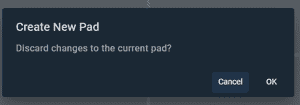

# 安古拉达介绍

> 原文:[https://www.geeksforgeeks.org/introduction-to-angulardart/](https://www.geeksforgeeks.org/introduction-to-angulardart/)

在本文中，我们将了解 AngularDart 框架的基础知识，以及如何在在线模式下开始使用它。所以首先让我们看看什么是 Dart。

**Dart:** Dart 是一种面向对象的编程语言，支持各种编程范例，如类、多态、接口、继承、集合和泛型。Dart 由谷歌开发，用于构建应用程序和服务器。

如果你是一个初学者，并想在下载依赖项之前开始在线实现 Dart 代码，我们建议你去 https://dartpad.dev/?id.。但是如果你想深入了解它，并想在你的系统上实现代码，你可以从它的官方网站 https://dart.dev/tools/sdk/archive.安装 Dart SDK

**镖中代码:**

## 镖

```ts
void main() {  
    var info = "article";  
    var publisher = "Geeks for Geeks";  
    print("This $info is published on $publisher");  
} 
```

**输出:**

```ts
This article is published on Geeks for Geeks
```

在上面的代码中:

*   **void:**void 是返回类型，表示函数没有返回值。
*   **main():**main()函数表示程序的开始，对于程序的执行至关重要。
*   **var:**var 语句声明了一个变量，它可以包含字母、数字或符号。
*   **print():**print()功能用于在控制台上打印输出。

**注意:**我们可以很清楚的看到，它和 C 风格的语法和 JavaScript 的结合非常相似。

**注意:**要了解更多飞镖及其设置，请查看极客的极客[飞镖教程](https://www.geeksforgeeks.org/dart-tutorial/)。

现在让我们看看什么是 AngularDart。

**AngularDart:** AngularDart 是 Google 开发的框架，用于使用 HTML、CSS 和 Dart 构建 web 应用程序、服务器应用程序或单页应用程序。它以其良好的速度、执行力和生产力而闻名。AngularJS 是制作结构化 web 应用程序的著名工具，AngularDart 基本上是 Dart 语言中 Angular 的实现。目前版本的 AngularDart 是 **5.3.1** ，并且正在光纤、谷歌 Play Console 等许多应用中使用。

如果你之前和**旋舞**和**飞镖**合作过，那么你会爱上安古拉达特。

**如何在线运行 AngularDart 代码:**如果您是初学者，想要在线测试您的 AngularDart 代码，请按照以下步骤操作:

**第一步:**打开[镖靶](https://dartpad.dev/)

**第二步:**点击**新 Pad**


**第三步:**当确认框出现时，点击**确定**



**第 4 步:**选择**镖**并切换 HTML 开关**开启**并点击**创建**


**第五步:**现在你可以**编写**镖、HTML 和 CSS 代码，要运行代码，点击**运行**按钮。


**下面是 AngularDart 代码实现:**

## 镖

```ts
import 'dart:html';

void main() {
  var header = querySelector('#header');
  header.text = "Geeks for Geeks ";
}
```

## 超文本标记语言

```ts
<center>
  <h1 id="header"></h1>
  <h2>is best</h2>
</center>
```

## 半铸钢ˌ钢性铸铁(Cast Semi-Steel)

```ts
body {
  display: flex;
  flex-direction: column;
  background-repeat: no-repeat;
  background-size: cover;
  background-image: url(
    "https://pbs.twimg.com/profile_images/1304985167476523008/QNHrwL2q.jpg")
}

h1 {
  color: black;
  font-family: Arial, Helvetica, sans-serif;
}

h2 {
  color: black;
  font-family: Arial, Helvetica, sans-serif;
}
```

**输出:**


在上面的代码中:

1.  我们在 dart 文件中导入了所需库的**‘Dart:html’**。
2.  在主方法中，我们将变量声明为**“头”**。
3.  变量使用 querySelector 获取值。
4.  我们给标题变量分配了一个文本来在 HTML 中使用。
5.  在 HTML 文件中，我们使用 id 作为参数调用了头值。
6.  在 CSS 文件中，我们根据需要设计了元素的样式。

**注意:**如果您想将依赖项下载到您的系统中，请查看 https://angulardart.dev/guide/setup 文档。

现在，让我们看看 AngularDart 和它的类似工具之间的核心区别。

### angolardt 诉 angularjs

<figure class="table">

| AngularDart | 安古斯 |
| --- | --- |
| AngularDart 比 AngularJS 快 | AngularJS 比 AngularDart 慢 |
| AngularDart 是用 Dart 语言编写的 | AngularJS 是用 Javascript 语言编写的 |
| AngularDart 是一个基于类的框架 | AngularJS 是一个基于符号的框架 |
| AngularDart 使用组件。 | AngularJS 使用指令控制器。 |
| AngularDart 使用了 shadowDom | 角度使用无转换包含 |
| 在 AngularDart 中，我们使用 apply 函数。 | 在 AngularJs 中，使用链接/编译函数。 |
| AngularDart 使用属性映射概念 | AngularJS 没有属性映射概念 |

</figure>

### 角度阻力与颤振:

<figure class="table">

| AngularDart | 摆动 |
| --- | --- |
| AngularDart 用于构建网络应用程序。 | Flutter 用于为安卓、iOS 和网络开发跨平台应用程序。 |
| AngularDart 不太受欢迎。 | Flutter 在开发人员中非常受欢迎。 |
| 很少有公司使用 AngularDart。 | 大量公司使用 Flutter 进行应用程序开发。 |

</figure>

### **AngularDart 的优缺点:**

**优点:**

*   角镖源代码是干净的
*   Dart 开发人员的福音。
*   许多与 Typescript 版本不兼容的功能可以与 Dart 版本一起使用。
*   AngularDart 不仅仅是一种编程语言，还是一套稳定的库和坚实的工具。
*   AngularDart 更快。

cons:t1]

*   AngularDart 教程很难找到。
*   不太活跃的天使之星社区。
*   角度组件包不支持互联网浏览器。
*   不太受欢迎，也不像 Angular Typescript 那样是最新的。