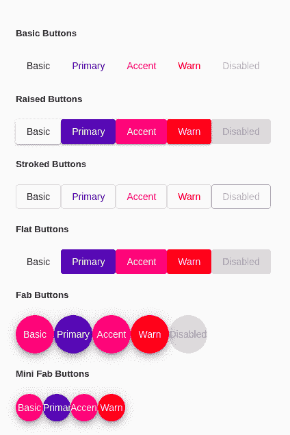

# <mat-button>中有棱角的材料</mat-button>

> 原文:[https://www . geesforgeks . org/mat-button-in-angular-material/](https://www.geeksforgeeks.org/mat-button-in-angular-material/)

Angular Material 是一个 UI 组件库，由 Angular 团队开发，用于构建桌面和移动网络应用程序的设计组件。

为了使用它，我们需要在我们的项目中安装 angular，拥有它后，您可以输入以下命令并下载它。

**安装语法:**

```
ng add @angular/material

```

**角材中按钮的类型:**角材中出现的按钮称为<垫按钮>。它们是许多类型的垫子按钮，有角形材料， 它们是:

<figure class="table">

| **按钮名称**

 | **按钮所使用的标签** | **解释** |
| 基本按钮 | T106】垫-按钮> | They have a frame-shadow. |
| 描边按钮 | <垫-描边-按钮>

 | These buttons do not have any background theme color. |
| 扁平按钮 | <垫子-扁平按钮> | These buttons are very flat, that is, they don't have any kind of animation, only ripple effect. |
| Fab 按钮 | <mat-Fab> | These buttons are round buttons. |
| Mini Fab Buttons | <mat-Mini-Fab> | These buttons are also round, but they are small compared with Fab Buttons. |

</figure>

**进场:**

*   首先，使用上述命令安装角度材料。
*   安装完成后，从 app.module.ts 文件中的“@angular/material/button”导入“MatButtonModule”。
*   然后使用表中的上述标签对所有类型的按钮进行编码。
*   如果我们想改变主题，那么我们可以使用 color 属性来改变它。在 angular 中，我们有 3 个主题，它们是主要的、强调的和警告的。
*   完成上述步骤后，就可以开始项目了。

**代码实现:**在本例中，我们将以角度实现所有类型的<垫钮>。

**app.module.ts:**

## java 描述语言

```
import { NgModule } from '@angular/core';
import { BrowserModule } from '@angular/platform-browser';
import { FormsModule } from '@angular/forms';

import { AppComponent } from './app.component';
import { BrowserAnimationsModule } from '@angular/platform-browser/animations';
import {MatButtonModule} from '@angular/material/button';

@NgModule({
  imports:      [ BrowserModule, 
                  FormsModule, 
                  BrowserAnimationsModule, 
                  MatButtonModule ],
  declarations: [ AppComponent ],
  bootstrap:    [ AppComponent ]
})
export class AppModule { }
```

**app.component.html:**

## 超文本标记语言

```
<h5>Basic Buttons</h5>
<div>
  <button mat-button>Basic</button>
  <button mat-button color="primary">Primary</button>
  <button mat-button color="accent">Accent</button>
  <button mat-button color="warn">Warn</button>
  <button mat-button disabled>Disabled</button>
</div>

<h5>Raised Buttons</h5>
<div>
  <button mat-raised-button>Basic</button>
  <button mat-raised-button color="primary">Primary</button>
  <button mat-raised-button color="accent">Accent</button>
  <button mat-raised-button color="warn">Warn</button>
  <button mat-raised-button disabled>Disabled</button>
</div>

<h5>Stroked Buttons</h5>
<div>
  <button mat-stroked-button>Basic</button>
  <button mat-stroked-button color="primary">Primary</button>
  <button mat-stroked-button color="accent">Accent</button>
  <button mat-stroked-button color="warn">Warn</button>
  <button mat-stroked-button disabled>Disabled</button>
</div>

<h5>Flat Buttons</h5>
<div>
  <button mat-flat-button>Basic</button>
  <button mat-flat-button color="primary">Primary</button>
  <button mat-flat-button color="accent">Accent</button>
  <button mat-flat-button color="warn">Warn</button>
  <button mat-flat-button disabled>Disabled</button>
</div>

<h5>Fab Buttons</h5>
<div>
  <button mat-fab>Basic</button>
  <button mat-fab color="primary">Primary</button>
  <button mat-fab color="accent">Accent</button>
  <button mat-fab color="warn">Warn</button>
  <button mat-fab disabled>Disabled</button>
</div>

<h5>Mini Fab Buttons</h5>
<div>
  <button mat-mini-fab>Basic</button>
  <button mat-mini-fab color="primary">Primary</button>
  <button mat-mini-fab color="accent">Accent</button>
  <button mat-mini-fab color="warn">Warn</button>
</div>
```

**输出:**

