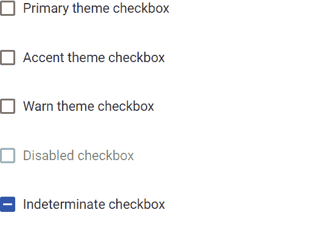

# <mat-checkbox>在</mat-checkbox>角材

> 原文:[https://www . geesforgeks . org/mat-checkbox-in-angular-material/](https://www.geeksforgeeks.org/mat-checkbox-in-angular-material/)

Angular Material 是一个 UI 组件库，由 Angular 团队开发，用于构建桌面和移动网络应用程序的设计组件。为了安装它，我们需要在我们的项目中安装 angular，一旦你有了它，你可以输入下面的命令并下载它。<mat-checkbox>用于在我们有多个选项要选择时进行检查或选择。</mat-checkbox>

**安装语法:**

```
ng add @angular/material
```

**进场:**

*   首先，使用上述命令安装角度材料。
*   安装完成后，从 app.module.ts 文件中的“@ angular/MatCheckboxModule/checkbox”导入“matcheckbox module”。
*   然后我们需要使用<mat-checkbox>标签来显示复选框。</mat-checkbox>
*   我们还可以使用禁用的输入属性来禁用复选框。
*   如果我们想改变主题，那么我们可以使用 color 属性来改变它。在 angular 中，我们有 3 个主题，它们是主要的、强调的和警告的。
*   完成上述步骤后，就可以开始项目了。

**项目结构:**如下图:


## app.module.ts

```
import { NgModule } from '@angular/core'; 
import { BrowserModule } from '@angular/platform-browser'; 
import { FormsModule } from '@angular/forms'; 

import { MatCheckboxModule } from '@angular/material/checkbox';
import { AppComponent } from './app.component'; 
import { BrowserAnimationsModule } from '@angular/platform-browser/animations';

@NgModule({ 
  imports: 
  [ 
    BrowserModule, 
    FormsModule, 
    MatCheckboxModule,
    BrowserAnimationsModule
  ], 
  declarations: [ AppComponent ], 
  bootstrap: [ AppComponent ] 
}) 

export class AppModule { }
```

## app.component.html

```
<mat-checkbox color="primary"> 
  Primary theme checkbox
</mat-checkbox>

<br>
<br>

<mat-checkbox color="accent"> 
  Accent theme checkbox
</mat-checkbox>

<br>
<br>

<mat-checkbox color="warn"> 
  Warn theme checkbox
</mat-checkbox>

<br>
<br>

<mat-checkbox color="warn" disabled> 
  Disabled  checkbox
</mat-checkbox>

<br>
<br>

<mat-checkbox color="primary" indeterminate="true"> 
  Indeterminate  checkbox
</mat-checkbox>
```

**输出:**

