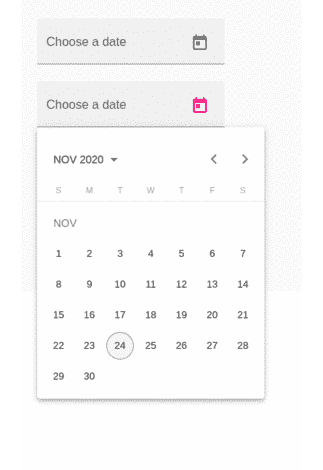
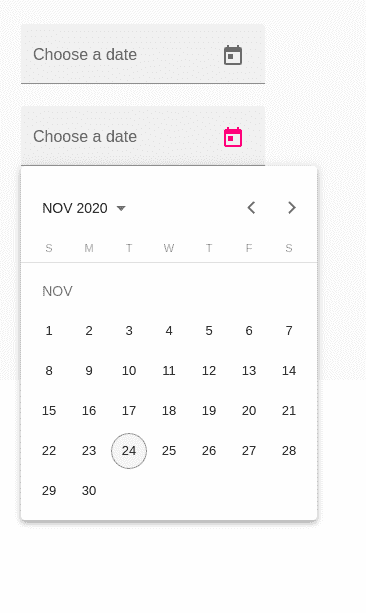
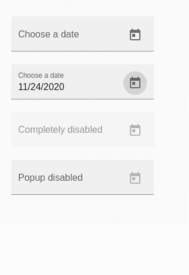
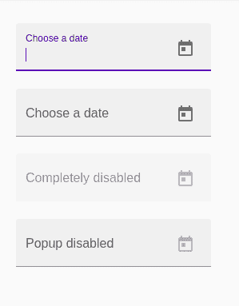
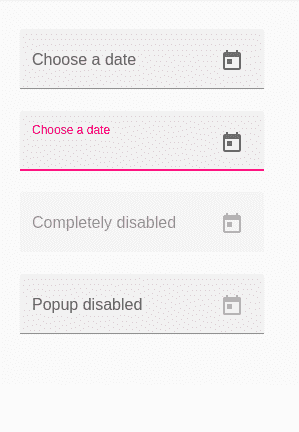

# 角度材料中的垫日期拾取器

> 原文:[https://www . geesforgeks . org/mat-date-picker-in-angular-material/](https://www.geeksforgeeks.org/mat-date-picker-in-angular-material/)

Angular Material 是一个 UI 组件库，由 Angular 团队开发，用于构建桌面和移动网络应用程序的设计组件。为了安装它，我们需要在我们的项目中安装 angular，一旦你有了它，你可以输入下面的命令并下载它。

**安装语法:**

```ts
ng add @angular/material
```

**进场:**

*   首先，使用上述命令安装角度材料。
*   安装完成后，从 app.module.ts 文件中的“@angular/material”导入“MatDatepickerModule”。
*   然后使用<mat-datepicker-toggle>标签使用角度材料日期选择器和以及 matInput。</mat-datepicker-toggle>
*   我们还可以禁用日期选择器的弹出窗口，并手动输入日期。不同的颜色有不同的主题。
*   为了改变主题，我们需要传递一个颜色属性。下面我使用了一个强调主题和默认主题来给出一个更广阔的视角。
*   完成上述步骤后，就可以开始项目了。

**代码实现:**

**app.module.ts:**

## java 描述语言

```ts
import { NgModule } from '@angular/core';
import { BrowserModule } from 
    '@angular/platform-browser';
import { FormsModule } from '@angular/forms';

import { AppComponent } from './app.component';
import { BrowserAnimationsModule } from 
    '@angular/platform-browser/animations';
import { MatButtonModule } from 
    '@angular/material/button';
import { MatButtonToggleModule } from 
    '@angular/material/button-toggle';
import { MatDatepickerModule } from 
    '@angular/material/datepicker';
import { MatInputModule } from 
    '@angular/material/input';
import { MatFormFieldModule } from 
    '@angular/material/form-field';
import { MatNativeDateModule } from 
    '@angular/material/core';

@NgModule({
    imports: [BrowserModule,
        FormsModule,
        BrowserAnimationsModule,
        MatButtonModule,
        MatButtonToggleModule,
        MatDatepickerModule,
        MatInputModule,
        MatFormFieldModule,
        MatNativeDateModule
    ],
    declarations: [AppComponent],
    bootstrap: [AppComponent]
})
export class AppModule { }
```

**app.component.html:**

## 超文本标记语言

```ts
<mat-form-field appearance="fill">
    <mat-label>Choose a date</mat-label>
    <input matInput [matDatepicker]="picker1">
    <mat-datepicker-toggle matSuffix [for]="picker1">
    </mat-datepicker-toggle>
    <mat-datepicker #picker></mat-datepicker>
</mat-form-field>
<br>

<mat-form-field color="accent" appearance="fill">
    <mat-label>Choose a date</mat-label>
    <input matInput [matDatepicker]="picker2">
    <mat-datepicker-toggle matSuffix [for]="picker2">
    </mat-datepicker-toggle>
    <mat-datepicker #picker2></mat-datepicker>
</mat-form-field>
<br>

<mat-form-field appearance="fill">
    <mat-label>Completely disabled</mat-label>
    <input matInput [matDatepicker]="picker3" disabled>
    <mat-datepicker-toggle matSuffix [for]="picker3">
    </mat-datepicker-toggle>
    <mat-datepicker #picker3></mat-datepicker>
</mat-form-field>
<br>

<mat-form-field appearance="fill">
    <mat-label>Popup disabled</mat-label>
    <input matInput [matDatepicker]="picker4">
    <mat-datepicker-toggle matSuffix [for]="picker4" 
        disabled>
    </mat-datepicker-toggle>
    <mat-datepicker #picker4></mat-datepicker>
</mat-form-field>
```

**输出:**

*   **GIF :**



*   **输出图像:**这是打开包含日历的弹出窗口的方式:



*   选择日历后，日期显示方式如下:

 

*   如果使用的主题是重音主题:

