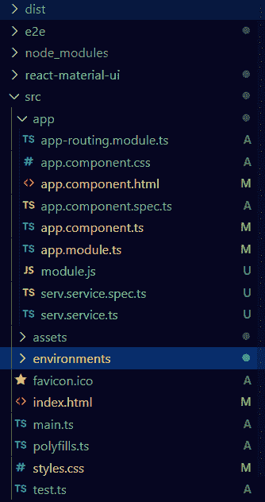

# <mat-label>在</mat-label>角材

> 原文:[https://www . geesforgeks . org/mat-label-in-angular-material/](https://www.geeksforgeeks.org/mat-label-in-angular-material/)

Angular Material 是一个 UI 组件库，由 Angular 团队开发，用于构建桌面和移动网络应用程序的设计组件。为了安装它，我们需要在我们的项目中安装 angular，一旦你有了它，你可以输入下面的命令并下载它。mat-label 类似于我们在普通 HTML 表单中使用的标签。但是 mat-label 的优势在于它有预定义的 CSS 样式类和动画。

**安装语法:**

```
ng add @angular/material
```

**进场:**

*   首先，使用上述命令安装角度材料。
*   安装完成后，从 app.module.ts 文件中的“@angular/material/form-field”导入“MatFormFieldModule”。
*   现在我们需要在<mat-form-field>标签中使用带有各自标签名称的<mat-label>标签。</mat-label></mat-form-field>
*   下面是一个如何在<mat-form-field>中使用<mat-label>标签的例子</mat-label></mat-form-field>
*   完成上述步骤后，就可以开始项目了。

**项目结构:** 如下图。



**代码实现:**

**app.module.ts:**

## java 描述语言

```
import { NgModule } from '@angular/core'; 
import { BrowserModule } from '@angular/platform-browser'; 
import { FormsModule } from '@angular/forms'; 
import { MatFormFieldModule } from '@angular/material/form-field'; 

import { AppComponent } from './app.component'; 
import { BrowserAnimationsModule } from 
    '@angular/platform-browser/animations';

@NgModule({ 
  imports: 
  [ BrowserModule, 
    FormsModule, 
    MatFormFieldModule,
    BrowserAnimationsModule], 
  declarations: [ AppComponent ], 
  bootstrap: [ AppComponent ] 
}) 
export class AppModule { }
```

**app.component.html:**

## 超文本标记语言

```
<mat-form-field appearance="legacy">
    <mat-label>Mat Label Example</mat-label>
    <input matInput placeholder="Placeholder">
</mat-form-field>
```

**输出:**

