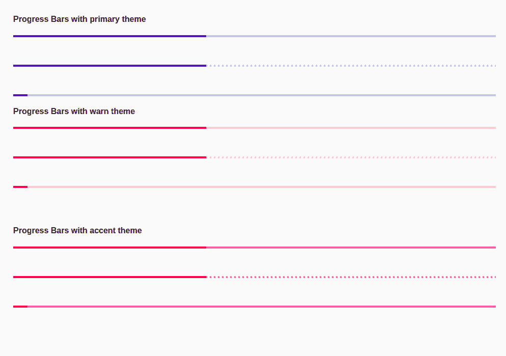

# <mat-progress-bar>在</mat-progress-bar>角材

> 原文:[https://www . geesforgeks . org/mat-进度条-in-angular-material/](https://www.geeksforgeeks.org/mat-progress-bar-in-angular-material/)

**简介:**

Angular Material 是一个 UI 组件库，由 Angular 团队开发，用于构建桌面和移动网络应用程序的设计组件。为了安装它，我们需要在我们的项目中安装 angular，一旦你有了它，你可以输入下面的命令并下载它。<mat-progress-bar>标签用于显示进度条。进度条用于指示特定任务的状态。</mat-progress-bar>

**安装语法:**

```
ng add @angular/material
```

**进场:**

*   首先，使用上述命令安装角度材料。
*   安装完成后，从 app.module.ts 文件中的“@angular/material/progress-bar”导入“MatProgressBarModule”。
*   要使用进度条，我们只需要使用<mat-progress-bar>标签。</mat-progress-bar>
*   它们是许多类型的进度条，如确定的、不确定的、缓冲的等等。
*   为了显示进度，我们需要给标签赋予一个 value 属性。
*   如果我们想改变主题，那么我们可以使用 color 属性来改变它。在 angular 中，我们有 3 个主题，它们是主要的、强调的和警告的。
*   完成上述步骤后，就可以开始项目了。

**代码实现:**

**app.module.ts:**

## java 描述语言

```
import { CommonModule } from '@angular/common'; 
import { NgModule } from '@angular/core'; 
import { FormsModule } from '@angular/forms'; 
import { MatProgressBarModule } from '@angular/material'; 

import { AppComponent } from './example.component'; 

@NgModule({ 
  declarations: [AppComponent], 
  exports: [AppComponent], 
  imports: [ 
    CommonModule, 
    FormsModule, 
    MatProgressBarModule

  ], 
}) 
export class AppModule {}
```

**app.component.html:**

## 超文本标记语言

```
<h4> Progress Bars with primary theme </h4>

<mat-progress-bar mode="determinate" 
    value="40"></mat-progress-bar>
<br><br><br>

<mat-progress-bar mode="buffer" 
    value="40"></mat-progress-bar>
<br><br><br>

<mat-progress-bar mode="indeterminate" 
    value="40"></mat-progress-bar>

<h4> Progress Bars with warn theme </h4>
<mat-progress-bar mode="determinate" 
    value="40" color="warn"></mat-progress-bar>
<br><br><br>

<mat-progress-bar mode="buffer" value="40" 
    color="warn"></mat-progress-bar>
<br><br><br>

<mat-progress-bar mode="indeterminate" 
    value="40" color="warn"></mat-progress-bar>
<br><br><br>

<h4> Progress Bars with accent theme </h4>

<mat-progress-bar mode="determinate" value="40"
        color="accent"></mat-progress-bar>
<br><br><br>

<mat-progress-bar mode="buffer" value="40" 
    color="accent"></mat-progress-bar>
<br><br><br>

<mat-progress-bar mode="indeterminate" 
    value="40" color="accent"></mat-progress-bar>
```

**输出:**

