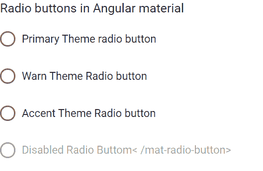

# <mat-radio-button>在</mat-radio-button>角材

> 原文:[https://www . geesforgeks . org/mat-radio-button-in-angular-material/](https://www.geeksforgeeks.org/mat-radio-button-in-angular-material/)

Angular Material 是一个 UI 组件库，由 Angular 团队开发，用于构建桌面和移动网络应用程序的设计组件。为了安装它，我们需要在我们的项目中安装 angular，一旦你有了它，你可以输入下面的命令并下载它。<mat-radio-button>用于当我们有多个选项时选择一个选项。</mat-radio-button>

**安装语法:**

```ts
ng add @angular/material
```

**进场:**

*   首先，使用上述命令安装角度材料。
*   安装完成后，从 app.module.ts 文件中的“@ angular/MatRadioModule/radio”导入“MatRadioModule”。
*   然后我们需要使用<mat-radio-button>标签来显示单选按钮。</mat-radio-button>
*   我们还可以使用 disabled input 属性禁用单选按钮。
*   如果我们想改变主题，那么我们可以使用 color 属性来改变它。在 angular 中，我们有 3 个主题，它们是主要的、强调的和警告的。
*   完成上述步骤后，就可以开始项目了。

**项目结构:**如下图:


**文件名:app.module.ts**

## java 描述语言

```ts
import { NgModule } from '@angular/core';
import { BrowserModule } from '@angular/platform-browser';
import { FormsModule } from '@angular/forms';

import { MatRadioModule } from '@angular/material/radio';
import { AppComponent } from './app.component';
import { BrowserAnimationsModule } from '@angular/platform-browser/animations';

@NgModule({
  imports:
  [
    BrowserModule,
    FormsModule,
    MatRadioModule,
    BrowserAnimationsModule
  ],
  declarations: [ AppComponent ],
  bootstrap: [ AppComponent ]
})

export class AppModule { }
```

**文件名:app.component.html**

## 超文本标记语言

```ts
<h3> Radio buttons in Angular material </h3>

<mat-radio-button value="1" color="primary">
  Primary Theme radio button
</mat-radio-button><br><br>

<mat-radio-button value="2" color="warn">
  Warn Theme Radio button
</mat-radio-button><br><br>

<mat-radio-button value="3" color="accent">
  Accent Theme Radio button
</mat-radio-button>

<br>
<br>

<mat-radio-button value="4" color="accent" disabled>
  Disabled Radio Button
</mat-radio-button>
```

**输出:**

