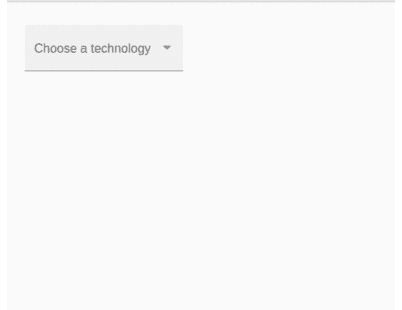

# <mat-select>在</mat-select>角材

> 原文:[https://www . geesforgeks . org/mat-select-in-angular-material/](https://www.geeksforgeeks.org/mat-select-in-angular-material/)

**简介:**
Angular Material 是 Angular 团队开发的 UI 组件库，用于构建桌面和移动 web 应用的设计组件。为了安装它，我们需要在我们的项目中安装 angular，一旦你有了它，你可以输入下面的命令并下载它。< mat-select >标签用于显示下拉菜单中的选项。

**安装语法:**

```
ng add @angular/material
```

**进场:**

*   首先，使用上述命令安装角度材料。
*   安装完成后，从 app.module.ts 文件中的“@angular/material/select”导入“MatSelectModule”。
*   然后使用<mat-select>标签将该组标签内的所有项目分组。</mat-select>
*   在<mat-select>标签中，我们需要对每个项目使用<mat-option>标签。</mat-option></mat-select>
*   我们还可以使用 disabled 属性禁用选项。
*   完成上述步骤后，就可以开始项目了。

**代码实现:**

**T2**

## java 描述语言

```
import { CommonModule } from '@angular/common'; 
import { NgModule } from '@angular/core'; 
import { FormsModule } from '@angular/forms'; 
import { MatSelectModule,MatFormFieldModule } 
    from '@angular/material'; 

import { AppComponent } from './example.component'; 

@NgModule({ 
  declarations: [AppComponent], 
  exports: [AppComponent], 
  imports: [ 
    CommonModule, 
    FormsModule, 
    MatSelectModule,
    MatFormFieldModule

  ], 
}) 
export class AppModule {}
```

**app.component.html:**

## 超文本标记语言

```
<mat-form-field appearance="fill">
  <mat-label>Choose a technology</mat-label>
  <mat-select>
    <mat-option value="html"> HTML </mat-option>
    <mat-option value="css" disabled>CSS (disabled)</mat-option>
    <mat-option value="js">JAVASCRIPT</mat-option>
  </mat-select>
</mat-form-field>
```

**输出:**



**参考:**T2】https://material.angular.io/components/select/overview