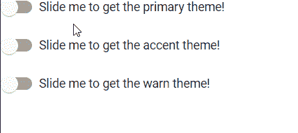

# 角形材料中的垫-滑动-肘节

> 原文:[https://www . geesforgeks . org/mat-slide-toggle-in-angular-material/](https://www.geeksforgeeks.org/mat-slide-toggle-in-angular-material/)

Angular Material 是一个 UI 组件库，由 Angular 团队开发，用于构建桌面和移动网络应用程序的设计组件。为了安装它，我们需要在我们的项目中安装 angular，一旦你有了它，你可以输入下面的命令并下载它。

**mat-slide-toggle** 是一种开关或按钮，用于在“1”和“关”或“真”或“假”等状态之间切换。

**安装语法:**

```ts
ng add @angular/material
```

**进场:**

*   首先，使用上述命令安装角度材料。
*   安装完成后，从 app.module.ts 文件中的“@angular/material/ 滑动切换导入“ MatSlideToggleModule ”。
*   然后使用 mat-slide-toggle 标签显示一个切换按钮。
*   为了写出这个按钮的意义，我们需要在开始和结束标签之间提到它。
*   如果我们想改变主题，那么我们可以使用 color 属性来改变它。在 angular 中，我们有 3 个主题，它们是主要的、强调的和警告的。
*   完成上述步骤后，就可以开始项目了。

**代码实现:**

**app.module.ts:**

## java 描述语言

```ts
import { NgModule } from '@angular/core'; 
import { BrowserModule } from '@angular/platform-browser'; 
import { FormsModule } from '@angular/forms'; 

import { AppComponent } from './app.component'; 
import { MatSlideToggleModule } from '@angular/material/slide-toggle';

@NgModule({ 
imports: 
[ BrowserModule, 
    FormsModule, 
  MatSlideToggleModule
], 
declarations: [ AppComponent ], 
bootstrap: [ AppComponent ] 
}) 

export class AppModule { }
```

**app.component.html:**

## 超文本标记语言

```ts
<mat-slide-toggle color="primary">
  Slide me to get the primary theme!
</mat-slide-toggle> <br />
<br />
<mat-slide-toggle color="accent">
  Slide me to get the accent theme!
</mat-slide-toggle>
<br />
<br />
<mat-slide-toggle color="warn">
  Slide me to get the warn theme!
</mat-slide-toggle>
```

**输出:**

