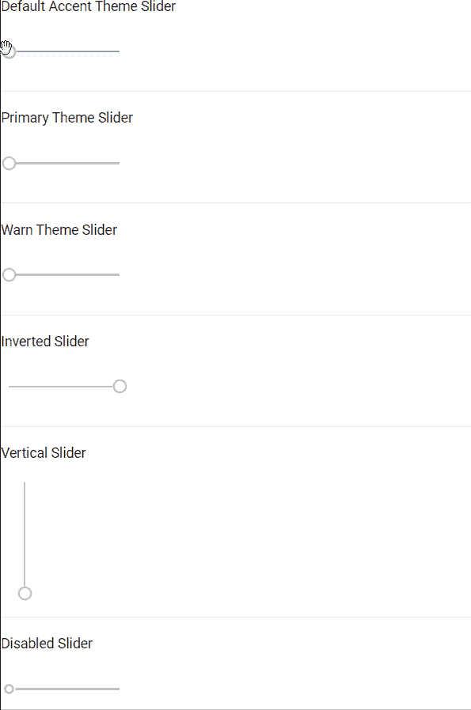

# <mat-slider>在</mat-slider>角材

> 原文:[https://www . geesforgeks . org/mat-角形滑块-材料/](https://www.geeksforgeeks.org/mat-slider-in-angular-material/)

Angular Material 是一个 UI 组件库，由 Angular 团队开发，用于构建桌面和移动网络应用程序的设计组件。为了安装它，我们需要在我们的项目中安装 angular，一旦你有了它，你可以输入下面的命令并下载它。在我们的项目中，只要需要滑块，就会使用标签。

**安装语法:**

```ts
ng add @angular/material
```

**进场:**

*   首先，使用上述命令安装角度材料。
*   安装完成后，从 app.module.ts 文件中的“@angular/material/slider”导入“MatSliderModule”。
*   然后使用垫子滑块标签来显示滑块。
*   它们是<mat-slider>中的很多属性，帮助我们在不同的场景中使用它。</mat-slider>
*   下表解释了一些重要的属性。
*   如果我们想改变主题，那么我们可以使用 color 属性来改变它。在 angular 中，我们有 3 个主题，它们是主要的、强调的和警告的。
*   默认情况下，会设置强调主题。
*   完成上述步骤后，就可以开始项目了。

<figure class="table">

| **物业名称** | **意义** |
| 转化的 | 以便以相反的方向显示滑块。 |
| 垂直的 | 以便在垂直方向上显示滑块。 |
| 有缺陷的 | 为了禁用滑块 |

</figure>

**代码实现:**

**app.module.ts:**

## java 描述语言

```ts
import { NgModule } from '@angular/core'; 
import { BrowserModule } from '@angular/platform-browser'; 
import { FormsModule } from '@angular/forms'; 

import { AppComponent } from './app.component'; 
import { MatSliderModule } from '@angular/material/slider'; 

@NgModule({ 
  imports: 
  [ BrowserModule, 
    FormsModule, 
    MatSliderModule], 
  declarations: [ AppComponent ], 
  bootstrap: [ AppComponent ] 
}) 
export class AppModule { }
```

**app.component.html:**

## 超文本标记语言

```ts
<p>Default Accent Theme Slider</p>
<mat-slider></mat-slider>
<hr>

<p>Primary Theme Slider</p>
<mat-slider color="primary"></mat-slider>
<hr>

<p>Warn Theme Slider</p>
<mat-slider color="warn"></mat-slider>
<hr>

<p>Inverted Slider</p>
<mat-slider invert="true"></mat-slider>
<hr>

<p>Vertical Slider</p>
<mat-slider vertical="true"></mat-slider>
<hr>

<p>Disabled Slider</p>
<mat-slider disabled="true"></mat-slider>
<hr>
```

**输出:**

