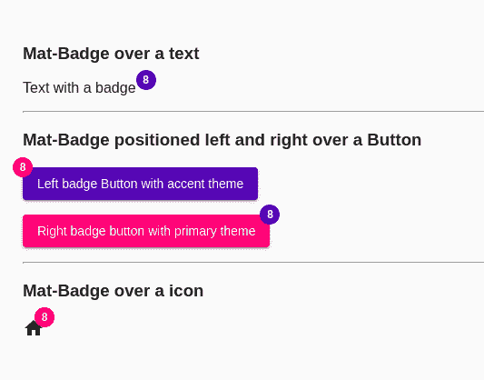

# 有角材料的 MatBadge

> 原文:[https://www.geeksforgeeks.org/matbadge-in-angular-material/](https://www.geeksforgeeks.org/matbadge-in-angular-material/)

Angular Material 是一个 UI 组件库，由 Angular 团队开发，用于构建桌面和移动网络应用程序的设计组件。为了安装它，我们需要在我们的项目中安装 angular，一旦你有了它，你可以输入下面的命令并下载它。

主要使用 **matBadge** 并赋值，以便在文本、图像或图标上显示数字或状态。我们可以将它们关联为通知图标编号指示器。

**安装语法:**

```
ng add @angular/material
```

**进场:**

*   首先，使用上述命令安装角度材料。
*   安装完成后，从 app.module.ts 文件中的“@angular/material/badge”导入“MatBadgeModule”。
*   然后使用 matBadge 并指定一个数字，将其显示在任何文本或图像上。
*   为了定制徽章的大小和位置，我们还有其他属性，如 matBadgeOverlap 和 matBadgeSize。
*   如果我们想改变主题，那么我们可以使用 matBadgeColor 属性来改变它。在 angular 中，我们有 3 个主题，它们是主要的、强调的和警告的。
*   完成上述步骤后，就可以开始项目了。

**代码实现:**

**app.module.ts:**

## java 描述语言

```
import { NgModule } from '@angular/core';
import { BrowserModule } from '@angular/platform-browser';
import { FormsModule } from '@angular/forms';

import { AppComponent } from './app.component';
import { MatBadgeModule} from '@angular/material/badge'; 
import { MatIconModule} from '@angular/material/icon'; 
import { MatButtonModule} from '@angular/material/button'; 

@NgModule({
  imports:
  [ BrowserModule, 
    FormsModule,
    MatButtonModule, 
    MatBadgeModule,
    MatIconModule ],
  declarations: [ AppComponent ],
  bootstrap:    [ AppComponent ]
})
export class AppModule { }
```

**app.component.html:**

## 超文本标记语言

```
<h3> Mat-Badge over a text</h3>

<p>
    <span matBadge="8" matBadgeOverlap="false">
        Text with a badge
    </span>
</p>
<hr>

<h3>
    Mat-Badge positioned left 
    and right over a Button
</h3>

<p>
    <button mat-raised-button color="primary"
        matBadge="8" matBadgePosition="before" 
        matBadgeColor="accent">
        Left badge Button with accent theme
    </button>
</p>

<p>
    <button mat-raised-button color="accent" 
        matBadge="8" matBadgePosition="after" 
        matBadgeColor="primary">
        Right badge button with primary theme
    </button>
</p>
<hr>

<h3> Mat-Badge over a icon</h3>

<p>
    <mat-icon matBadge="8" matBadgeColor="warn">
        home
    </mat-icon>
</p>
```

**输出:**

