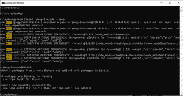
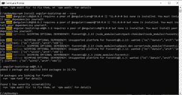
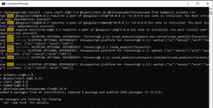
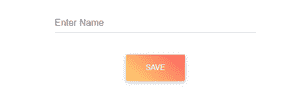

# 角度的 MDBootstrap 介绍和安装

> 原文:[https://www . geesforgeks . org/mdbootstrap-introduction-and-installation-for-angular/](https://www.geeksforgeeks.org/mdbootstrap-introduction-and-installation-for-angular/)

**简介:****MDBootstrap(Bootstrap 的材质设计)**是一个完整的 UI 包，可以和 **Angular、React、Vue、**等其他框架集成。它被用来设计一个完全响应和移动友好的布局，使用各种组件，插件，动画，使其更具吸引力和用户友好性，与其他浏览器兼容。

**MDBootstrap 的特性:**

*   一个容易下载的开源工具。
*   完全响应不同的设备。
*   存在各种用户界面组件，这使得开发人员的任务更容易。
*   提供大量的动画和图标。
*   这些应用程序令人惊叹的外观和感觉。

**先决条件:**

*   像 VS 代码，崇高，括号等代码编辑器。
*   node.js 应该安装在系统中

**对于窗户:**

[https://www . geesforgeks . org/windows 上安装节点 js/](https://www.geeksforgeeks.org/installation-of-node-js-on-windows/)

**对于 Linux:**

[https://www . geesforgeks . org/installation-of-node-js-on-Linux/](https://www.geeksforgeeks.org/installation-of-node-js-on-linux/)

**角度项目设置知识**

**角度安装 MDBootstrap:**

*   Install **“@angular/cdk”** package (required if MDBootstrap Angular version is greater than or equal to 9.0.0)

    ```tshtml
    npm install @angular/cdk --save
    ```

    

*   Install **“angular-bootstrap-md”** package

    ```tshtml
    npm install angular-bootstrap-md --save
    ```

    

*   在**【app . module . ts】中，**导入**【mdbbootstrapmmodule】**如下所示:

    ```tshtml
    import { BrowserModule } from '@angular/platform-browser';
    import { NgModule } from '@angular/core';

    import { AppRoutingModule } from './app-routing.module';
    import { AppComponent } from './app.component';
    import { MDBBootstrapModule } from 'angular-bootstrap-md';
    @NgModule({
      declarations: [
        AppComponent
      ],
      imports: [
        BrowserModule,
        AppRoutingModule,
        MDBBootstrapModule.forRoot()
      ],
      providers: [],
      bootstrap: [AppComponent]
    })
    export class AppModule { }
    ```

*   Install other third party libraries like for animation

    > NPM install-–save chart . js @ 2 . 5 . 0 @ types/chart . js @ fortawesome/font awesome-free hammer js animate . CSS

    

*   通过导入更新**“angular . JSON”**文件。css 和。来自 node_modules 的样式和脚本数组中的 js 文件如下所示:

    ```tshtml
    {
      "$schema": "./node_modules/@angular/cli/lib/config/schema.json",
      "version": 1,
      "newProjectRoot": "projects",
      "projects": {
        "myNewApp": {
          "projectType": "application",
          "schematics": {
            "@schematics/angular:component": {
              "style": "scss"
            }
          },
          "root": "",
          "sourceRoot": "src",
          "prefix": "app",
          "architect": {
            "build": {
              "builder": "@angular-devkit/build-angular:browser",
              "options": {
                "outputPath": "dist/myNewApp",
                "index": "src/index.html",
                "main": "src/main.ts",
                "polyfills": "src/polyfills.ts",
                "tsConfig": "tsconfig.app.json",
                "aot": true,
                "assets": [
                  "src/favicon.ico",
                  "src/assets"
                ],
                "styles": [
    "node_modules/@fortawesome/fontawesome-free/scss/fontawesome.scss",
    "node_modules/@fortawesome/fontawesome-free/scss/solid.scss",
    "node_modules/@fortawesome/fontawesome-free/scss/regular.scss",
    "node_modules/@fortawesome/fontawesome-free/scss/brands.scss",
    "node_modules/angular-bootstrap-md/assets/scss/bootstrap/bootstrap.scss",
    "node_modules/angular-bootstrap-md/assets/scss/mdb.scss",
                  "node_modules/animate.css/animate.css",
                  "src/styles.scss"
                ],
                "scripts": [
                  "node_modules/chart.js/dist/Chart.js",
                  "node_modules/hammerjs/hammer.min.js"
                ]
              },
              "configurations": {
                "production": {
                  "fileReplacements": [
                    {
                      "replace": "src/environments/environment.ts",
                      "with": "src/environments/environment.prod.ts"
                    }
                  ],
                  "optimization": true,
                  "outputHashing": "all",
                  "sourceMap": false,
                  "extractCss": true,
                  "namedChunks": false,
                  "extractLicenses": true,
                  "vendorChunk": false,
                  "buildOptimizer": true,
                  "budgets": [
                    {
                      "type": "initial",
                      "maximumWarning": "2mb",
                      "maximumError": "5mb"
                    },
                    {
                      "type": "anyComponentStyle",
                      "maximumWarning": "6kb",
                      "maximumError": "10kb"
                    }
                  ]
                }
              }
            },
            "serve": {
              "builder": "@angular-devkit/build-angular:dev-server",
              "options": {
                "browserTarget": "myNewApp:build"
              },
              "configurations": {
                "production": {
                  "browserTarget": "myNewApp:build:production"
                }
              }
            },
            "extract-i18n": {
              "builder": "@angular-devkit/build-angular:extract-i18n",
              "options": {
                "browserTarget": "myNewApp:build"
              }
            },
            "test": {
              "builder": "@angular-devkit/build-angular:karma",
              "options": {
                "main": "src/test.ts",
                "polyfills": "src/polyfills.ts",
                "tsConfig": "tsconfig.spec.json",
                "karmaConfig": "karma.conf.js",
                "assets": [
                  "src/favicon.ico",
                  "src/assets"
                ],
                "styles": [
                  "src/styles.scss"
                ],
                "scripts": []
              }
            },
            "lint": {
              "builder": "@angular-devkit/build-angular:tslint",
              "options": {
                "tsConfig": [
                  "tsconfig.app.json",
                  "tsconfig.spec.json",
                  "e2e/tsconfig.json"
                ],
                "exclude": [
                  "**/node_modules/**"
                ]
              }
            },
            "e2e": {
              "builder": "@angular-devkit/build-angular:protractor",
              "options": {
                "protractorConfig": "e2e/protractor.conf.js",
                "devServerTarget": "myNewApp:serve"
              },
              "configurations": {
                "production": {
                  "devServerTarget": "myNewApp:serve:production"
                }
              }
            }
          }
        }},
      "defaultProject": "myNewApp"
    }
    ```

*   在**【app . component . html】**中添加如下代码，使用如下所示的带 Angular 的 MDBootstrap 组件:

    ```tshtml
    <div class="container">
      <div class="row justify-content-center">
        <div class="col-4">
          <div class="md-form">
            <input mdbInput type="text" 
                id="name" class="form-control">
            <label for="name">Enter Name</label>
          </div>
        </div>
      </div>
      <div class="row justify-content-center">
        <div class="col-4 d-flex justify-content-center">
          <button mdbBtn type="button" 
                         gradient="peach" 
                         rounded="true" mdbWavesEffect>
              Save</button>
        </div>
      </div>
    </div>
    ```

*   然后使用以下命令保存后运行应用程序:

    ```tshtml
    ng serve -o
    ```

**输出:**

