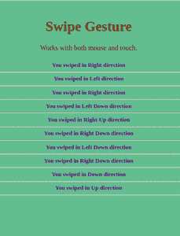

# 使用哈默 JS

在 Angular 9 中进行鼠标滑动控制

> 原文:[https://www . geesforgeks . org/鼠标-滑动-角度控制-9-使用-hammerjs/](https://www.geeksforgeeks.org/mouse-swipe-controls-in-angular-9-using-hammerjs/)

Angular 是一个应用程序设计框架和开发平台，用于创建高效复杂的单页应用程序。从第一次发布到现在已经有了很大的变化。并且它不断地在其发行版中添加新的特性和修改，这是一件好事。但是有时我们在以前版本中使用的东西在最新版本中停止工作。哈默 JS 也是如此。

**HammerJS** 是一个非常好的开源库，可以识别触摸、鼠标和指针事件做出的手势。您可以在这里阅读更多关于哈默 JS 及其文档[的信息。](https://hammerjs.github.io/)

在 Angular 9 中，如果您使用以前添加 HammerJS 的方法，它将不起作用，因为 Angular 已经修改了它的一些特性。因此，您将从一开始就经历在 Angular 9 中使用 HammerJS 的整个过程。

**进场:**

方法是在本地安装 hammerjs 包，导入到 *main.ts* 中，通过扩展 *HammerGestureConfig* 类设置 Hammer 手势配置。然后，您可以绑定到特定事件，如滑动、平移、挤压、按压等。最重要的是导入 app 模块文件中的 **HammerModule** 。

**Example and Explanation: Swipe Gesture**

*   在您的 angular 项目中，通过运行下面的命令在本地安装 hammerjs 包。

    ```ts
    npm install --save hammerjs
    ```

    *   现在，您需要在您的 <u>main.ts</u> 文件中导入**hammersjs**模块。如果不导入此内容，您将在控制台中得到一个错误。*错误:Hammer.js 未加载，无法绑定到 XYZ 事件。*

    ```ts
    import 'hammerjs';
    ```

    *   让我们转到我们的 <u>app.module.ts，</u>在这里，您可以使用 [HammerGestureConfig](https://github.com/angular/angular/blob/10.0.5/packages/platform-browser/src/dom/events/hammer_gestures.ts#L86-L155) 类和 Hammer _ signature _ CONFIG 添加您自己的 Hammer 手势配置，如下图所示。
    **还要确保导入** *锤子模块*，因为这是 Angular 9 中已经完成的当前修改。
    否则你的项目不会工作，也不会出错。(虽然这是在 typescript 中，但是编辑器还不支持，所以忽略它，不要混淆。)

    **app.module.ts**

    ```ts
    // add this in your app.module.ts
    import { NgModule, Injectable } from '@angular/core';
    import { BrowserModule } from '@angular/platform-browser';
    import { FormsModule } from '@angular/forms';
    // particular imports for hammer
    import * as Hammer from 'hammerjs';
    import {
    HammerModule, HammerGestureConfig, HAMMER_GESTURE_CONFIG} 
    from '@angular/platform-browser';
    import { AppComponent } from './app.component';

    @Injectable()
    export class MyHammerConfig extends HammerGestureConfig {
      overrides = <any> {
        swipe: { direction: Hammer.DIRECTION_ALL },
      };
    }

    @NgModule({
      imports:      [ BrowserModule, FormsModule, HammerModule ],
      declarations: [ AppComponent, HelloComponent ],
      bootstrap:    [ AppComponent ],
      providers: [
        {
          provide: HAMMER_GESTURE_CONFIG,
          useClass: MyHammerConfig,
        },
      ],
    })
    export class AppModule { }
    ```

    *   现在我们将为滑动手势创建一个简单的例子。对于**app.component.html**，可以添加以下代码。
    **【app.component.html】**

    ```ts
    <!--add this in your app.component.html -->
    <div class="swipe" (swipe)="onSwipe($event)">
      <h1>Swipe Gesture</h1>
      <p>Works with both mouse and touch.</p>
      <h5 [innerHTML]="direction"></h5>
    </div>
    ```

    *   Add some styles to your example like this in **app.component.css**. The important thing to notice is where you want the swipe gesture, set **user-select** as none.

    **app.component.css**

    ```ts
    .swipe {
        background-color: #76b490;
        padding: 20px;
        margin: 10px;
        border-radius: 3px;
        height: 500px;
        text-align: center;
        overflow: auto;
        color: rgb(78, 22, 131);
        user-select: none;
    }
    h1,
    p {
        color: rgb(116, 49, 11);
    }
    ```

    *   Lastly, add your typescript code in **app.component.ts** like this.

    ```ts
    // add this in your app.component.ts
    import { Component } from "@angular/core";

    @Component({
      selector: "my-app",
      templateUrl: "./app.component.html",
      styleUrls: ["./app.component.css"]
    })
    export class AppComponent {
      direction = "";

      onSwipe(event) {
     const x =
       Math.abs(
    event.deltaX) > 40 ? (event.deltaX > 0 ? "Right" : "Left") : "";
     const y =
       Math.abs(
    event.deltaY) > 40 ? (event.deltaY > 0 ? "Down" : "Up") : "";

        this.direction += 
    `You swiped in <b> ${x} ${y} </b> direction <hr>`;
      }
    }
    ```

    **输出:**
    

    使用 HammerJS 还可以实现其他几种手势。更多信息，请阅读他们的[文档](https://hammerjs.github.io/getting-started/)。