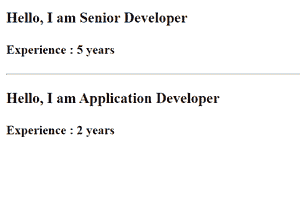

# ng-角铁含量

> 原文:[https://www.geeksforgeeks.org/ng-content-in-angular/](https://www.geeksforgeeks.org/ng-content-in-angular/)

当我们想要将内容动态地插入到组件中以帮助提高组件的可重用性时，使用 ng-content。使用 ng-content，我们可以在组件选择器中传递内容，当 angular 解析出现在 ng-content 位置的内容时。

**语法:**

**进场:**

*   创建要使用的角度应用程序。
*   使用命令“ng g c geek”创建一个组件“geek”。
*   然后我们在应用程序组件中使用这个组件，并在“极客”组件中提供 ng 内容。
*   使用 ng-content，我们在 geek 组件中传递了两件事，第一是人的位置，第二是一年的经验。

**示例:**

## app.component.html

```ts
<app-geek>
    <strong class="app">Senior Developer</strong>
    <strong class="app1">Experience : 5 years</strong>
</app-geek>
<hr>

<app-geek>
    <strong class="app">Application Developer</strong>
    <strong class="app1">Experience : 2 years</strong>
</app-geek>
```

## geek.component.html

```ts
<h3>
    <span>Hello, I am </span>
    <ng-content select=".app"></ng-content>
</h3>

<h4>
    <ng-content select=".app1"></ng-content>
</h4>
```

当我们需要在组件选择器中传递多个东西时，我们必须为它们提供唯一的选择器，无论是任何 id 还是类，这样使用这个唯一的选择器，我们就可以访问 ng-content 中的特定内容。因此，这里 ng-content 中的“select”用于获取具有匹配类名 app 或 app1 的内容。

**输出:**使用“ng serve”命令运行此命令，然后转到浏览器并打开“localhost:4200”。

