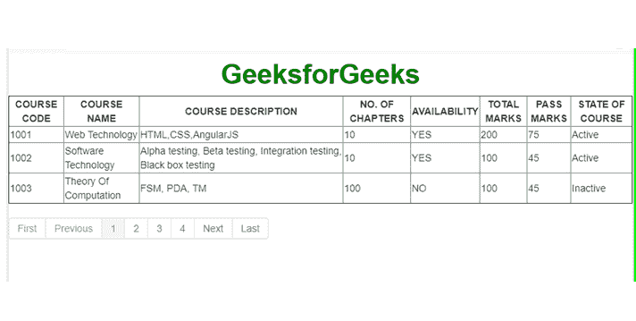

# 在 AngularJS 中分页

> 原文:[https://www.geeksforgeeks.org/paging-in-angularjs/](https://www.geeksforgeeks.org/paging-in-angularjs/)

分页是一种将特定大页面的内容分成小页面并以索引格式按顺序显示的技术。这种技术在设计搜索引擎时非常流行，在搜索引擎中，最相关的内容以优先级为基础呈现。此外，许多 Angular 开发人员使用分页技术，并使用 Bootstrap 开发动态网页。

**示例:**
在下面的示例中，实现了分页技术，在 AngularJS 中也称为分页技术。HTML 代码必须添加到 index.html 文件中，javascript 代码必须添加到 script.js 文件中。在下面提到的例子中，我们创建了一个表，并使用 javascript 将数据放入其中，并使用分页来表示整个实现。

```ts
<!DOCTYPE html>
<html ng-app="myApp">
    <head>
        <script data-require="angular.js@1.1.5" 
                data-semver="1.1.5" 
                src=
           "http://code.angularjs.org/1.1.5/angular.min.js">
      </script>
        <link data-require="bootstrap-css@2.3.2" 
              data-semver="2.3.2" 
              rel="stylesheet" 
              href=
"//netdna.bootstrapcdn.com/twitter-bootstrap/2.3.2/css/bootstrap-combined.min.css" />
        <script data-require="angular-ui-bootstrap@0.3.0" 
                data-semver="0.3.0" 
                src=
"http://angular-ui.github.io/bootstrap/ui-bootstrap-tpls-0.3.0.min.js">
      </script>

        <link rel="stylesheet"
              href="style.css" />
        <script src="script.js"></script>
        <script src="app.js"></script>
    </head>
    <h1 style="color: green;" ;>GeeksforGeeks</h1>
    <body ng-controller="ListController as list">
        <table border="1">
            <thead>
                <tr>
                    <th>COURSE CODE</th>
                    <th>COURSE NAME</th>
                    <th>COURSE DESCRIPTION</th>
                    <th>NO. OF CHAPTERS</th>
                    <th>AVAILABILITY</th>
                    <th>TOTAL MARKS</th>
                    <th>PASS MARKS</th>
                    <th>STATE OF COURSE</th>
                </tr>
            </thead>
            <tr ng-repeat="item in filteredItems">
                <td>{{item.courseCode}}</td>
                <td>{{item.courseName}}</td>
                <td>{{item.courseDescription}}</td>
                <td>{{item.noc}}</td>
                <td>{{item.available}}</td>
                <td>{{item.totm}}</td>
                <td>{{item.passm}}</td>
                <td>{{item.soc}}</td>
            </tr>
        </table>
        <div data-pagination=""
             data-num-pages="numOfPages()" 
             data-current-page="curPage"
             data-max-size="maxSize" 
             data-boundary-links="true">
      </div>
    </body>
</html>
```

```ts
// Write Javascript code here
var app = angular.module('myApp', ['ui.bootstrap']);

  app.controller('ListController', function($scope){

  $scope.curPage = 1,
  $scope.itemsPerPage = 3,
  $scope.maxSize = 5;

    this.items = itemsDetails;

  $scope.numOfPages = function () {
    return Math.ceil(itemsDetails.length / $scope.itemsPerPage);

  };

    $scope.$watch('curPage + numPerPage', function() {
    var begin = (($scope.curPage - 1) * $scope.itemsPerPage),
    end = begin + $scope.itemsPerPage;

    $scope.filteredItems = itemsDetails.slice(begin, end);
  });
  });

  var itemsDetails = [
    { courseCode : 1001,
      courseName : 'Web Technology',
      courseDescription : 'HTML, CSS, AngularJS',
      noc : '10',
      available : 'YES',
      totm : 200,
      passm : 75,
      soc : 'Active'
      },
    { courseCode : 1002,
      courseName : 'Software Technology',
      courseDescription :
      'Alpha testing, Beta testing, 
       Integration testing, Black box testing',
      noc : '10',
      available : 'YES',
      totm : 100,
      passm : 45,
      soc : 'Active'
      },
    { courseCode : 1003,
      courseName : 'Theory Of Computation',
      courseDescription : 'FSM, PDA, TM',
      noc : '100',
      available : 'NO',
      totm : 100,
      passm : 45,
      soc : 'Inactive'
      },
    { courseCode : 1004,
      courseName : 'Algorithm',
      courseDescription : 
        'Greedy algorithms, Dynamic Programming, Sorting',
      noc : '6',
      available : 'YES',
      totm : 200,
      passm : 75,
      soc : 'Active'
      },
    { courseCode : 1005,
      courseName : 'Networking',
      courseDescription : 'IP',
      noc : '12',
      available : 'YES',
      totm : 50,
      passm : 19,
      soc : 'Active'
      },
    {courseCode : 1006,
      courseName : 'Database',
      courseDescription : 'Indexing, B and B+ trees, SQL',
      noc : '24',
      available : 'NO',
      totm : 200,
      passm : 75,
      soc : 'Inactive'
      },
    { courseCode : 1007,
      courseName : 'Programming',
      courseDescription : 'C, C++, JAVA, Python',
      noc : '30',
      available : 'YES',
      totm : 200,
      passm : 75,
      soc : 'Active'
      },
    { courseCode : 1008,
      courseName : 'Data structure',
      courseDescription : 'Tree, Graph',
      noc : '10',
      available : 'NO',
      totm : 100,
      passm : 45,
      soc : 'Inactive'
      },
    { courseCode : 1009,
      courseName : 'Operating Systems',
      courseDescription : 
            'CPU Scheduling, Memory Managment, Disk Management',
      noc : '21',
      available : 'YES',
      totm : 200,
      passm : 75,
      soc : 'Active'
      },
    { courseCode : 1010,
      courseName : 'Compiler',
      courseDescription : 'Top down parsing, Bottom up Parsing',
      noc : '15',
      available : 'YES',
      totm : 200,
      passm : 75,
      soc : 'Active'
      }
  ];
```

**输出:**
首页-
T5【最后一页-


**说明:**
网页以表格形式显示所有课程详情。这里使用的技术是分页。这允许在单个网页上仅播放三行，并且在最后一页上仅显示一行。
已经创建了四个页面。为了显示分页栏，我们使用了 ui.bootstrap 作为 AngularJS 应用程序的依赖项。**“curPage”**的初始化值为 1，这意味着每当网页加载时，它都会将第一页显示为当前页面。每页的项目数是使用“items per page”变量指定的，它被赋予值 3，因为我们希望在一页中最多显示 3 个项目。
**“最大大小”**变量表示分页系统中允许的最大页数。行*“this . items = items details；”*启动 itemDetails 变量。我们创建了一个函数来计算页数，然后将该值存储在名为“numOfPages”的范围变量中。

我们已经输入了 10 门课程的详细信息，通过上述天花板函数计算页数，总共给了我们 4 页。我们在“itemsDetails”数组中有 10 个项目，这意味着数组索引的范围将从 0 到 9。对于第一页，“curPage”的值将为 0。这将使 begin 的值为 0。它将帮助我们获得数组的第一个索引值。“end”变量的值将是 0 + 3 = 3。通过使用 slice()方法，我们显示了 3 行，分别是项目编号 0、1 和 2。同样，在第二页、第三页和第四页，将显示其余项目。这就是 AngularJS 中分页的工作方式。