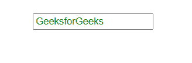
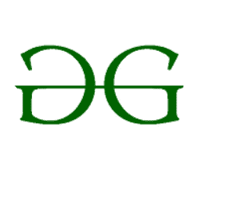
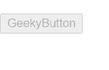

# 角度为 8

的属性绑定

> Original: [https://www.geeksforgeeks.org/property-binding-in-angular-8/](https://www.geeksforgeeks.org/property-binding-in-angular-8/)

属性绑定是一种**单向数据绑定**技术。 在属性绑定中，我们将 DOM 元素的属性绑定到字段，该字段是组件类型脚本代码中定义的属性。 实际上，ANGLING 在内部将字符串插值转换为属性绑定。

在这种情况下，我们将已定义元素的属性绑定到 HTML DOM 元素。

**语法：**

```
<element [property]= 'typescript_property'>
```

**接近：**

*   在 app.Component.ts 文件中定义一个属性元素。
*   在 app.Component.html 文件中，通过将属性值分配给 app.Component.ts 文件的元素来设置 HTML 元素的属性。

**示例 1：**使用属性绑定设置输入元素的值。

**app.Component.html**

```
<input style = "color:green;
                margin-top: 40px; 
                margin-left: 100px;" 
[value]='title'>
```

加入时间：清华大学 2007 年 01 月 25 日下午 3：33

```
import { Component } from '@angular/core';    
@Component({    
  selector: 'app-root',    
  templateUrl: './app.component.html',    
  styleUrls: ['./app.component.css']    
})    
export class AppComponent {   
  title = 'GeeksforGeeks'; 
}
```

发帖主题：Re：Колибри0.7.0



**示例 2：**使用属性绑定获取图像源。

**app.Component.html**

```

```

加入时间：清华大学 2007 年 01 月 25 日下午 3：33

```
import { Component } from '@angular/core';    
@Component({    
  selector: 'app-root',    
  templateUrl: './app.component.html',    
  styleUrls: ['./app.component.css']    
})    
export class AppComponent {   
  src = 'https://www.geeksforgeeks.org/wp-content/uploads/gfg_200X200-1.png'; 
}
```

发帖主题：Re：Колибри0.7.0



**示例 3：**使用属性绑定禁用按钮。

**app.Component.html**

```
<button [disabled]='bool' style="margin-top: 20px;">GeekyButton</button>
```

加入时间：清华大学 2007 年 01 月 25 日下午 3：33

```
import { Component } from '@angular/core';    
@Component({    
  selector: 'app-root',    
  templateUrl: './app.component.html',    
  styleUrls: ['./app.component.css']    
})    
export class AppComponent {   
  bool = 'true'; 
}
```

发帖主题：Re：Колибри0.7.0

