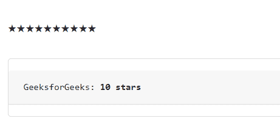

# 角度 NGX 自举额定值分量

> Original: [https://www.geeksforgeeks.org/rating-component-in-angular-ngx-bootstrap/](https://www.geeksforgeeks.org/rating-component-in-angular-ngx-bootstrap/)

Angel NGX Bootstrap 是一个 Bootstrap 框架，它与 Angel 一起使用来创建具有很好样式的组件，并且这个框架非常易于使用，可以用来制作响应性很强的网站。

在本文中，我们将了解如何在角度 NGX 自举中使用额定值。 **额定值**用于制作将使用星号显示的组件。

**安装语法：**

```ts
npm install ngx-bootstrap --save
```

**接近：**

*   First, install the angular ngx bootstrap using the above-mentioned command.

*   在 index.html

    > <link href="”https://maxcdn.bootstrapcdn.com/bootstrap/4.0.0/css/bootstrap.min.css”" rel="”stylesheet”">

    中添加以下脚本
*   在 mode.ts 中导入评级组件
*   在 app.Component.html 中创建一个评级组件。
*   使用 ng 服务为应用程序提供服务。

**示例：**

## Index.html

```ts
<!DOCTYPE html>
<html lang="en">

<head>
    <meta charset="utf-8" />
    <base href="/" />
    <meta name="viewport" content=
        "width=device-width, initial-scale=1" />
    <link href=
"https://maxcdn.bootstrapcdn.com/bootstrap/4.0.0/css/bootstrap.min.css"
        rel="stylesheet" />

    <link rel="icon" type="image/x-icon" href="favicon.ico" />
    <link rel="preconnect" href="https://fonts.gstatic.com" />
    <link href=
"https://fonts.googleapis.com/css2?family=Roboto:wght@300;400;500&display=swap"
        rel="stylesheet" />
    <link href="https://fonts.googleapis.com/icon?family=Material+Icons"
        rel="stylesheet" />
</head>

<body class="mat-typography">
    <app-root></app-root>
</body>

</html>
```

## App.component.html

```ts
<div id="gfg">
    <rating [(ngModel)]="rate" [max]="max" 
        [readonly]="isReadonly">
    </rating>
</div>
<div class="card">
    <pre class="card-block card-header" 
        style="margin: 15px 0;">
        GeeksforGeeks: <b>{{rate}}</b> 
    </pre>
</div>
```

## App.module.ts

```ts
import { NgModule } from '@angular/core';

// Importing forms module
import { FormsModule, ReactiveFormsModule }
    from '@angular/forms';
import { BrowserModule }
    from '@angular/platform-browser';
import { BrowserAnimationsModule }
    from '@angular/platform-browser/animations';
import { RatingModule }
    from 'ngx-bootstrap/rating';

import { AppComponent }
    from './app.component';

@NgModule({
    bootstrap: [
        AppComponent
    ],
    declarations: [
        AppComponent
    ],
    imports: [
        FormsModule,
        BrowserModule,
        BrowserAnimationsModule,
        ReactiveFormsModule,
        RatingModule.forRoot()
    ]
})
export class AppModule { }
```

## App.component.css

```ts
.card{
    margin: 30px;
}

#gfg{
    margin: 30px;
}
```

## App.component.ts

```ts
import { Component, OnInit,LOCALE_ID } 
from '@angular/core';

@Component({
    selector: 'app-root',
    templateUrl: './app.component.html',
    styleUrls: ['./app.component.css']
})
export class AppComponent {
    max = 10;
    rate = 10;
    isReadonly = true;
}
```

发帖主题：Re：Колибри0.7.0



**引用：**[https://valor-software.com/ngx-bootstrap/rating](https://valor-software.com/ngx-bootstrap/rating)