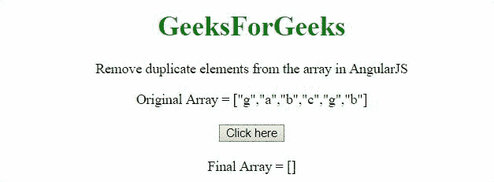
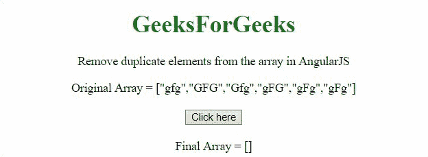

# 使用 AngularJS

从数组中移除重复的元素

> 原文:[https://www . geeksforgeeks . org/remove-replicate-elements-from-array-use-angularjs/](https://www.geeksforgeeks.org/remove-duplicate-elements-from-an-array-using-angularjs/)

我们给出了一个数组，任务是使用 AngularJS 从数组中移除/删除重复项。

**进场:**

*   方法是使用 **filter()方法**，在方法内部，不重复的元素将被返回，重复的只返回一次。
*   因此，将形成一个独特的阵列。

**例 1:** 在本例中，字符**‘g’和‘b’**从原始数组中删除。

## 超文本标记语言

```tshtml
<!DOCTYPE HTML>
<html>

<head>
    <script src=
"https://ajax.googleapis.com/ajax/libs/angularjs/1.2.13/angular.min.js">
    </script>

    <script>
        var myApp = angular.module("app", []);
        myApp.controller("controller", function ($scope) {
            $scope.arr = ['g', 'a', 'b', 'c', 'g', 'b'];
            $scope.res = [];
            $scope.remDup = function () {
                $scope.res = $scope.arr
                    .filter(function (item, pos) {
                    return $scope.arr.indexOf(item) == pos;
                })
            };
        });
    </script>
</head>

<body style="text-align:center;">
    <h1 style="color:green;">
        GeeksForGeeks
    </h1>

    <p>
        Remove duplicate elements from 
        the array in AngularJS
    </p>

    <div ng-app="app">
        <div ng-controller="controller">
            Original Array = {{arr}}
            <br><br>
            <button ng-click='remDup()'>
                Click here
            </button>
            <br><br>
            Final Array = {{res}}<br>
        </div>
    </div>
</body>

</html>
```

**输出:**



**示例 2:** 本示例执行**区分大小写比较**，因此像“ **gfg”和“GFG”**这样的元素不会被视为重复。

## 超文本标记语言

```tshtml
<!DOCTYPE HTML>
<html>

<head>
    <script src=
"https://ajax.googleapis.com/ajax/libs/angularjs/1.2.13/angular.min.js">
    </script>

    <script>
        var myApp = angular.module("app", []);
        myApp.controller("controller", function ($scope) {
            $scope.arr = ['gfg', 'GFG', 
                'Gfg', 'gFG', 'gFg', 'gFg'];
            $scope.res = [];
            $scope.remDup = function () {
                $scope.res = $scope.arr
                    .filter(function (item, pos) {
                    return $scope.arr.indexOf(item) == pos;
                })
            };
        });
    </script>
</head>

<body style="text-align:center;">
    <h1 style="color:green;">
        GeeksForGeeks
    </h1>

    <p>
        Remove duplicate elements 
        from the array in AngularJS
    </p>

    <div ng-app="app">
        <div ng-controller="controller">
            Original Array = {{arr}}
            <br>
            <br>
            <button ng-click='remDup()'>
                Click here
            </button>
            <br>
            <br>
            Final Array = {{res}}<br>
        </div>
    </div>
</body>

</html>
```

**输出:**

