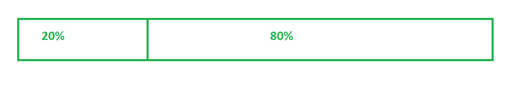
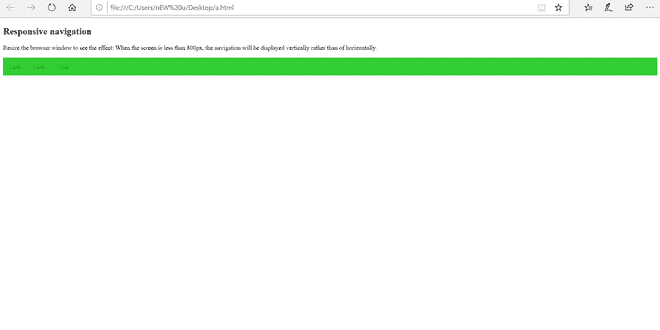
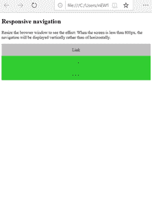
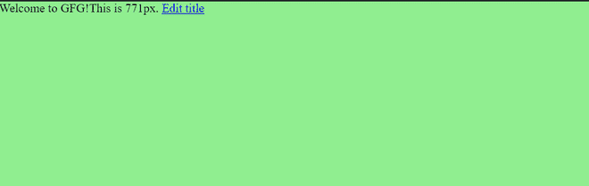
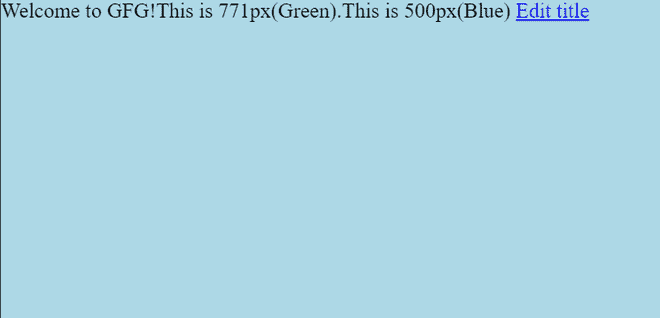
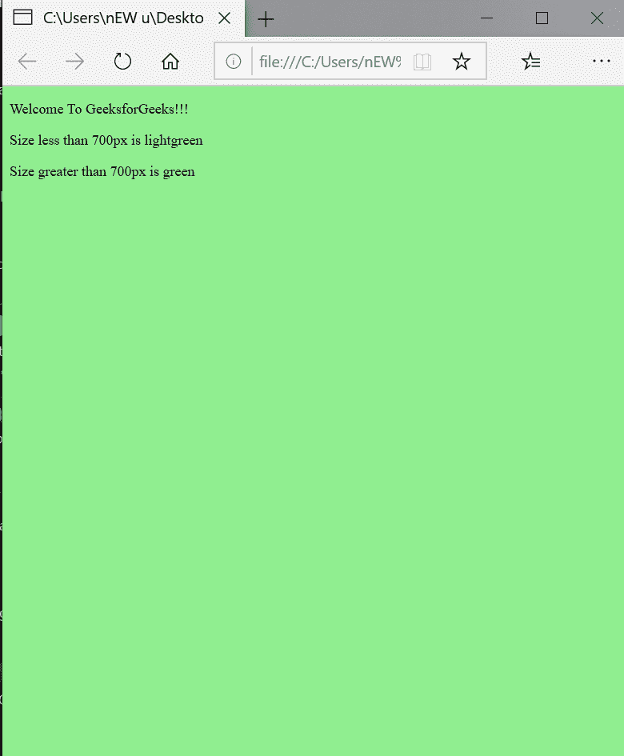
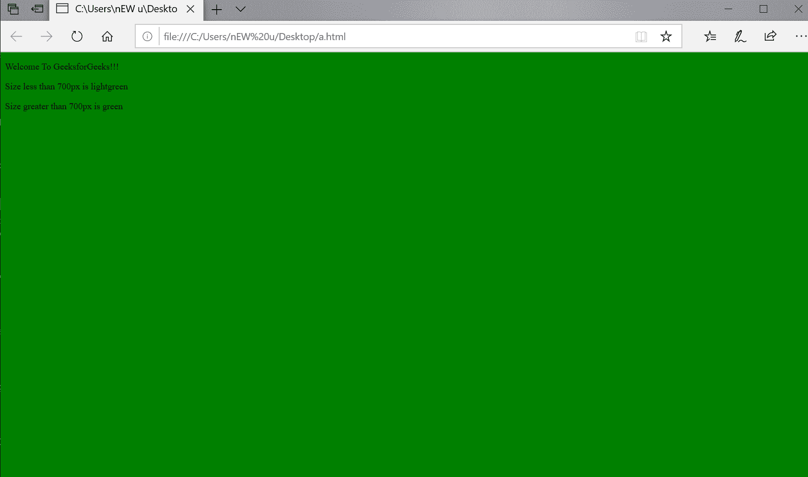

# AngularJS 中的响应页面

> 原文:[https://www.geeksforgeeks.org/responsive-page-in-angularjs/](https://www.geeksforgeeks.org/responsive-page-in-angularjs/)

侧重于网站外观动态变化的网页开发设计，这取决于我们在其上查看的设备的屏幕大小和方向。满足用户需求的整个过程被称为响应性网页设计(RWD)。因此，基本上，当用户从任何设备访问网站时，他们应该能够获得最佳体验。如今，用户可以使用手机、平板电脑、个人电脑和笔记本电脑等设备访问网站。所以，他们获得的便利应该是我们的首要任务。因此，为了实现这一点，我们使用 RWD。响应式设计只使用 HTML 和 CSS。

**查看端口:**

查看端口是指用户可见的区域。它因设备而异。与电脑相比，手机的体积会更小。

**语法:**

```
<!DOCTYPE html>
   <html>
     <head>
       <meta name="viewport" 
             content="width=device-width,
             initial-scale=1.0">
   </head>
<body>

<h2>GFG</h2>
<p>Apply the above in between the 
head tag for responsive webpages.</p>

</body>
</html>
```

这将有助于以 1×1 的纵横比查看网页，这将从智能手机浏览器中删除默认功能，并使网站成为全视图，从而允许用户增加或减少屏幕大小。

在 HTML5 中引入了元。它帮助浏览器控制缩放和尺寸。

width =设备-width-处理网页的宽度。

initial-scale=1.0 part 设置初始缩放级别(首次在浏览器中加载页面时)。

**网格视图:**

将页面分成大约 12 个网格的列，大约为屏幕总宽度的 100%。

**语法:**

```
* {
 box-sizing: border-box;
} 
```



```
.A{
width: 20%;
float: left;
}
.B{
 width: 80%;
float: left;
}
```

**上下缩放的响应图像:-**

```
image {
 width: 100%;
 height: auto;
}
```

**最大宽度属性:**

图像将缩小，但不会放大到大于其原始大小:

```
image {
max-width: 100%;
height: auto;
}
```

**语法:**

```
.video { 
position: relative;
padding-bottom: 56.25%;
padding-top: 30px;
height: 0;
overflow: hidden;
}
.video iframe, 
.video object,
.video embed {
position: absolute;
top: 0;
left: 0;
width: 100%;
height: 100%;
}
```

**响应排版:**

```
Along with images and videos, it is very necessary to make text also responsive. 
The root element's font-size known as rem is used for this. 
@media (min-width: 640px) { body {font-size:1rem;} } 
@media (min-width:960px) { body {font-size:1.5rem;} } 
@media (min-width:1100px) { body {font-size:2rem;} } 

```

**是怎么做到的？**

*   浏览器代理字符串*   Use CSS media queries.

    **服务:**

    *   确定设备类型并使用适当的分音。
    *   ng-if 和 ng-switch 显示所需内容。

    **定制指令:**

    无需使用 ng-if 和 ng-switch 来显示所需内容。更多的语义方法。

    **HTML 标记 API:**

    <figure class="table">

    | ***HTML 标记 API*** |
    | Layout (row &#124; column) |
    | Flex (integer value) |
    | Flex- order (integer value) |
    | Flex- offset (integer value) |
    | Layout-Fill |
    | Layout-package |
    | Layout-no package |
    | Layout-Margins |
    | Layout-Fill |
    | show |
    | hide |  |

    </figure>

    **断点和媒体查询:**

    当根据设备的宽度响应网站的内容时，允许对用户进行最佳布局的设备被称为**断点**或**媒体查询断点**，因为它们与媒体查询一起使用。有两种方法可以应用断点。

    媒体查询是作为一种 CSS 技术引入 CSS3 的。

    *   **Based on the device.**

    **景观**

    ```
    @media screen
     and (device-width: 360px)
     and (device-height: 640px)
     and (-webkit-device-pixel-ratio: 3)
     and (orientation: landscape) {
     }
    ```

    **智能手机人像**

    ```
    @media only screen and (min-width: 300px) {
    }
    ```

    **智能手机领域**

    ```
    @media only screen and (min-width: 480px) {
    }
    ```

    **ipad(人像)**

    ```
     @media only screen and (min-device-width : 768px) 
       and 
    (max-device-width : 1024px) 
       and
    (orientation : portrait) {
    ...
    }
    ```

    **写字板人像**

    ```
    @media only screen and (min-width: 768px) {
    }
    ```

    **平板电脑风景/桌面**

    ```
    @media only screen and (min-width: 1024px) {
    }
    ```

    **平板电脑横向/桌面(1200 像素)**

    ```
     @media only screen and (min-width: 1200px) {
    ...
    }
    ```

    **示例:**

    ```
    <!DOCTYPE html>
    <html lang="en">
    <head>
    <meta charset="utf-8">
    <meta name="viewport" 
          content="width=device-width, 
                   initial-scale=1">
    <style>
    * {
      box-sizing: border-box;
    }

    /* Style the top navigation bar */
    .topnav {
      overflow: hidden;
      background-color: #32CD32;
    }

    .topnav a {
      float: left;
      display: block;
      color: #228B22;
      text-align: center;
      padding: 14px 16px;
      text-decoration: none;
    }

    /* Change color on hover */
    .topnav a:hover {
      background-color: #C0C0C0;
      color: black;
    }

    @media screen and (max-width: 800px) {
      .topnav a {
        float: none;
        width: 100%;
      }
    }
    </style>
    </head>
    <body>

    <h2>Responsive navigation </h2>
    <p>Resize the browser window to see the effect:
     When the screen is less than 800px, 
    the navigation will be displayed vertically 
    rather than of horizontally.</p>

    <div class="topnav">
      <a href="#">Link1</a>
      <a href="#">Link2</a>
      <a href="#">Link3</a>
    </div>

    </body>
    </html>
    ```

    
    

    *   **Based on the content.**

    ```
    @media only screen (min-width: 768px){
    ...
     }
    "or"
    @media only screen and (min-width: 768px) and (max-width: 959px){
     ...
     }
    ```

    <figure class="table">

    | **断点** | **介质查询(像素范围)** |
    | 特小号 | (最大宽度:599 像素) |
    | gt-xs 系列 | (最小宽度:600 像素) |
    | 钐 | (最小宽度:600 像素)和(最大宽度:959 像素) |
    | gt-sm 公司 | (最小宽度:960 像素) |
    | 钔 | (最小宽度:960 像素)和(最大宽度:1279 像素) |
    | gt-md

     | (最小宽度:1280 像素) |
    | 水准仪 | (最小宽度:1280 像素)和(最大宽度:1919 像素) |
    | gt-lg | (最小宽度:1920 像素) |
    | 特大号 | (最小宽度:1920 像素) |

    </figure>

    **使用 AngularJs 进行响应性设计的优势:**

    *   用更少的努力更快地创建网络应用程序——AngularJs 使用 HTML 代码。无需编写冗长的 MVC 管道。代码行更少。
    *   安全和响应的网页设计-安全的 HTTP 调用建立与服务器的通信。RESTful APIs 和 web 服务有助于这种交流。任何企业都应该选择一个合适且理想的安全专业，以使其安全性更加强大，并保护 AngularJS 应用程序的安全。
    *   易于集成-使用 AngularJS 开发响应迅速的网络应用程序，实现协作。使用面向对象的 MVC 进行服务器端和其他已知模型的 Web 开发人员可以轻松地学习和使用 AngularJS。依赖注入使得开发人员可以集成已经用 AngularJS 开发的模块。有许多库存在并补充了 AngularJS 来开发项目中的新功能。

    **使用带 AngularJs 的引导:**

    Angular 强大的模型驱动设计使用模型视图控制器(MVC)方法，允许刚接触 Angular 的开发人员快速上手并提高工作效率。有一点学习曲线，特别是在理解 Angular 的指令方面，但是双向服务器绑定所需的代码的总体减少比我们使用 jQuery 时少得多。

    **例 1:** AngularJs

    ```
    <!DOCTYPE html>
    <html>
    <head>
    <meta name="viewport" 
          content="width=device-width, 
                   initial-scale=1.0">
    <style>
    body {
      background-color: lightgreen;
    }

    @media only screen and (max-width: 600px) {
      body {
        background-color: lightblue;
      }
    }
    </style>
    <div ng-app>
      <div ng-controller="ClickToEditCtrl">
        <div ng-hide="editorEnabled">
          {{title}}
          <a href="#" 
             ng-click="editorEnabled=!editorEnabled">
                Edit title</a>
        </div>
        <div ng-show="editorEnabled">
          <input ng-model="title">
          <a href="#" 
             ng-click="editorEnabled=!editorEnabled">
                        Done editing?</a>
        </div>
      </div>
    </div>
    </body>
    </html>
    ```

    ```
    function ClickToEditCtrl($scope) {
      $scope.title = "Welcome to GFG!";
    }
    ```

    **输出:**
    

    

    **例 2:**

    响应图像:

    ```
    <!DOCTYPE html>
    <html>
    <head>
    <meta name="viewport" 
          content="width=device-width,
                   initial-scale=1.0">
    <style>
    body {
      background-color: green;
    }

    @media only screen and (max-width: 700px) {
      body {
        background-color: lightgreen;
      }
    }
    </style>
    </head>
    <body>

    <p>Welcome To GeeksforGeeks!!!</p>
      <p>Size less than 700px is lightgreen</p>
      <p>Size greater than 700px is green</p>
    </body>
    </html>
    ```

    **输出:**

    

    