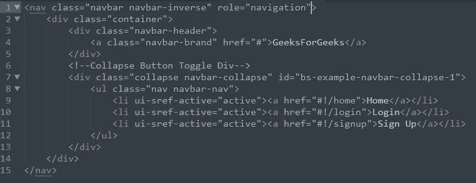
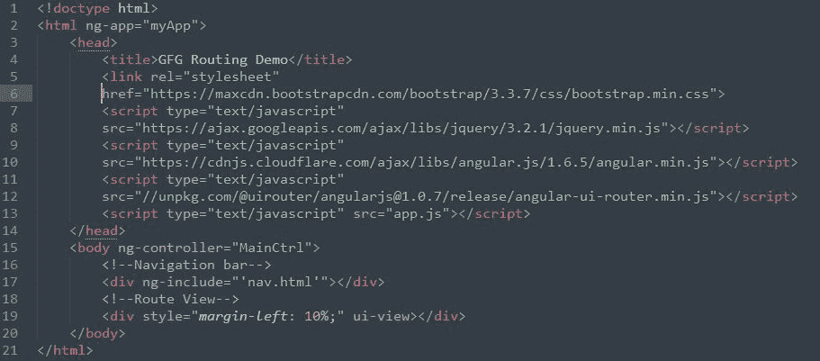
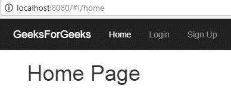
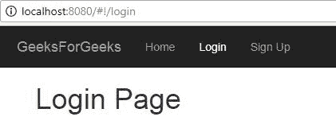
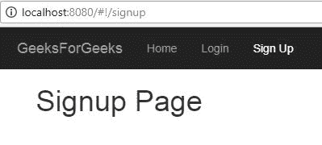

# 使用 Angular UI 路由器在 Angular JS 中路由

> 原文:[https://www . geesforgeks . org/routing-angular-js-using-angular-ui-router/](https://www.geeksforgeeks.org/routing-angular-js-using-angular-ui-router/)

[AngularJS](https://en.wikipedia.org/wiki/AngularJS) 是一个基于 JavaScript 的前端 web 应用框架，由 Google 维护。 [AngularJS](https://en.wikipedia.org/wiki/AngularJS) 将 HTML 的属性解释为将输入/输出组件绑定到由标准 JavaScript 变量表示的模型的指令。

**先决条件:**

*   [HTML](https://www.geeksforgeeks.org/tag/html/)
*   CSS
*   [JavaScript](https://www.geeksforgeeks.org/javascript-tutorial/)
*   AngularJS

    Angular-UI-Router 是一个 AngularJS 模块，用于为 AngularJS 应用程序创建路由。路由是单页应用程序和常规应用程序的重要组成部分，Angular-UI-Router 提供了在 AngularJS 中轻松创建和使用路由的功能。

    Angular-UI-Router 有 **stateProvider** 方法，用于在应用中创建路由/状态。状态提供程序将状态名称和状态配置作为参数。

    **语法:**

    ```
    $stateProvider
    .state('StateName', {
        url: 'Url pattern for this State',
        template: "Html content",
        controller: "Name of the Controller for this state"
    });

    ```

    可以使用 templateUrl 代替模板，并给定要为状态呈现的 HTML 文件的路径。
    **例:**

    ```
    $stateProvider
    .state('Home', {
        url: '/home',
        templateUrl: "home.html",
        controller: "HomeCtrl"
    });

    ```

    **在路线之间导航的简单项目，演示 Angular-UI-Router 模块的使用。**
    **先决条件:** [Node.js](https://www.geeksforgeeks.org/tag/node-js/) 和 [npm](https://www.geeksforgeeks.org/node-js-npm-node-package-manager/)

    ```
    To run and install http-server node module to host demo app.
    ```

    **执行操作的步骤:**
    **1。**创建如下目录结构:

    ```
    routingDemo
    --app.js
    --index.html
    --nav.html

    ```

    **2。**创建**nav.html**文件如下。这个文件由导航条标题和内容组成。
    

    **3。**创建**index.html**文件如下。所有需要的依赖项都包含在这个文件中，还有**nav.html**文件和 **ui-view** 的定义，其中将呈现不同路线的内容。
    

    **说明:**

    *   所有的依赖项都通过 CDN 包含在头标签中。
    *   nav.html 文件包含在 index.html 页面的正文标签中
    *   The last division in body defines ui-view div where the content of different routes will be rendered.

        **注意:**如果不起作用，将第二个和第三个脚本替换为以下内容:

        ```
        <script src="angular.min.js"></script>
        <script src = "
        https://unpkg.com/@uirouter/angularjs@1.0.7/release/angular-ui-router.min.js">
        </script>

        ```

        **4。**创建 **app.js** 文件如下。这是一个应用程序文件，其中包含要通过控制器执行的路由信息和操作。

        ```
        // declares application module with name "myApp"
        // inject ui.router dependency
        var app = angular.module('myApp', [ "ui.router" ]);

        // define route configurations inside app.config
        // injecting dependencies
        app.config(function($stateProvider, $locationProvider, 
                                        $urlRouterProvider) {

            // creating routes or states
            $stateProvider
                .state('Home', {
                    url : '/home',
                    template : "<h1>Home Page</h1>",
                    controller : "HomeCtrl"
                })
                .state('Login', {
                    url : '/login',
                    template : "<h1>Login Page</h1>",
                    controller : "LoginCtrl"
                })
                .state('Signup', {
                    url : '/signup',
                    template : "<h1>Signup Page</h1>",
                    controller : "SignupCtrl"
                });

            // Redirect to home page if url does not 
            // matches any of the three mentioned above
            $urlRouterProvider.otherwise("/home");
        });

        // create empty controllers for the states as we are
        // not doing anything but just displaying message
        app.controller('MainCtrl', function() {});
        app.controller('HomeCtrl', function() {});
        app.controller('LoginCtrl', function() {});
        app.controller('SignupCtrl', function() {});
        ```

        **5。**要在浏览器中运行上述演示应用，请安装 **http-server 节点模块**。要安装 **http 服务器模块**，请使用以下命令:

        ```
               npm install http-server -g

        ```

        **6。**安装后:
        –从 **routingDemo** 文件夹，运行以下命令:

        ```
               http-server

        ```

        上述命令将在端口 8080 上托管演示应用程序。可以使用以下链接访问应用程序:

        ```
               localhost:8080/

        ```

        **7。**如果通过浏览器访问该应用，输出如下:
        

        **8。**点击**导航栏**中的**登录**选项卡后，输出如下:
        

        **9。**点击**导航栏**中的**报名**标签，输出如下:
        

        本示例应用程序创建了三条路线，即**主页**、**登录**和**注册**。

        **应用:**

    *   路由对于单页应用程序很重要，因为它们为同一页上的应用程序提供了不同的功能。
    *   Routes creation and manipulation is easy with the angular-ui-router module.

        **参考文献:**

        *   [https://github . com/angular-ui/ui-router/wiki/快速参考](https://github.com/angular-ui/ui-router/wiki/quick-reference)
        *   [https://ui-router . github . io/ng1/docs/1 . 0 . 0-beta . 1/class/state . state provider . html](https://ui-router.github.io/ng1/docs/1.0.0-beta.1/classes/state.stateprovider.html)
        *   [https://en . Wikipedia . org/wiki/angolajs](https://en.wikipedia.org/wiki/AngularJS)