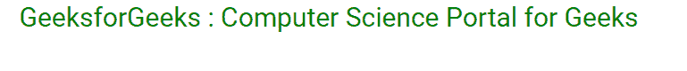

# 角度 8 中的字符串插值

> 原文:[https://www . geesforgeks . org/string-in-interpolation-in-angular-8/](https://www.geeksforgeeks.org/string-interpolation-in-angular-8/)

Angular 8 中的字符串插值是一种 **单向数据绑定** 技术用于将数据从一个 TypeScript 代码传输到一个 HTML 模板(视图)。它使用 **双花括号** 中的模板表达式来显示从组件到视图的数据。字符串插值将组件的属性值添加到 HTML 模板视图中。

**语法:**

```ts
{{ component_property }}

```

**进场:**

*   在 app.component.ts 文件中定义一个包含一些字符串值的属性。
*   在 app.component.html 文件中，通过在双花括号{{ property_name }}中调用属性名来绑定该属性的值。

**例 1:**

*   **app.component.html**T3】

    ## 超文本标记语言

    ```ts
    <h1>
      {{ title }}
    </h1>
    ```

*   **app.component.ts**

    ## java 描述语言

    ```ts
    import { Component } from '@angular/core';    
    @Component({    
      selector: 'app-root',    
      templateUrl: './app.component.html',    
      styleUrls: ['./app.component.css']    
    })    
    export class AppComponent {   
      title = "GeeksforGeeks";
    }
    ```

**输出:**


**例 2:**

*   **app.component.html**T3】

    ## 超文本标记语言

    ```ts
    <h1 [style.color] = "'green'" 
        [style.text-align] = "'center'" >
        {{ title }} : {{ about }}
    </h1>
    ```

*   **app.component.ts**

    ## java 描述语言

    ```ts
    import { Component } from '@angular/core';    
    @Component({    
      selector: 'app-root',    
      templateUrl: './app.component.html',    
      styleUrls: ['./app.component.css']    
    })    
    export class AppComponent {   
      title = "GeeksforGeeks";
      about = "Computer Science Portal for Geeks";
    }
    ```

**输出:**

