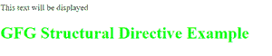
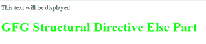
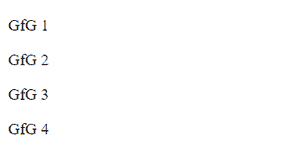
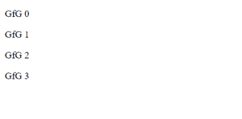
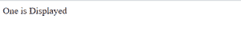

# 有角度的结构指令

> 原文:[https://www . geesforgeks . org/structural-instructions-in-angular/](https://www.geeksforgeeks.org/structural-directives-in-angular/)

结构指令负责 DOM 元素的结构和布局。它用于隐藏或显示 DOM 上的东西。使用“*”可以很容易地识别结构指令。每个结构指令前面都有一个“*”符号。
结构指令中的一些构建示例如下:

**1.*ngIf：**

ngIf 用于根据分配给它的表达式值显示或隐藏 DOM 元素。表达式值可能为真，也可能为假。

**语法:**

```ts
<div *ngIf="boolean"> </div>
```

在上面的语法中，布尔值代表真值或假值。因此，它产生了如下两种有效语法:

```ts
<div *ngIf="true">  </div>
<div *ngIf="false">  </div>

```

**ngIf 的例子:**

```ts
<div *ngIf="false">
  This text will be hidden
  <h1 [ngStyle]="{'color':'#FF0000'}">
    GFG Structural Directive Example
  </h1>
</div>
<div *ngIf="true">
  This text will be displayed
  <h1 [ngStyle]="{'color':'#00FF00'}">
    GFG Structural Directive Example
  </h1>
</div>
```

**输出:**



*ngIf 示例

**2.**

ngIf-else 的工作方式类似于简单的 If-else 语句，其中如果条件为真，则呈现“If”DOM 元素，否则呈现另一个 DOM 元素。Angular 使用带有元素选择器的 ng-template，以便在 DOM 上显示 else 部分。

**语法:**

```ts
<div *ngIf="boolean; else id_selector">  </div>
<ng-template #id_selector>  </ng-template>

```

在上面的语法中，布尔值代表真值或假值。如果布尔值为真，则在 DOM 上呈现 If 中的元素，否则在 DOM 上呈现另一个元素。
*** Ngif-else 示例:**

```ts
<div *ngIf="false;else id_selector">
  This text will be hidden
  <h1 [ngStyle]="{'color':'#FF0000'}">
    GFG Structural Directive 
    If Part
  </h1>
</div>
<ng-template #id_selector>
  This text will be displayed
  <h1 [ngStyle]="{'color':'#00FF00'}">
    GFG Structural Directive 
    Else Part
  </h1>
</ng-template>
```

**输出:**



* Ngif–其他示例

**3。*神经生长因子:**
*神经生长因子用于循环遍历 DOM 中的动态列表。简单地说，它用于在 HTML DOM 中构建数据表示列表和表格。

**语法:**

```ts
<div *ngFor="let item of item-list">  </div>
```

**神经生长因子示例:**

假设您有一个如下所示的列表:

```ts
items = ["GfG 1", "GfG 2", "GfG 3", "GfG 4"];

```

```ts
<div *ngFor="let item of items">
 <p >  {{item}} </p>
</div>
```

**输出:**



*例如

**带有索引的*的示例-2:**
假设您有一个如下所示的列表:

```ts
items = ["GfG ", "GfG ", "GfG ", "GfG "];

```

```ts
<div *ngFor="let item of items;let i=index">
 <p >  {{item}} {{i}} </p>
</div>
```

**输出:**
这里，指数从‘0’开始，而不是‘1’



*用于带索引的

**4。*ngSwitch :**
ngSwitch 用于在*ngSwitchCase 内部的表达式定义的多个 case 语句之间进行选择，并根据该选择显示在 DOM Element 上。如果没有匹配的表达式，将显示默认的 DOM 元素。
**语法:**

```ts
<div [ngSwitch]="expression">
  <div *ngSwitchCase="expression_1"></div>  
  <div *ngSwitchCase="expression_2"></div>  
  <div *ngSwitchDefault></div>  
</div>

```

在上面的语法中，用每个案例检查表达式，然后在 DOM 上呈现与表达式匹配的案例，否则在 DOM 上呈现默认案例。
**开关示例:**

```ts
<div [ngSwitch]="'one'">
  <div *ngSwitchCase="'one'">One is Displayed</div>  
  <div *ngSwitchCase="'two'">Two is Displayed</div>  
  <div *ngSwitchDefault>Default Option is Displayed</div>  
</div>
```

在上面的示例中，ngSwitch 中的表达式“one”与 ngSwitchCase 中的表达式相匹配。因此，DOM 上显示的元素是“显示一个”。
**输出:**



nsswitch 案例示例