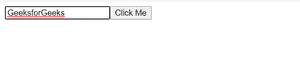
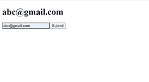

# AngularJS 中的模板参考变量

> 原文:[https://www . geesforgeks . org/template-reference-variable-in-angular js/](https://www.geeksforgeeks.org/template-reference-variable-in-angularjs/)

**angular 中的模板引用变量**用于访问 DOM 内部任意元素的所有属性。它也可以是对角度组件或指令或网络组件的引用。

模板参考变量可以参考以下内容–

*   DOM 元素
*   指令
*   角度分量
*   网络组件

**进场:**

*   创建一个要使用的角度应用程序。
*   创建输入元素，并使用# tag 将模板引用添加到该输入字段。
*   将此模板引用绑定在按钮点击方法“changeTitle()”中。
*   现在在 changeTitle 方法中，我们可以完全访问这个输入字段，这里我们已经设置了输入字段值和焦点属性。

**语法:**变量名前使用#标记。示例–#极客

```
<input #geek placeholder="" />
```

**例 1:**

## app.component.html

```
<input #geek placeholder="" />
<!-- geek refers to the input element; 
     pass it to an event handler -->
<button (click)="changeTitle(geek)">Click Me</button>
```

在上面的 HTML 模板中，我们用模板引用变量“email”创建了一个输入元素，并创建了一个按钮。单击按钮，我们访问完整的输入元素及其所有属性。

```
"#geek" is template reference variable on input field
```

## app.component.ts

```
import { Component } from '@angular/core';

@Component({
  selector: 'app-root',
  templateUrl: './app.component.html',
  styleUrls: ['./app.component.css']
})
export class AppComponent {

  changeTitle(inputElement){
    inputElement.value = "GeeksforGeeks";
    inputElement.focus();
  }

}
```

输入元素的模板引用变量可以在 changeTitle()函数中访问，在按钮单击时，我们将更新输入元素的值，并使该字段集中。

**输出:**



**示例 2:** 在模板驱动的表单中，我们实际上是使用模板引用变量来访问表单数据。

## app.component.html

```
<h1>{{email_address}}</h1>
<form #itemForm="ngForm" (ngSubmit)="onSubmit(itemForm)">
    <input ngModel #email="ngModel" type="email" 
        placeholder="Email" name="email" />

    <button type="submit">Submit</button>
</form>
```

因此，在这里，我们使用表单元素上的模板引用变量来访问表单数据，在表单提交上，我们显示通过表单字段提供的输入电子邮件。

## app.component.ts

```
import { Component } from '@angular/core';

@Component({
  selector: 'app-root',
  templateUrl: './app.component.html',
  styleUrls: ['./app.component.css']
})
export class AppComponent {
  email_address = 'geek@geek.com';
  onSubmit(form){
    this.email_address = form.value.email;
  }
}
```

因此，完整的表单字段是使用“itemForm”模板引用变量访问的，我们在浏览器中显示电子邮件地址。

**输出:**

