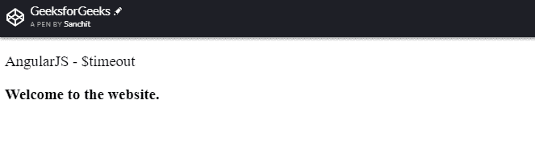
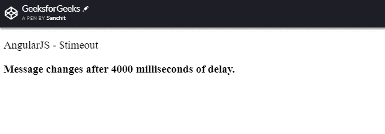
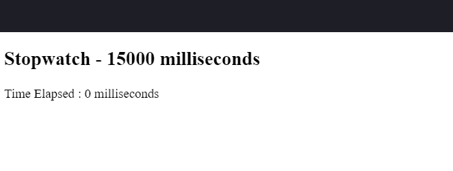
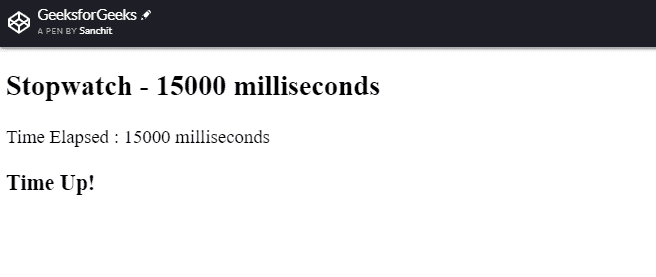

# $ AngularJS 中的超时服务

> 原文:[https://www.geeksforgeeks.org/timeout-service-in-angularjs/](https://www.geeksforgeeks.org/timeout-service-in-angularjs/)

Web 开发是一个快速发展的领域。今天介绍的一项技术，几个月内肯定会过时。以前的网站都是静态的，很少甚至没有动画或者 CSS。然而，普通 JavaScript 的引入彻底改变了网站的外观和功能。但如前所述，很快用户就厌倦了，开始寻找新鲜的现成的东西。这就是 AngularJS 进入市场并彻底改变网站过去运作方式的时候。

单页应用程序是使用 AngularJS 创建的。AngularJS 中大约有 30 种内置服务。除此之外，用户还可以根据项目需求创建自己的用户定义服务。

**本文将讨论 AngularJS 的*‘$ time out’*服务。**
AngularJS 的这个*“$ time out”*服务在功能上类似于普通 JavaScript 的“window.setTimeout”对象。该服务允许开发人员在执行函数之前设置一些时间延迟。

**例如:**假设开发者想在用户登录 2 秒后，在用户屏幕上显示一条警告消息。他可以使用 AngularJS 的$timeout 函数来创建这样的功能。

```
var app = angular.module('timeoutApp', []);

app.controller('timeoutCtrl', function ($scope, $timeout) {

$scope.text="Enter username and password to login"

$timeout(function () {
        $scope.text = "Do not share your username and password with anybody";
}, 2000);

});
```

在上面给出的示例代码中，很明显，警告消息在用户登录后 2000 毫秒显示。
**例 1:**

```
<!DOCTYPE html>

<html>

<head>
    <title>GeeksforGeeks</title>
    <script src=
"http://ajax.googleapis.com/ajax/libs/angularjs/1.4.8/angular.min.js">
  </script>

    <script type="text/javascript">
        var app = angular.module('myApp', []);

        app.controller('myCtrl', function($scope, $timeout) {

            $scope.text = "Welcome to the website."

            $timeout(function() {

                $scope.text = 
                  "Message changes after 4000 milliseconds of delay.";
            }, 4000);

        });
    </script>

</head>

<body>

    <div ng-app="myApp" ng-controller="myCtrl">

        <p>AngularJS - $timeout</p>

        <b>{{text}}</b>

    </div>

</body>

</html>
```

**解释:**这个例子演示了一个工作秒表。秒表从 0 毫秒开始运行，直到计时器达到 15000 毫秒。15000 毫秒后，达到标记，屏幕上会显示一条新消息*“时间到了”*。

**输出**T2】



默认的欢迎消息



延迟 4 秒后的消息

**解释:**在第一个例子中，*$超时服务*已经被用来创建 4 秒的延迟。这就是欢迎消息在页面加载后 4 秒钟发生变化的原因。

### 例 2:

```
<!DOCTYPE html>

<html>

<head>
    <title>GeeksforGeeks</title>

    <script src=
"http://ajax.googleapis.com/ajax/libs/angularjs/1.4.8/angular.min.js">
  </script>

    <script type="text/javascript">
        (function() {

            var myApp = angular.module('myApp', []);

            myApp.controller(
              'myController', function($scope, $timeout) {

                //code for the delay
                $timeout(function() {
                    $scope.txt = "Time Up!";
                }, 15000);

                //storing time in scope variable
                $scope.time = 0;

                //callback calculations
                var timer = function() {
                    if ($scope.time < 15000) {
                        $scope.time += 500;
                        $timeout(timer, 500);
                    }
                }

                //execute
                $timeout(timer, 500);

            });

        })();
    </script>

</head>

<body>

    <div ng-app="myApp">
        <div ng-controller="myController">
            <h2>Stopwatch - 15000 milliseconds</h2>
            <div>Time Elapsed : {{time}} milliseconds</div>
            <h3>{{txt}}</h3>
        </div>
    </div>

</body>

</html>
```

**解释:**这个例子演示了一个工作秒表。秒表从 0 毫秒开始运行，直到计时器达到 15000 毫秒。15000 毫秒后，达到标记，屏幕上会显示一条新消息*“时间到了”*。

**输出**T2】



秒表开始前的截图



时间过去后的截图

为此，创建了一个计时器函数。该函数从 0 开始，每经过 0.5 秒钟递增 500。计时器一直运行，直到达到 15000 毫秒标记。屏幕上会显示一条新消息*“时间到了”*。